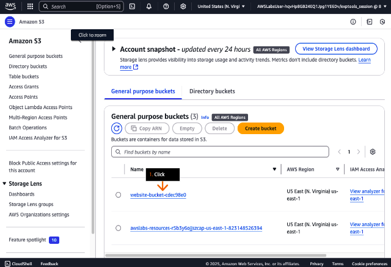

# Cloud Computing Essentials
# Learn
## Solution request
Improve website reliability by migrating to Amazon S3 static web hosting.

* Amazon S3 provides storage and retrieval of any amount of data from anywhere on the web.


* In Amazon S3, data is stored as objects (files and their associated metadata) within containers called buckets.


* This solution uses an S3 bucket to host a static website, capable of handling unlimited traffic volumes cost-effectively, removing the need for traditional web server management.


* The S3 bucket stores both the HTML file and supporting assets (such as client-side scripts and style sheets) required for website functionality. Any S3 bucket can be enabled for static wesite hosting.


* When configured for website hosting, the S3 bucket receives a dedicated URL.Requests to this URL, propmpt Amazon S3 to server the bucket's designated root object (typically the main HTML file).


* Access to the S3 bucket and its contents is controlled through permissions, which are defined in a bucket policy.


* A bucket policy. written in JSON format, specifies who can access the bucket and what operations they can perform.


* JSON is a standarized data format that's both humane-readable and machine-readable, widely used across AWS services and applications.


* When a city residents access the web portal for beachwave information, their browsers send GET requests to the static webpage's URL, which serves the index.html root object.


* The root object can be renamed from index.html to waves.html, with S3 bucket settings updated accordingly to reference the new filename.


# Practice
Concepts
In this parctice you will:
* Enable static website hosting on an Amazon S3 bucket.
* Review the bucket policy to secure the hosting bucket.

## Steps
1. In the top navigation bar search box, type: s3
2. In the search results, under Services, click S3.

Concept:The AWS Management Console is a web interface to access and manage the broad collection of offerings provided by Amazon Web Services (AWS).


3.  On the General purpose buckets tab, click the bucket name that starts with website-bucket-.

- The bucket contains code required for this practice lab

Concept: Amazon Simple Storage Service (Amazon S3) is an objectstorage service that stores and protects your data with high scalability, availability, security and performance. Amazon S3 can store any amount of data for various uses, such as websites, mobile apps, backups, archives, data lakes and analytics.



4. At the top of the page, select (highlight) and copy the bucket name, and then paste it in the text editor of your choice on your device.

- You must use this bucket name in the later DIY section of this solution.

5. On the Objects tab, review the objects in the S3 bucket.

- Five files should be displayed.
- These files contain the contents of the static website.
- You can click Upload to add local files to the bucket.

6. Choose the checkbox to select the text.html object.
7. Click Actions to expand the dropdown list.
8. Choose Rename object.


Concept: Amazon S3 stores objects in containers called buckets. Each storage object must be in a bucket. S3 offers different storage classes based on how often do you access your data, from frequently accessed data to archived data that's rarely accessed.


9. For New object name, type:

error.html
- This file contains the code for the error page, which opens whenever something goes wrong for website users.

10. Click Save changes.

Concept: You can choose which AWS Region will store your S3 buckets. Select a Region to reduce latency, lower costs or meet regulatory requirements. Objects remain in their Region unless you specifically move ot copy them to another Region.


11. In the success alert, review the message.
12. Click the Permissions tab.

Concept: With S3, you can upload files up to 5 GB in a single operation. For larger files up to 5 TB, you'll need to use multipart upload.


13. In the Block public access (bucket settings) section, review to confirm that Block all public access is turned off.

- Turning off "Block all public access" is necessary for static web hosting through your S3 bucket.

Concept: All S3 resources, buckets, objects and related subresources, are private by default. Only you, as the resource owner, can access them unless you grant permission to others through an access policy.


14. In the Bucket policy editor window, review the policy.

- This S3 bucket policy allows public read-only access (GetObject) to anyone for all objects within the specified bucket. However, to prevent unintended data exposure, we recommend stricter permissions for production environments.

Concept: You can grant permissions to S3 resources by using two types of policies: bucket policies and user policies. Both use JSON format. Each AWS resource has a unique identifier called Amazon Resource Name (ARN).


```
{
    "Version": "2012-10-17",
    "Id": "StaticWebPolicy",
    "Statement": [
        {
            "Sid": "S3GetObjectAllow",
            "Effect": "Allow",
            "Principal": "*",
            "Action": "s3:GetObject",
            "Resource": "arn:aws:s3:::website-bucket-cddab540/*"
        }
    ]
}
```

* Version: 2012-10-17
Es la versión del formato de política de AWS. AWS usa esta fecha como identificador de la sintaxis del documento. Todas las políticas usan este versión como estándar.

* Id: StaticWebPolicy
Es un identificador opcional de la política completa. Permite referirse a esta política específica (si se la quiere modificar mediante API o CLI). Sólo es un nombre descriptivo que dice que la política se usa para un sitio web estático.

* Satement: [....]
Es una lista de declaracione so reglas individuales. Cada declaración define qué acciones, a quién, sobre qué recursos y con qué efectos.

Dentro del array Statement hay un solo bloque.
* Sid: S3GetObjectAllow
StatementID es un identificador interno para esta regla. Sirve par distinguir varias reglas dentro de una política. Indica que se trata de la regla que permite obtener objetos (GetObject).

* Effect: Allow
Define si la política permite (Allow) o deniega (Deny) la acción. Permite exolícitamente la acción indicada.

* Principal: *
Indica quién puede realizar la acción. Significa cualquier usuario, es decir, acceso público. Todo el mundo en internet puede acceder a los objetos del bucket.

* Action: s3:GetObject
Es la acción o permiso que se otorga. Permite leer o descragar objetos del bucket. No permite subir, borrar ni listar objetos.

* Resource: arn:aws:s3:::website-bucket-cddab540/*
Especifica a qué recurso aplica la política:
   * arn:aws:s3::: es el prefijo para identificar recursos de S3.
   * website-bucket-cddab540/* significa todos los objetos dentro de ese bucket (no el bucket en sí). El /* final indica todos los archivos dentro del bucket.

Permite acceso público de solo lectura a todos los objetos dentro del bucket website-bucket-cddab540.

15. At the top of the page, click the Properties tab.

Concept: to host a static website on S3, you need to: configure your bucket for website hosting, set permissions, and add an index document. You can also set up redirects, logging and custom error pages.


16. In the Default encryption section, review the encryption settings.

Concept: Server-side encryption protects your data where it's stored. When you upload data to S3, it automatically encrypts your data before saving it to AWS data centers. When you acess your data, S3 automatically decrypts it for you.


17. In the Static Website hosting section, click Edit.

Concept: a static website contains fixed content that doesn't change, though it can include interactive features through client-side scripts.


18. For Static website hosting, choose Enable.
19. For Hosting type, choose Host a static website.
20. For Index document, type:

 index.html

21. For Error document, type:

 error.html

Concept: S3 provides two URL formats to access you data:
* Virtual-hosted style: https://bucket-name.s3.Region.amazonaws.com/key
* Path style: https://s3.Region.amazonaws.com/bucket-name/keyname


22. In the Static website hosting section, review to confirm that Hosting type is set to Bucket hosting.
23. Under Bucket website endpoint, click the copy icon to copy the provided endpoint.


24. To load the Beach Wave Conditions webpage, in a new browser tab (or window) address bar, paste the bucket website endpoint that you just copied, and then press Enter.


## DIY
Rename index.html to waves.html.
- use the Actions dropdown list to rename index.html to waves.html.
