# Learn 
Use Amazon Route 53 to map an IP address to a domain name, and then create a CNAME record to point one domain name to another.

A DNS service, such as Amazon Route 53, helps make the connection between domain names and IP addresses. The most common example of a DNS query is when a user opens a browser and types the domain name in the address bar.

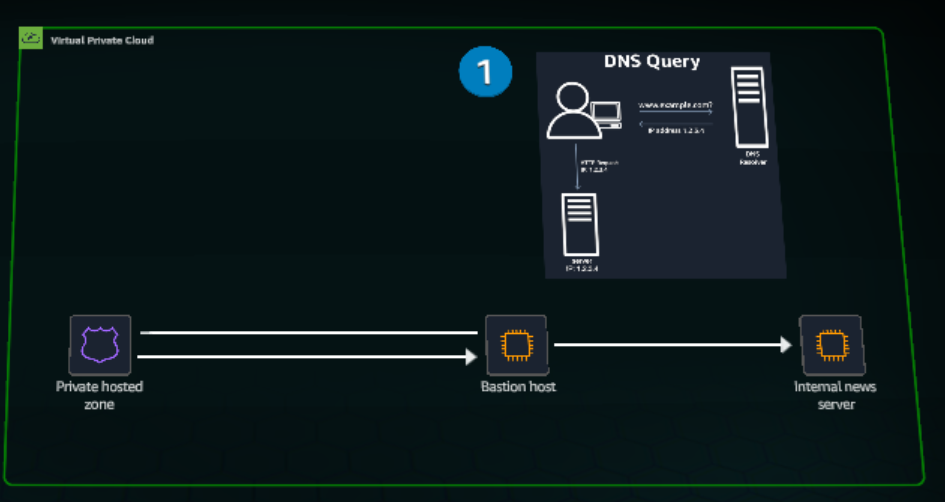

Route 53 can be used to manage public or private domain names. This solution uses Route 53 for ONLY internal AWS resources (private hosted zone).

In this configuration, Route 53 does not expose DNS data to the public internet.

Using a private hosted zone, you can route traffic for a domain an its subdomains to Amazon EC2 instances within one or more Virtual Private Cloud (VPC).

The private hosted zone has two record types A record and CNAME record.

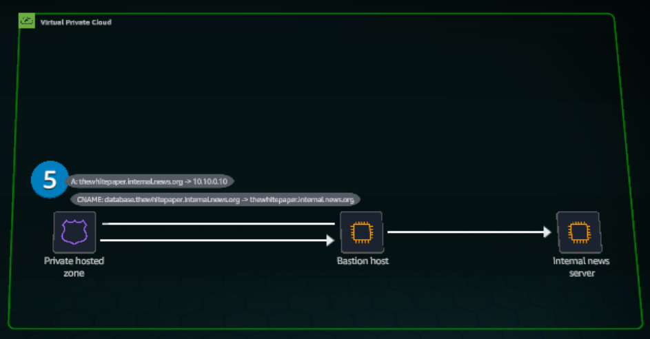

The A record is configured to map the IP address (10.10.0.10) from an EC2 instance to a human readable address. Here, that readav¡ble address is the domain name thewhitepaper.internal.news.org.

You can use a CNAME record to map the name of the current record, database.thewhitepaper.internal.news.org to another domain, such as thewhitepaper.internal.news.org.

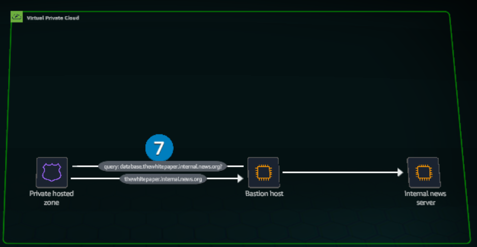

# Practice
In this Lab, you will:
- Configure local hosted zones to provide domain names internal to your VPC.

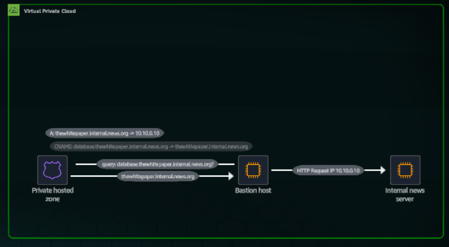

1. In the top navigation bar search box, type:
ec2
2. In the search results, under Services, click EC2.

Concept
Amazon EC2 is a web service that provides secure, resizable compute capacity in the cloud.

3. On the EC2 Dashboard, in the Resources section, click Instances (running).

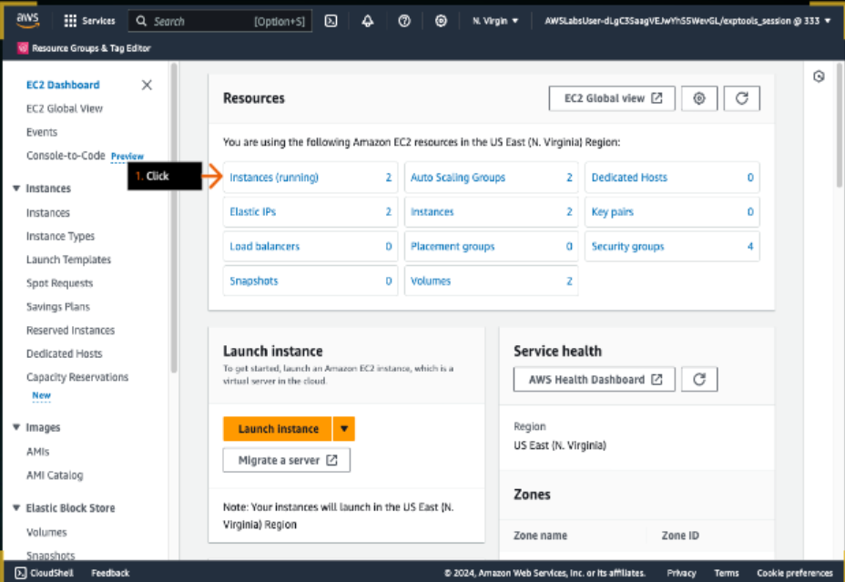

Concept 
Bastion hosts, or jump servers are often used as a best practice for accessing privately accessible hosts within a system environment. Systems with an app that is not intended to be publicly accessible can be accessed by logging into a bastion host first.

4. Review to ensure that two EC2 instances are displayed: the Internal News Server instance and the Bastion Server instance.
5. For the Internal News Server instance, under Instance ID, click the provided ID.

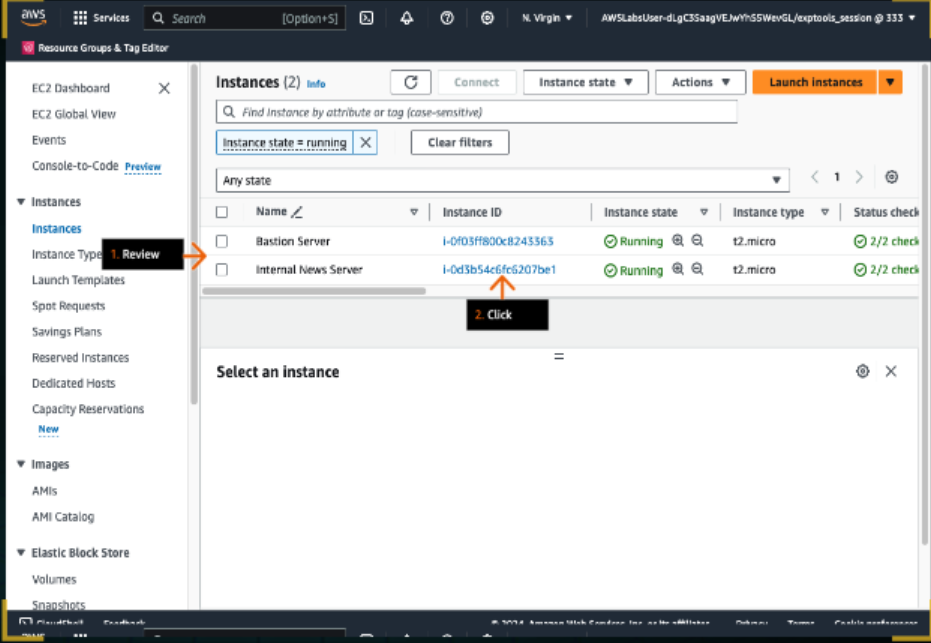

Concept
To increase security, a server hosting a core app will not be assigned apublic IP address and will use a private address to server content. A bastion host can be configured within a Virtual Private Cloud (VPC) to communicate with the private server.

6. In the Instance summary section, under Private IPv4 addresses, click the copy icon to copy the provided address, and then paste it to the text editor of your choice on your device.
- You will use this address in later steps.
- The address might be different than what is displayed on the screenshot example.
7. In the left navigation pane, click Instances.

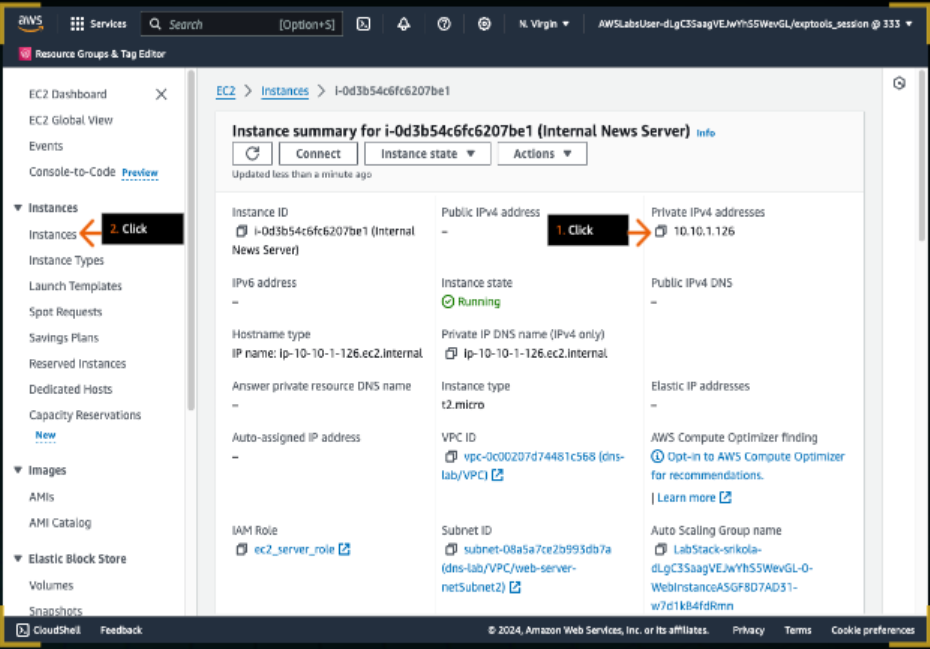

Concept
A Bastion host can be used to replicate a user that is accesing your website internally.

8. In the Instances section, choose the check box to select the Bastion Server instance.
9. Click Connect.

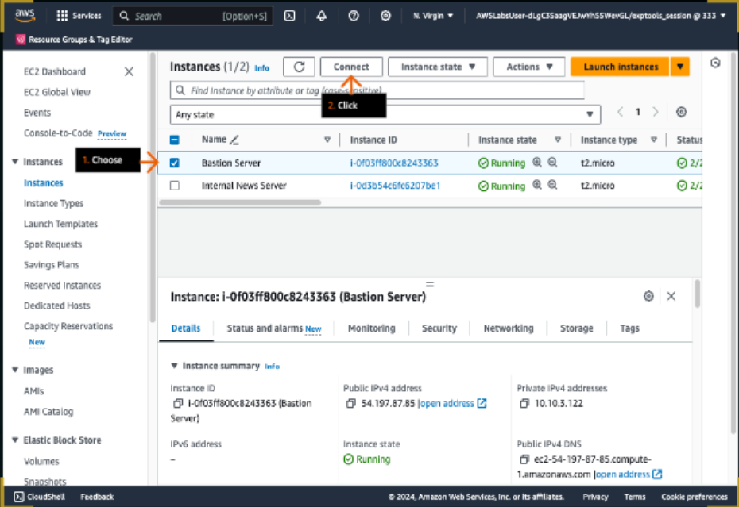

Concept
You can connect to your EC2 instance in multiple ways, using SSH clients such as PuTTy, Unix terminals, EC2 connect or Session Manager.

10. In the Connect to instance section, click the Session Manager tab.

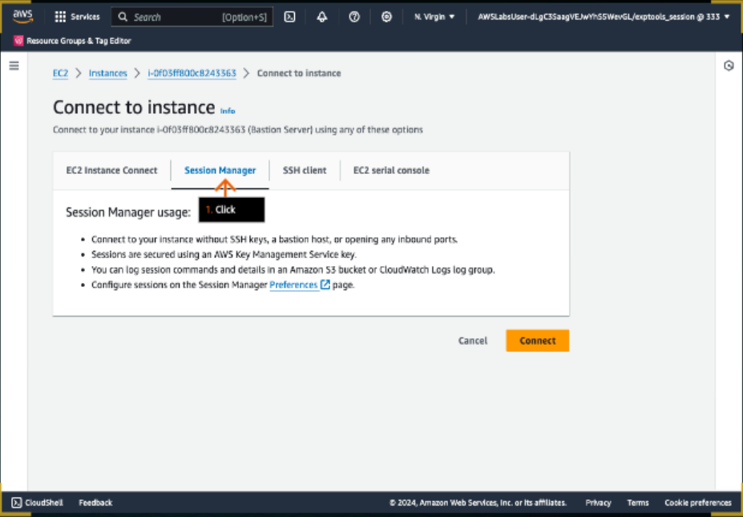

11. Click Connect.
- The server terminal window will open in a new browser tab (or window).

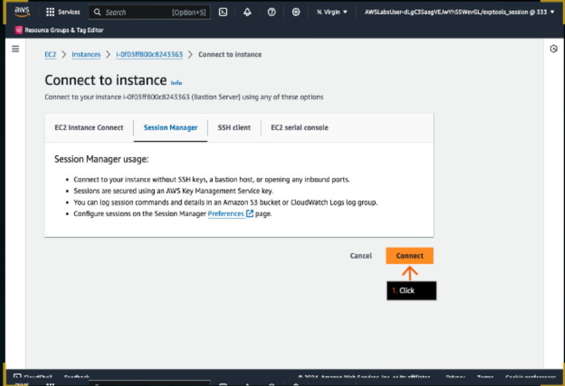

Concept
You can use the ping terminal command to test communication with a server. If a server is not reachable using the ping command, be sure that ICMP traffic is allowed in you security group.

12. To ping your Internal News Server, in the terminal window, at the command prompt, replacing the placeholder with the IP address that you copied in an earlier step, run (type the command and press Enter):
ping <ip address>

13. To end the ping command, on your keyboard, press Ctrl+C.

14. To attempt to ping the server using the DNS (domain name system) name, run:
ping thewhitepaper.internal.news.org

15. Review to see that the server is unreachable. 
16. Click the previous browser tab to return to the Amazon EC2 console (not shown).
- Leave the current browser tab open. You will return to the Session Connect terminal in later steps.

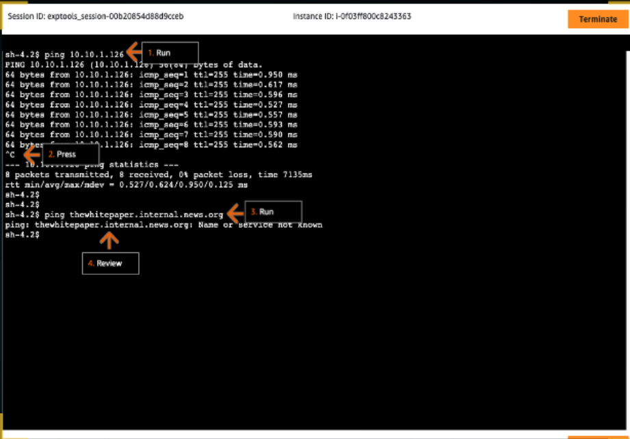

Concept 
Amazon Route 53 takes its name from port 53, which handles DNS requests for TCP and UDP traffic. You can interact with route 53 programmatically, using the API, or throush the AWS Management Console.

17. In the top navigation bar search box, type:
route 53
18. In the search results, under Services, click Route 53.

Concept
Route 53 provides a fine-tuned routing experience. You can perform complex routing policies, such as geographical and failover, and you can purchase and register domains.

19. Click on the menu (three lines) icon on the top left to open navigation pane.

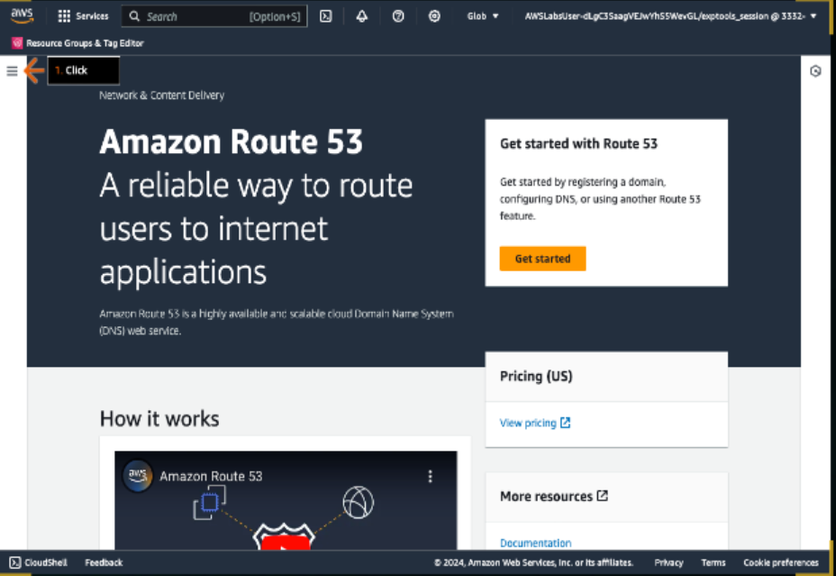

Concept
A hosted zone is a container of records that define how traffic will be routed, on the internet or within a VPC.

20. Click Hosted zones.
21. Click Create hosted zone.

Concept
A private hosted zone is a container that holds information about how you want Amazon Route 53 to respond to DNS queries for a domain and its subdomains within one or more VPCs that you create with the Amazon VPC service.

22. For Domain name, type: 
internal.news.org
23. For Description, type a description that you like, such as "Domain name for internal news server".
24. For Type, choose Private hosted zone.

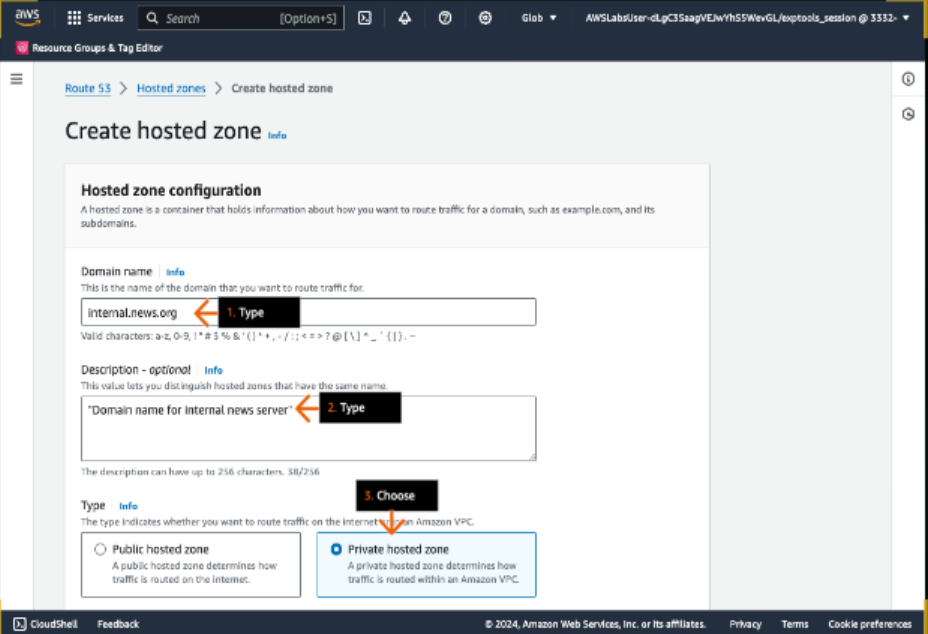

Concept
When creating a provate hosted zone, if the correct VPC is not selected, the DNS resolver will not route your traffic correctly.

25. Scroll down to VPCs to associate with the hosted zone.
26. For Region, choose US East (N. Virginia) [us-east-1].
27. For VPC ID, on the dropdown menu, choose the ID that contains dns-lab/VPC.
28. Click Create hosted zone.

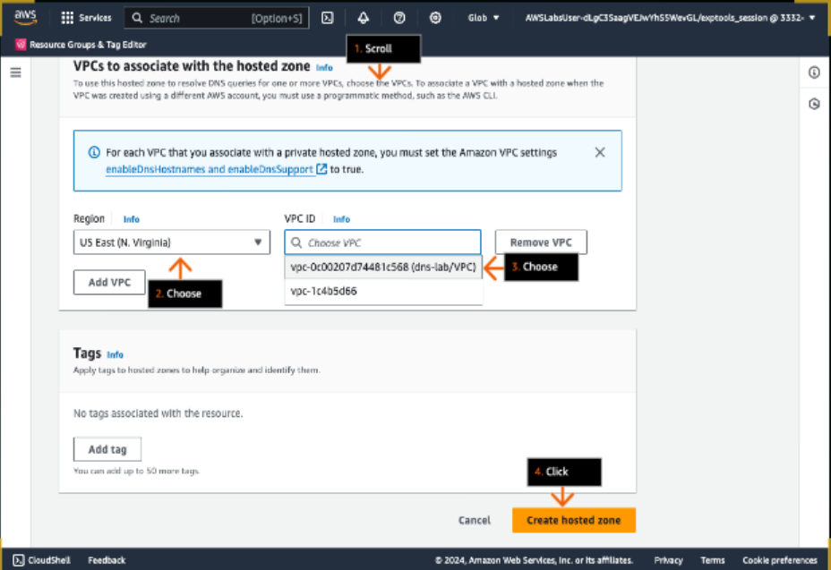

Concept
When you create a hosted zone, Route 53 creates a name server record and a start of authority record.

29. On the Records tab, click Create record.

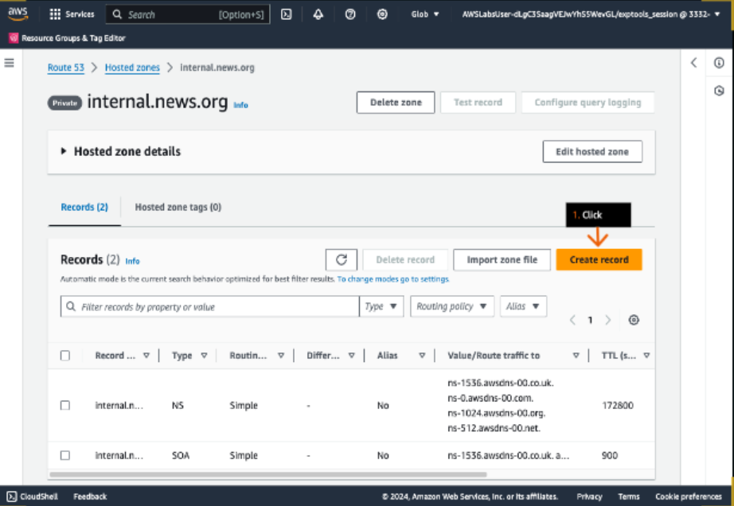

Concept
An A record maps a domain name to the IP address of a host server. Always specify a Time to Live (TTL) for each record so that DNS resolvers can cache your DNS records to the length of time specified through the TTL. A simple routing policy is used for a single resource, such as a domain name.

30. In the Quick create record section, for Record name, type: 
thewhitepaper

31. For Record type, choose  A - Routes traffic to an IPv4 address and some AWS resources.
32. For Value, paste the IP address that you copied to your text editor in an earlier step.
- This is the IP address of the Internal News Server.

33. For TTL, keep the default value of 300.
34. For Routing policy, keep the default of Simple routing.
35. Click Create records.

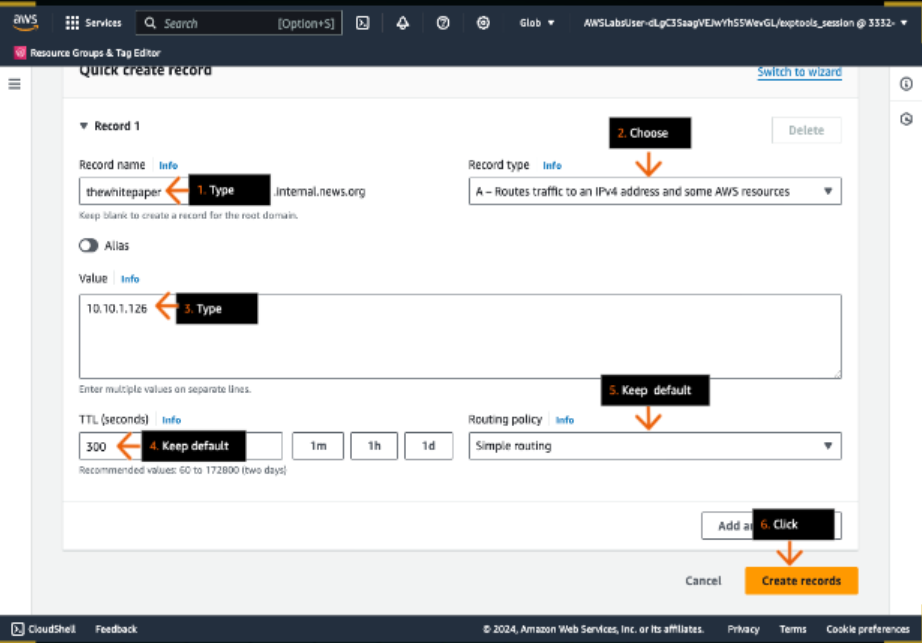

Concept
When you update a record set in your hosted zone, the change is propagated to all Route 53 edge locations within 60 seconds.

36. On the Records tab, review the new A record.

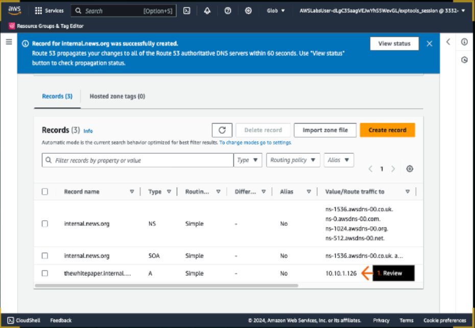

37. In the Session Connect terminal in the other browser tab, to ping your Internal News Server, run:
ping thewhitepaper.internal.news.org
- If the name does not resolve, wait one minute and try the ping command again.

38. Review the successful responses.
39. To end the ping command, on your keyboard, press Ctrl+C.

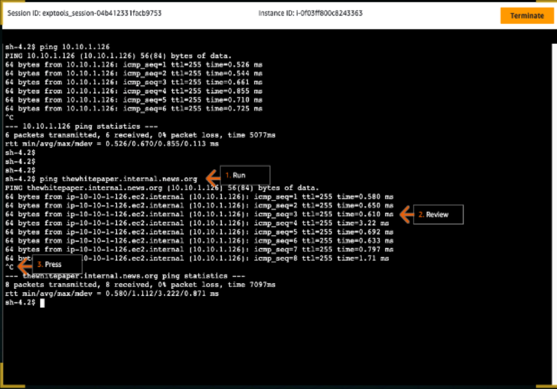