# Cloud First Steps

## Learn
Solution Request
Deploy the stabilization system across two EC2 instances in separate AZs.

This solution enhances the island's stabilization system reliability and availability  by migratins its computational module from in premises infrastructure to the AWS Global Infrastructure.

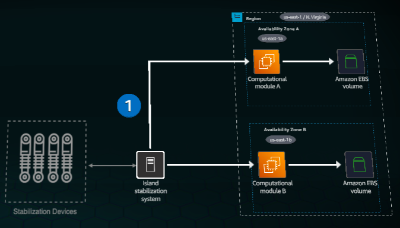

The computational module migration uses Amazon EC2 compute capacity in the US East (N.Virginia) Region.

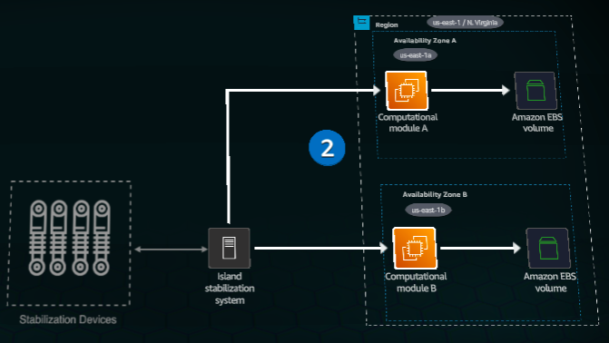

An AWS Region is a geographical cluster of data centers. Each Region contains three or more Availability Zones (AZs), providing a 99.99 percent service level agreement (SLA). Each AZ consists of one or more discrete data centers with redundant power, networking, and connectivity.

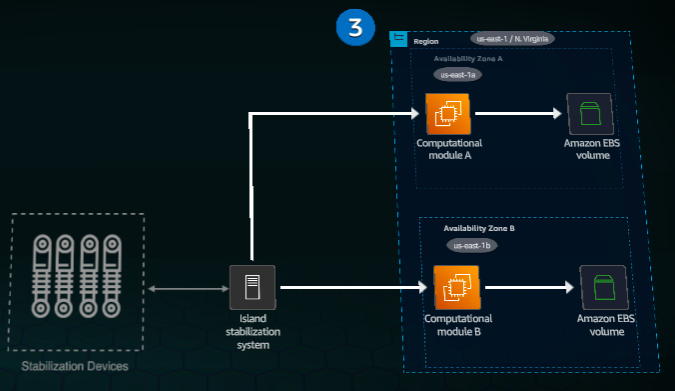

The computational module's data resides on an Aazon EBS volume attached to the EC2 instance. Amazon EBS delivers high performance block storage optimized for Amazon EC2.

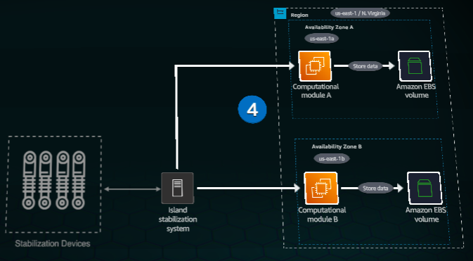

The module is accessible through its public IP address or DNS name.

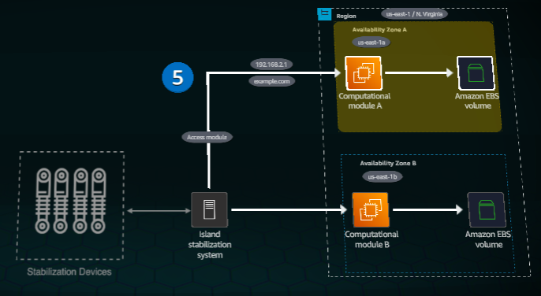

Availability improvements are achieved by running the computacional mosule on separate EC2 instances across multiple AZs within the Region. AZs are identified by an AWS Region code with a letter identifier (for example, us-east-1a).

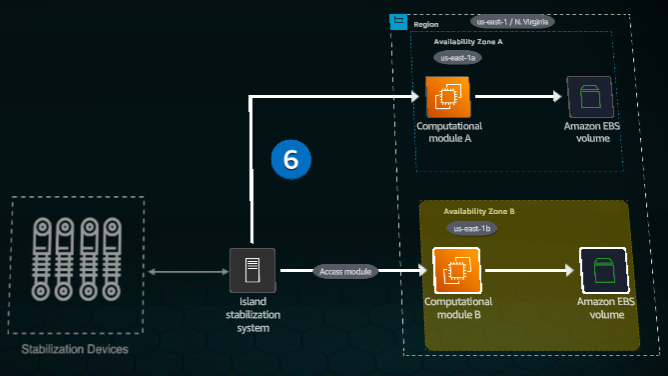

## Practice
Concept
In this practice lab, you will:
- Launch an Amazon EC2 Instance.
- Configure a user data script to display theinstance details in a browser.

1. On the top navigation bar, review the Region selector to confirm that the Region is set to N. Virginia (us-east-1).
2. In the Services search box, type: s3

3. In the search results, under Services, click S3.

Concept
An AWS Region is a geographic location with multiple data centers organizd into at least three AZs. Each AZis isolated from the others, providing reduundancy within the Region.

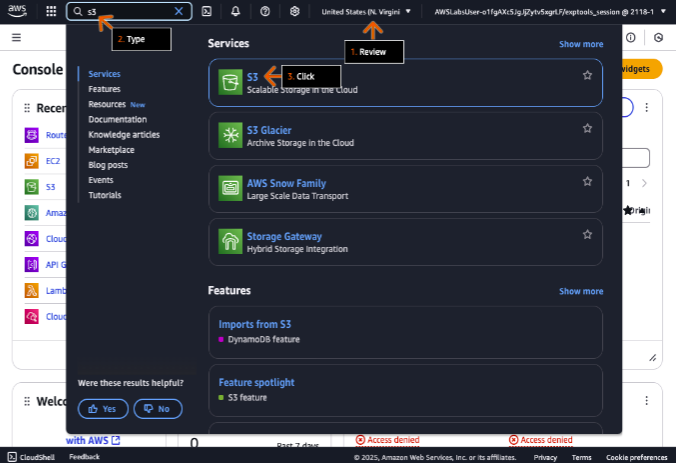

4. On the General purpose buckets tab, click the bucket name that starts with cloud-first-steps-.

Concept 
Amazon Simple Storage Service (Amazon S3) stores data as objects within buckets. An object consists of a file and its metadata, while a bucket is a container for ojects. To use S3, first create a bucket with a name and Region, then upload objects to it. Each object needs a unique key name to identify it within the bucket.

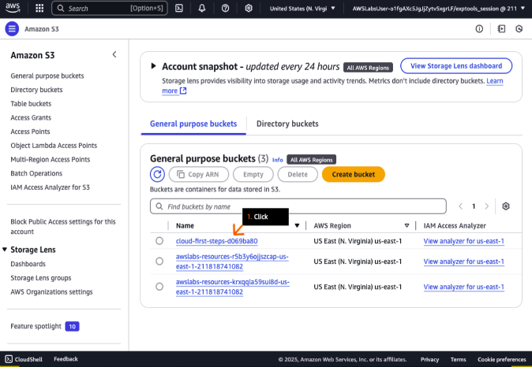

5. On the Objects tab, choose the checkbox to select the user-data.txt file.
6. Click Open.

- The file opens in a new browser tab (or window).

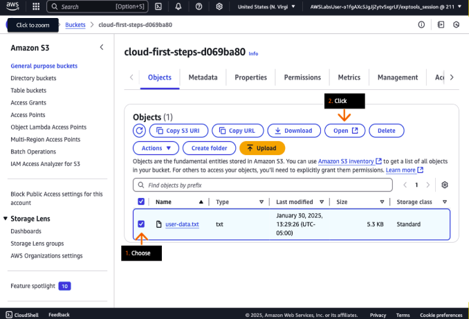

7. In the new browser tab, review the file contents.

- This script installs a web server that displays instance information on port 80.
- Note that the code block in your file might be longer than what is displayed in the screenshot example.

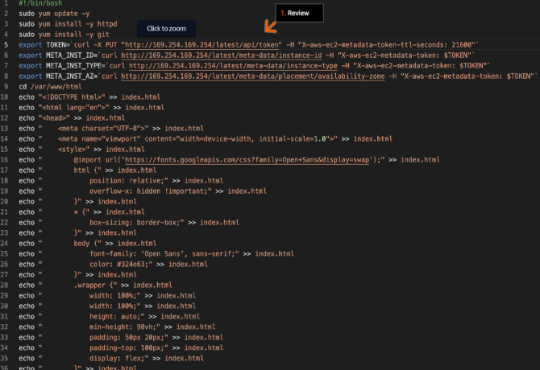

Concept: 
When launching an Amazon Elastic Compute Cloud (Amazon EC2) instance, you can provide user data to automate setup tasks and run startup scripts.

8. In the other browser tab, return to the Objects tab on the Amazon S3 console.
9. To save the user-data.txt file to your device, click Download.

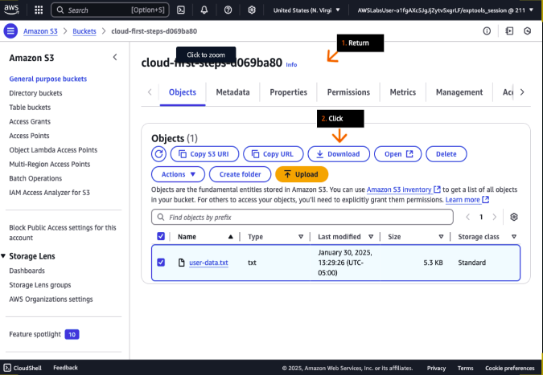

10. In the top navigation bar seac box, type EC2.

11. In the search results, under Services, click  EC2.

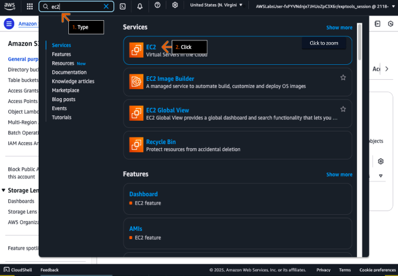

12. On the Dashboard, click Launch Instance.

Concept:
An EC2 instnace is a virtual server in the cloud.

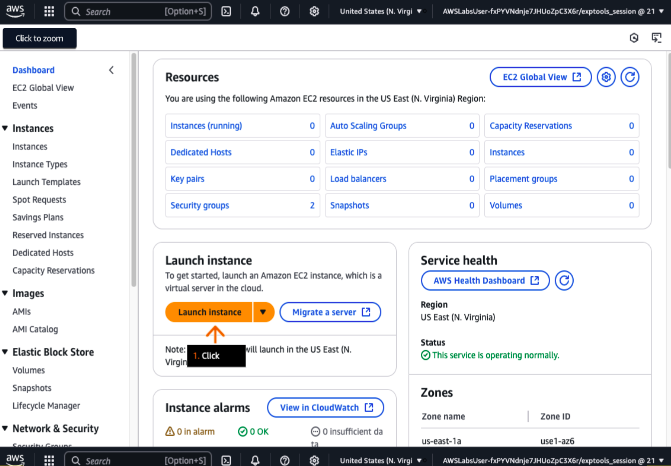

13. In the Name and tags section, for Name, type a name that you like, such as webserver01.
14. In the Application and OS Images section, under Quick Start, choose Amazon Linux.

Concept:
An Amazon Machine Image (AMI) is a template containing the operating system and software configuration for an instance. Each instance requires an AMI,so you can launch multiple instances with identical configurations or differentes instances with varying configurations.

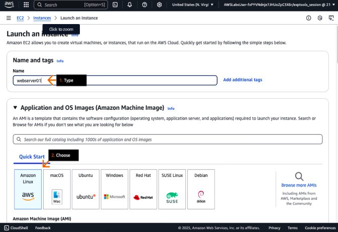

15. For Amazon Machine Image (AMI), on the dropdown list, keep or choose Amazon Linux 2023 AMI.
16. For Instance type, click Compare instance types.

Concept
Instance types determine the hardware resources available to your instance. These types are grouped into families based on compute, memory and storage capabilities.

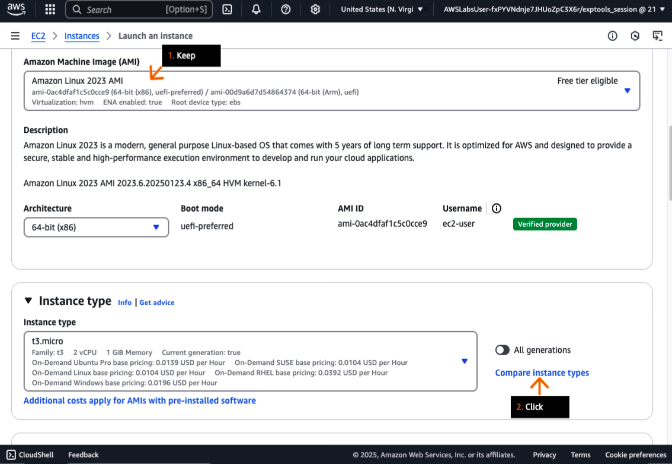

17. In teh Instance Types section, review the available instances and their associated resources.
18. Choose the t3.micro instance type.
19. Click get advice.

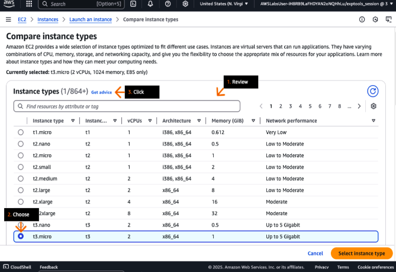

20. To see instance type and family recommendations for various workloads, in the pop-up box, review the different instance type requirements.

- You can use the dropdown lists to experiment with different requirements, clicking Get instance type advice for each new requirement.

21. When finished, close the pop-up box.
22. At the bottom of the page, click Select instance type.

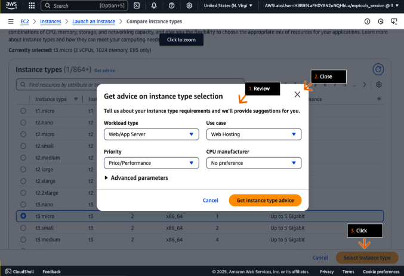

23. Review to confirm that the t3.micro instance type is selected.
24. For Key pair name, choose Proceed without a key pair. 
25. In the Network settings section, click Edit.

Concept
Amazon EC2 uses public key cryptography to secure login information. A public key encrypts the data, while a private key decrypts it. Together, tehese form a key pair.

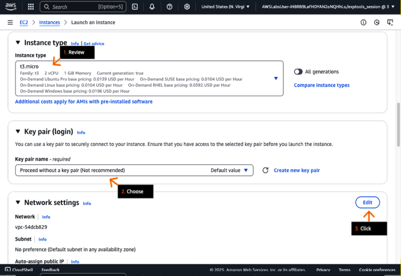

26. For VPC, choose cloud-first-steps/LabVpc.

- Your solution will fail if you do not choose this VPC.

27. For Subnet, choose the subnet in the us-east-1a Availability Zone.

- Note the AZ choices on the dropdown list. In the upcoming DIY section of this solution, you must choose the subnet in the other AZ.

**Concept**
A Virtual Private Cloud (VPC) is a dedicated virtual network in your AWS Account. A VPC exists within a Region, while its subnets must each reside in a single Availability Zone.

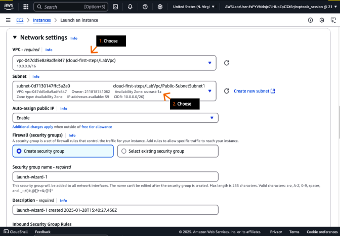

28. For Security group name, type: Lab-SG

29. For Description, type: HTTP Security Group

30. For Type, choose HTTP.
31. In the warning alert, review the message.

- Port 80 (HTTP) is accessible from the internet. While web servers need public access, security group rules should be as restrictive as possible.

**Concept**
A Security Group acts as a Virtual Firewall that controls traffic for instances. Each instance can use multiple SG, or the default SG applies. SG rules determine which traffic can flow to and from associated instances.

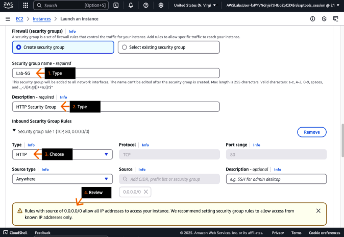

32. In the Configure storage section, keep the default section of an 8 GiB gp3 volume.

33. Click to expand advanced details.

**Concept**
The root device volume contains the image used to start your instance. General Purpose SSD volumes (gp2 and gp3)use solid-state drive technology to provide balanced price and performance.

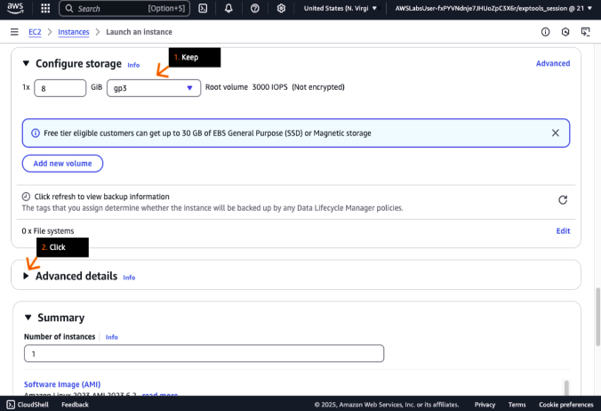

34. For User data, click Choose file.
35. In the pop-up box (not shown), choose the user-data.txt file that you downloaded to your device in an earlier step, and then review the file contents.

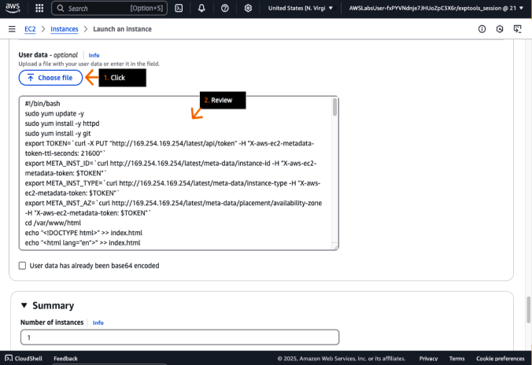

36. Review the Summary section.  
- When your browser is fully expanded, this section floats on the right side. 

37. Click Launch instance.

**Concept**
We recommend reviewing all instance configuration settings before launching.

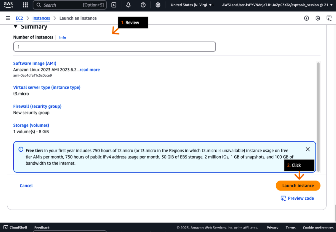

38. In the success alert, review the message

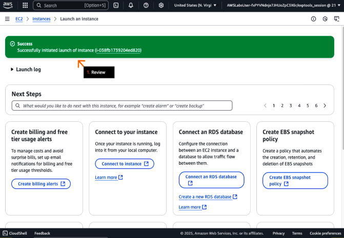

39. At the bottom of the page, click view all instances.

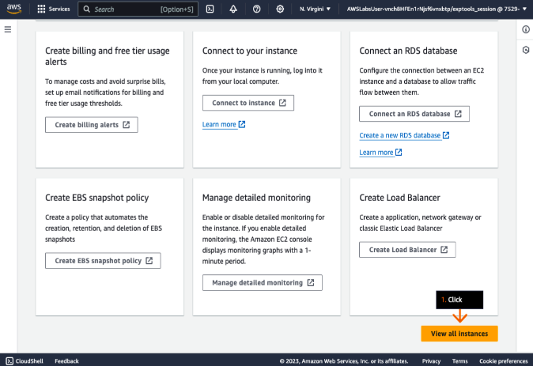

40. In the Instances section, choose the checkbox to select the available EC2 instance.
41. Wait 2–3 minutes, and then click the section's refresh icon.
42. Under Instance state, review to confirm that the instance is now running.

- The change from Pending to Running might take several minutes, and you might need to refresh several times.

43. For the running instance, on the Details tab, under Public IPv4 DNS, click the copy icon to copy the provided address.

- Do not click the "open address" link.

**Concept**
A new instance starts in he pending state before entering the running state when ready to use.

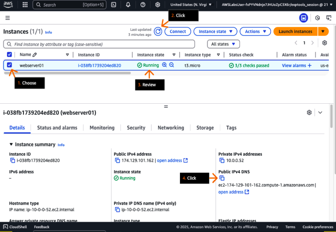

44. In a new browser tab (or window) address bar, type:

http://

45. Next to http://, paste the DNS address that you just copied and press Enter.
46. On the page, review the details about your instance.

- If you see a connection timeout message when opening the webpage, check that the address begins with http:// and not https://.
- The public DNS and the security group are used to access the instance details that appear on the webpage. The public DNS record translates a domain name to an IP address. The record informs the browser which server to connect to.

**Concept**
Amazon Route 53 is a DNS service that converts domain names (example.com) to IP addresses (192.0.2.1), routes users to applications, and provides reliable, cost-effective DNS management.

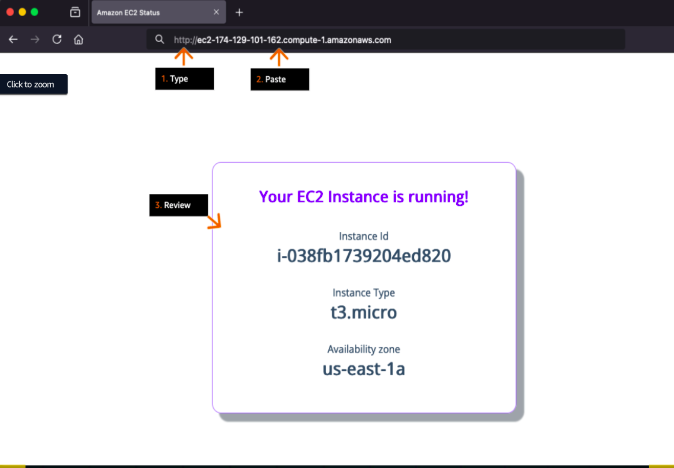

## DIY
- Launch a second EC2 instance in a different AZ in the same region.