# Learn
Create an AWS CloudFormation stack from sample code. After the stack is created, use it to deploy specified resources.

AWS CloudFormation helps you model a collection of resources, provision them quickly and consistenly, and manage them throughout their lifecycles by treating infrastructure as code.

This solution uses CloudFormation to create resources, called stacks. The definitions for the resources to be created are listed in a file, called a CloudFormatino template.

The template for this solution defines two main AWS resources: an instance EC2 and a bucket in Amazon S3.

Based on the template, CloudFormation determines the correct operations to perform, provisions resources in the most efficient way possible, and automatically rolls back changes if errors are encountered.

CloudFormation treats infrastructure as code, which is an efficient way to model resources, provision them quickly and consistenly, and manage them throught their lifecycles.

# Practice
In this lab, you will:
- Read a basic YAML stack in AWS CloudFormation.
- Create and deploy a basic CloudFormation stack.

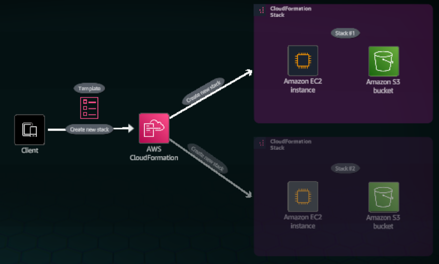

Concept
Using AWS CloudFormation, you can model, provision and manage AWS resources and third party resources by treating infrastructure as code.

1. In the top navigation bar search box, type: 
cloudformation
2. In the search results, under Services, click CloudFormation.

Concept
Code your infrastructure from scratch with the CloudFormation template language, in either YAML or JSON format, or start from many available AWS sample templates.

3. On the Stacks page, click Create stack to expand the dropdown menu.
4. Choose With new resources (standard).

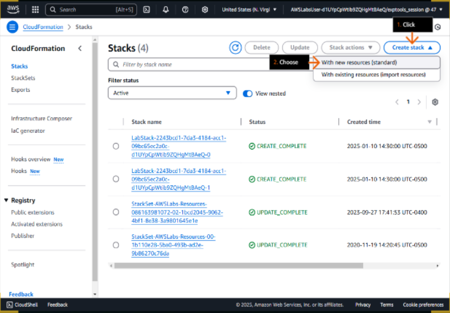

Concept 
If you are unfamiliar with JSON or YAML, you can use AWS CloudFormation App Composer, a tool for visually creating and modifying templates, to help you get started.

5. In the Create stack step, for Prerequisite - Prepare template, choose Build from Infrastructure Composer.
6. Click Create in Infrastructure Composer.

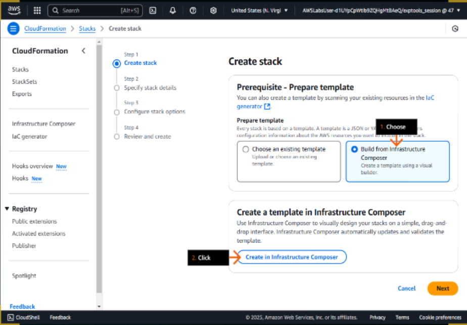

7. Click the Template tab.
8. Review the toggle to ensure it is set to YAML.

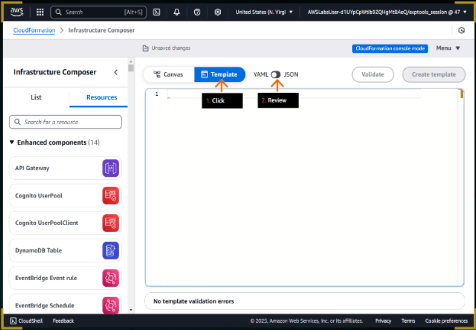

Concept
The Resources code is the only required code. It specifies the stack resources and their properties.

9. In the sample_code.txt file that you downloaded earlier, copy the Step 1 contents, and then paste it into the editor pane.
- Be sure to keep the code indents.
10. Click the toggle to view the JSON equivalent of the template, then click to return to YAML.

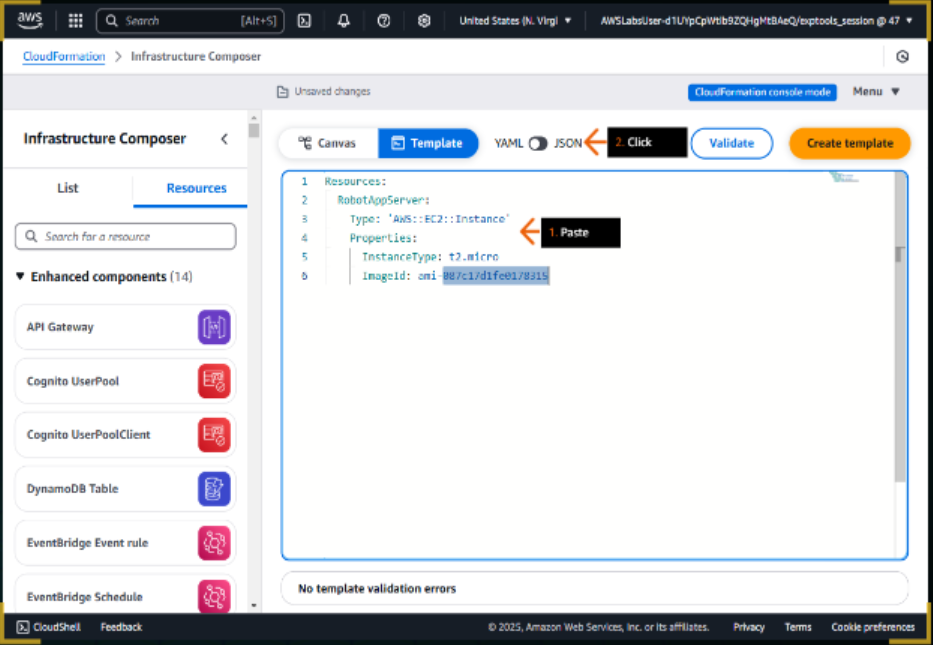

11. Click the Canvas tab to review the added resource.
- If the resource isn't displayed, check your code indents, compared to the screenshot in the previous step.

12. Click the Template tab.

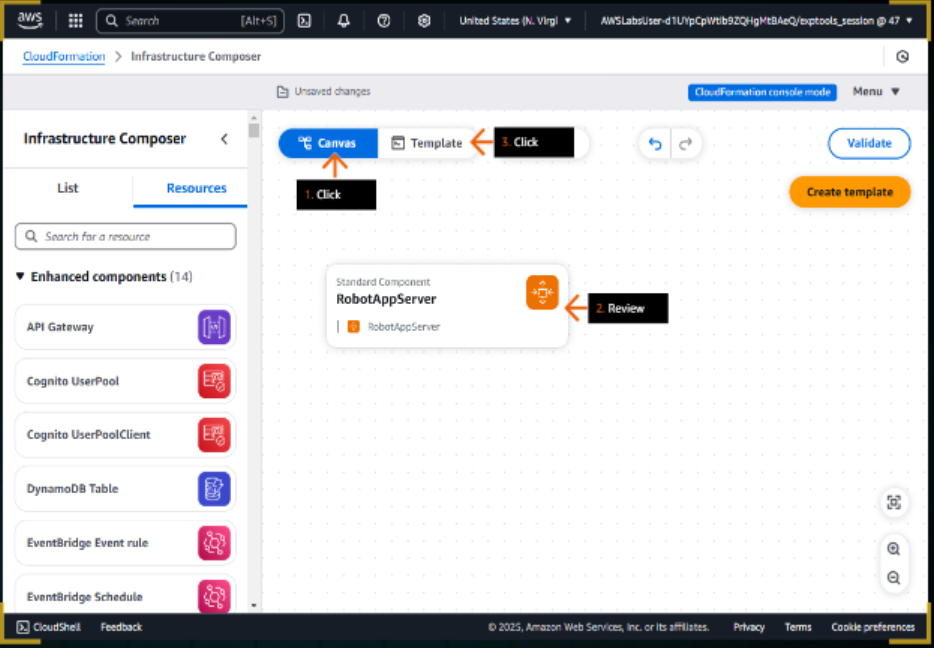

Concept
The AWS documentation defines which properties you can defin in a CloudFormation template.

13. In a new browser tab (or window) address bar, type:
https://docs.aws.amazon.com/AWSCloudFormation/latest/UserGuide/aws-properties-ec2-instance.html
and press Enter.

14. Under Syntax, scroll down to the YAML section. 
15. Review the list of property types that you can configure. 
16. Locate and click InstanceType.

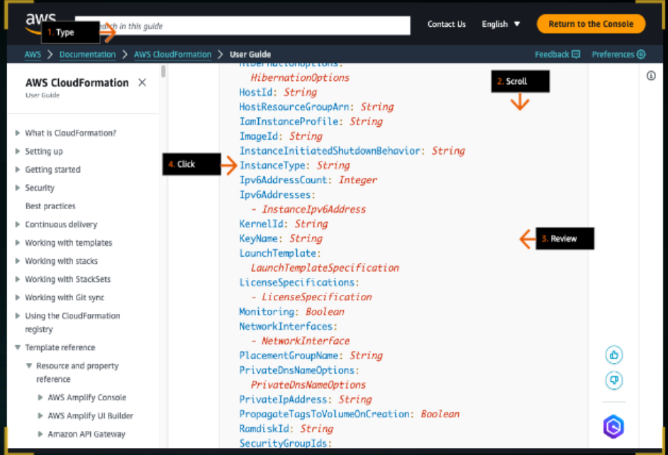

Concept
For each resource property, the documentation specifies a default value, wheter the item is required, the data type and the possible values for the attribute.

17.  For the InstanceType property, review the Required value.
- It determines if this property is required in your template.

18. Review the Type value.
- It specifies the value type.

19. Review the Allowed values.
- These include the different instance types that you can use with this property. See if you can find t2.micro.

20. Close this browser tab.

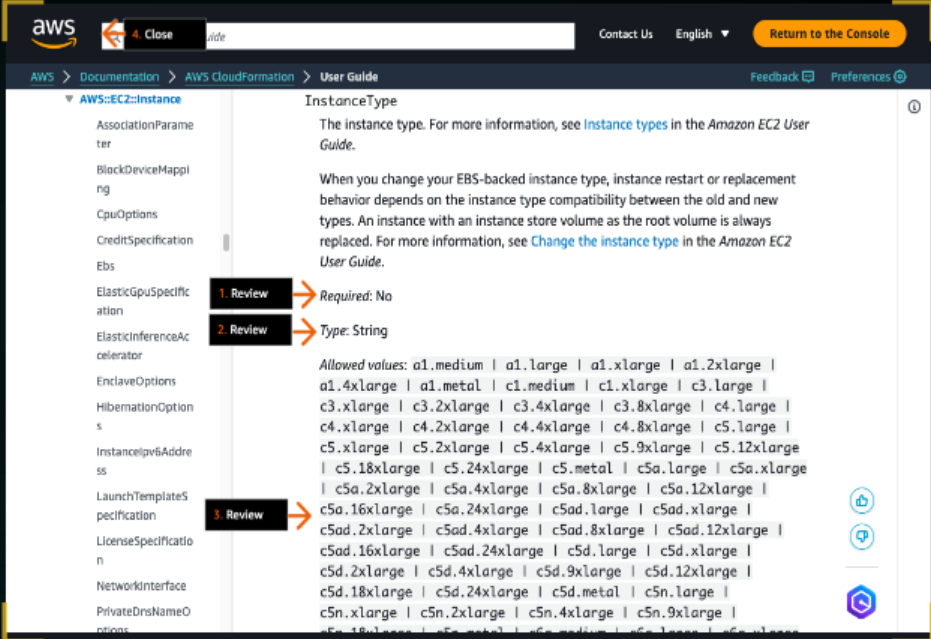

Concept
After you define the resources in your template, CloudFormation takes care of provisioning and configuring those resources for you.

21. In the sample_code.txt file that you downloaded earlier, copy the Step 2 contents, and then paste it into line 7 in the editor pane.
- Be sure the RobotAppSecurityGroup indent aligns with RobotAppServer and all other indents match the screenshot.

22. Click the Canvas tab.

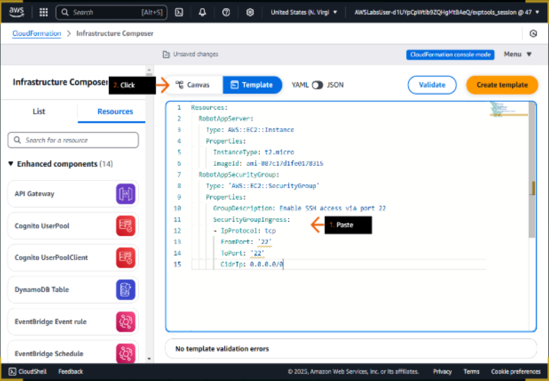

23. In the canvas pane, review to ensure that the RobotAppSecurityGroup resource was added.
- If the resource isn't displayed, check your code indents, compared to the example screenshot.

24. Click the Template tab.

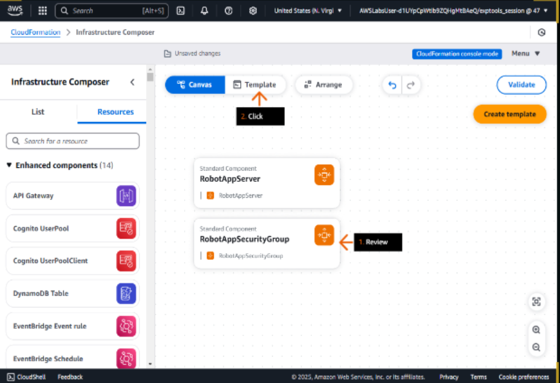

Concept
When you declare a resource in a template, such as an instance in Amazon EC2, you must attach it to another template resource, such as a security group. You can use the ref function to refer to that other resource.

25. In the sample_code.txt file that you downloaded earlier, copy the Step 3 contents, and then paste it after line 6.
- Insert an empty line after line 6, then paste.
- Be sure the indents are aligned with ImageId, matching the screenshot.
26. Click the Canvas tab.

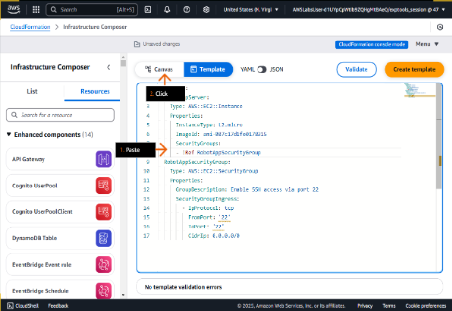

27. Review to ensure that RobotAppServer and RobotAppSecurityGroup are now connected.
- If the resources are not attached, check your code indents, compared to the example screenshot.
28. Click the Template tab.

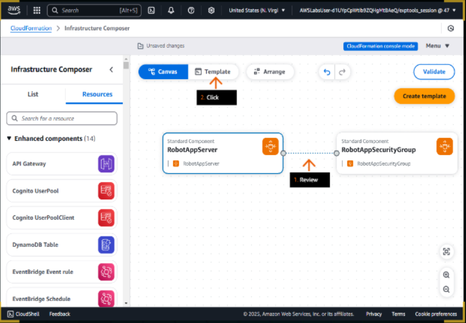

Concept 
When you use CloudFormation to create a bucket in Amazon S3 no properties are required. For example, if you 