# Serverless Foundation
Solution request: use AWS Lambda to run code withouth provisioning a server.

## Learn
In this solution, clients run synchronous calls on an AWS Lambda function.
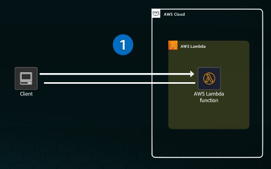

Lambda, part of the serverless offerings on AWS, can be used to run code withouth provisioning or managing servers so that customers pay only the resources that they use.

A client synchronously invokes the lambda function, which means that the invokation waits for the function to process the event and return a response.

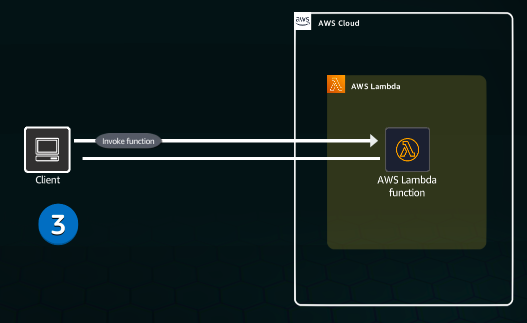

The Lambda function contains business logic code that processes the invokation. The code can be written in one of several supported programming languages.

Lambda uses compute power only when a function is invoked.

When the function code run is completed, a response is returned to the client.

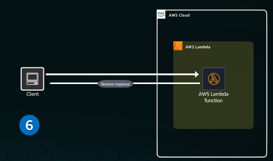

Functions can also be invoked asynchronously, which means that users don't need to wait for a response from the function code.

## Practice
Concept:
In this practice lab, you will:
- Use Python to create an AWS Lambda function.
- Deploy the Lambda function.
- Test the Lambda function.

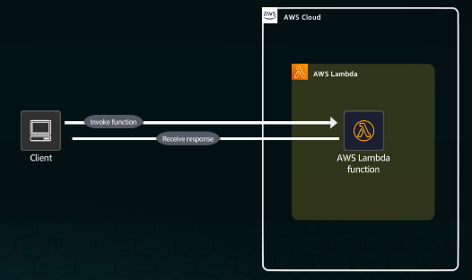

Concept: 
AWS Lambda runs your code only when needed, and it scale automatically from a few request per day to thousands per second. Using Lambda, you can run code for virtually any type of application or backend service, all with no administration.

1. On the top navigation bar, review the Region selector to ensure that the Region is set to N. Virginia (us-east-1).
2. In the Services search box, type: lambda

3. In the search results, under Services, click Lambda.

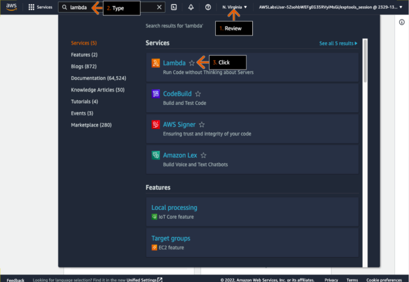

Concept: 
A Lambda function consists of code and any associated dependencies. A Lambda function also has configuration information associated with it.

4. In the Functions section, click Create function.

- You can safely ignore any Lambda functions that are already displayed in the section.

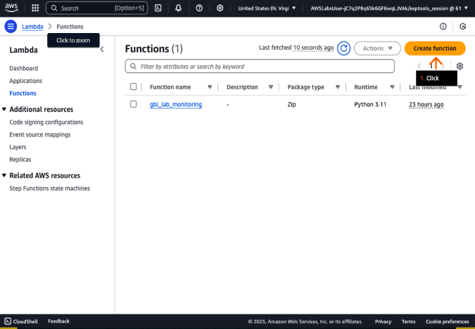

Concept
Lambda runtimes allow functions in different languages to run un the same base execution environment. You configure your function to use a runtime that matcehs your programming language.

5. For Create function, choose Author from scratch.
6. For Function name, type: LabFunction

- You can give a Lambda function any name that you like. 

7. For Runtime, on the dropdown menu, choose Python 3.11

- The available Python version in the AWS Management Console might be different from what is displayed in the screenshot example.

8. Scroll down the bottom of the page.

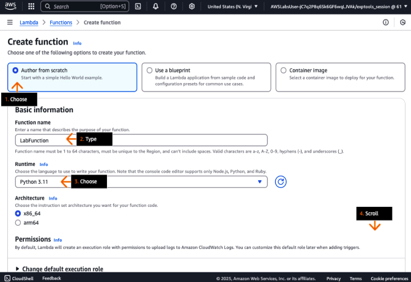

Concept:
A Lambda function's execution role is an AWS Identity and Access Mangemtn (IAM) role that grants the function permission to access AWS services and resources. You provie this role when you create a function, and Lambda assuems the role when your function is invoked.

9. Click to expand Change default execution role.
10. For Execution role, choose Use an existing role.
11. For Existing role, choose lab_function_role.
12. Click Create Function.

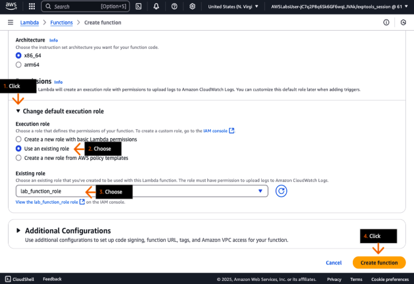

All runtimes share a common prohgramming model that defines the interface between youe code and the runtime code.

Concept:
Using the code editor on the Lambda console, you can write, test,a nd view the execution results of your Lambda function code.

13. On the labFunction page of the AWS Lambda console, scroll down to the Code tab.

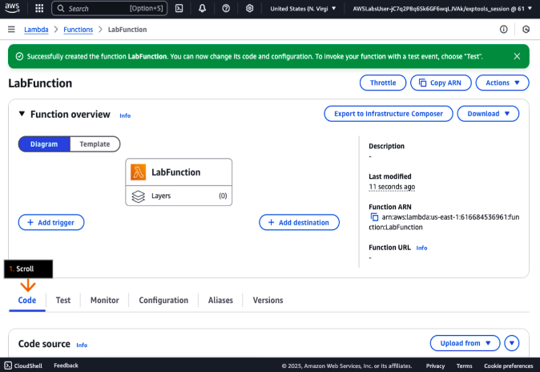

14. In the lambda_function code window, select (highlight) the code.
15. Delete the code.

Concept:
You tell the runtime which method to run by defining a handler in the function configuration, and the runtime runs that method. The runtime passes in objects to the handler that contains the invocation event and the context, such as the function name and request ID.

16. Paste the code from the sample_code.py file that you downloaded in an earlier step.

- You can open a .py file with IDLE (which comes with Python), Notepad++, or another text editor or IDE.
- Python code blocks are defined by their indentation, so maintain the indentation between copy and paste.

17. Click Deploy.

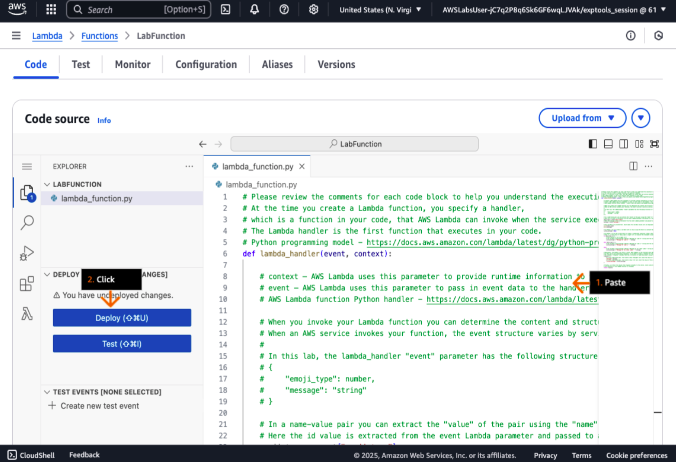

18. Review the code contents of the Lambda function.

- Reviewing and understanding the different parts of the Lambda function code is important for the next steps in the lab.

19. Review the parameters used in this Lambda function.

- Reviewing the parameters helps you with the later DIY section of this solution.

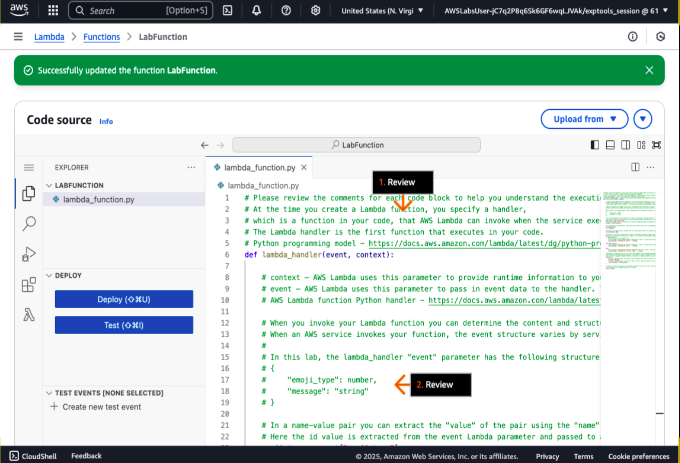

20. Review the print statements and the values used.
21. Review the if-else conditions in the Lambda function.

- You must update these items in the later DIY section.

22. Review the contents of the response section.
23. Review the return statement.

- When the labFunction is invoked, the response is returned by the return statement.

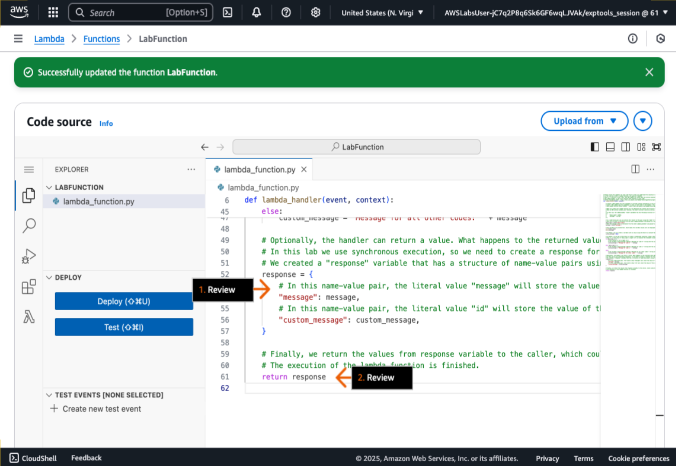

Concept: On the Lambda console, you can test your function locally. You can configure up to ten events per function. Test events you configure are not available to other users.

- To test the Lambda function, you must configure test event data for your function.

24. Click Test.

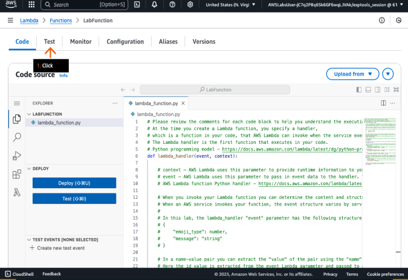

Concept: You can choose templates with sample events that come from other AWS services. You can also change keys and values in the sample JSON to test your code.

25. In the pop-up box, for Event name, type:

MyTestEvent

26. For Event sharing settings, choose Private.
27. For Template, choose Mobile Backend.

- The template name displays as mobile-backend-echo.

28. For Event JSON, type:

{
   "emoji_type" : 1,
   "message": "Hello world!"
}

- You can also copy-paste this text. You might receive an undefined value the first time that you try. The code should look similar to what is displayed in the screenshot example.

Concept: Lambda runs your function on your behalf. The handler in your Lambda function receives and then processes the test event.

29. Click Test.
30. In the Execution results window, review the results.

- The execution status should display as Succeeded, and the results should include the function response and function logs.

31. Scroll up to the top of the page.

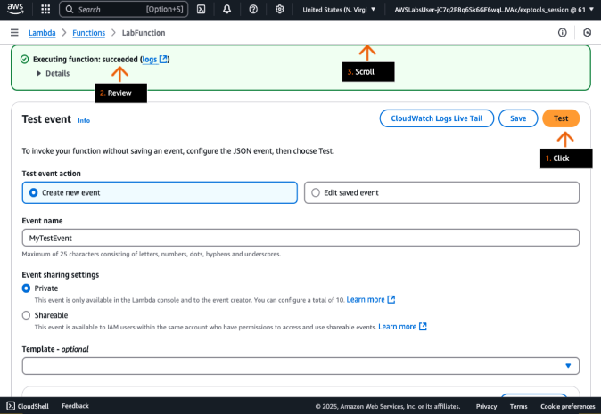

Concept: Lambda automatically monitors functions on your behalf, reporting metrics through Amazon Cloudwatch. Metrics include the number of request, the invocation duration per request, and the number of requests that result in an error.

32. To review the function logs in Amazon CloudWatch, click the Monitor tab.

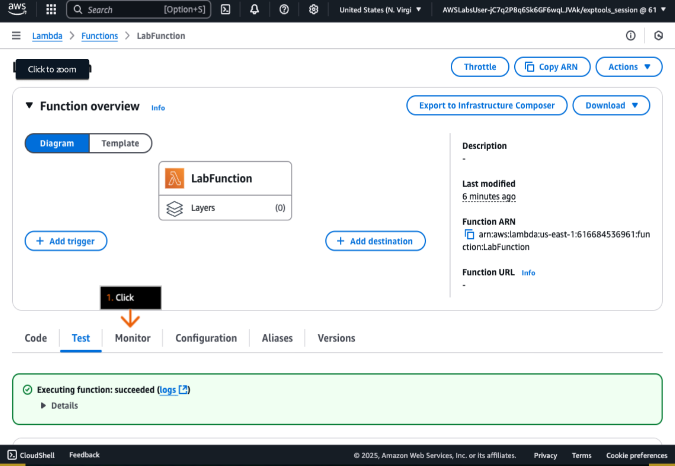

Concept: To help you troubleshoot failures in a function, Lambda logs all requests handled by your function, and also automatically stores logs generated by your code, through Amazon Cloudwatch logs.

33. Click View CloudWatch logs.  

-  The Amazon CloudWatch console opens in a new browser tab (or window). 

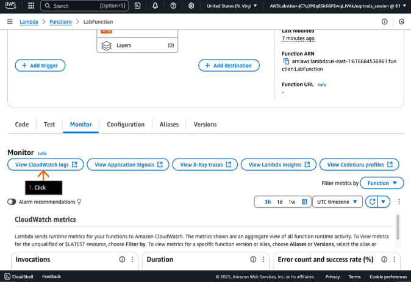

Concept: A log stream is a sequence of log events that share the same resource. Your Lambda function comes with a log group in Amazon Cloudwatch logs. The logs include a log stream for each instance of your function.

34. On the Log streams tab, click the first log stream.

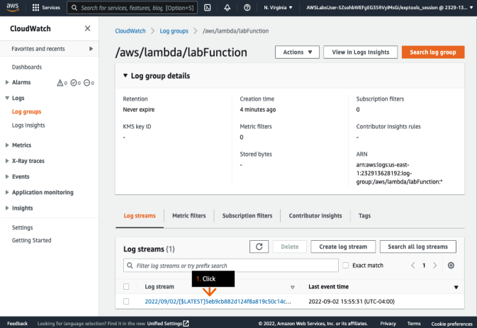

Concept: The Lambda runtime sends details about each invocation to the log steram. The runtime then relays logs and other output from your function's code.

35. Review the labFunction logs.

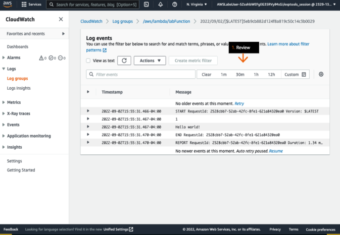

Concept: You can create JSON test events for your function on the Test tab.

36. Return to the AWS Lambda console in the previous browser tab, and then click the Test tab.
37. Scroll down to Event JSON

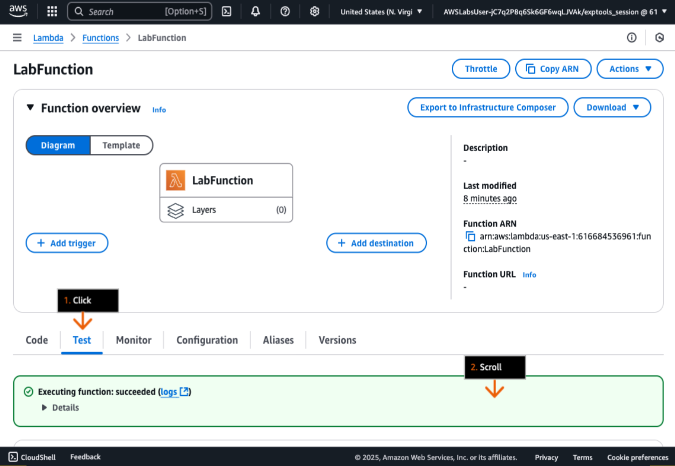

Concept: Saved test events are also available on the Code tab, on the Test deopdown menu. After you create one or more test events, you can invoke your function using one of your tests as an event.

38. For Test event action, choose Edit saved event.
39. For Event JSON, change the emoji_type value to 3.
40. At the top of the Test event section, click Save.

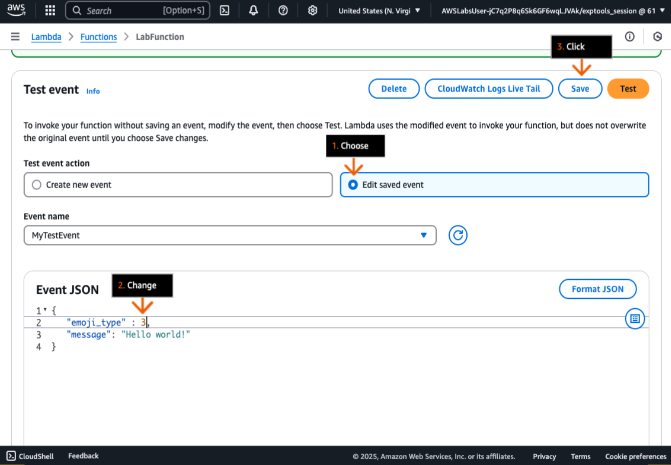

41. In the success alert, review the message.

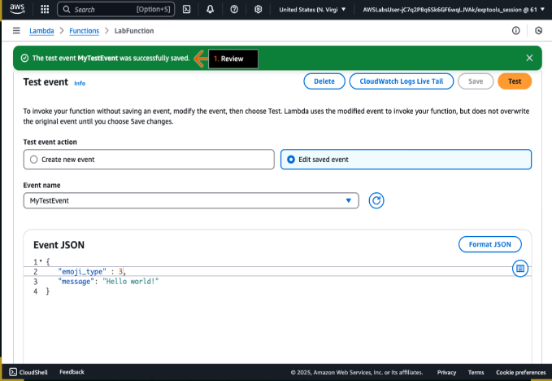

42. Click test.

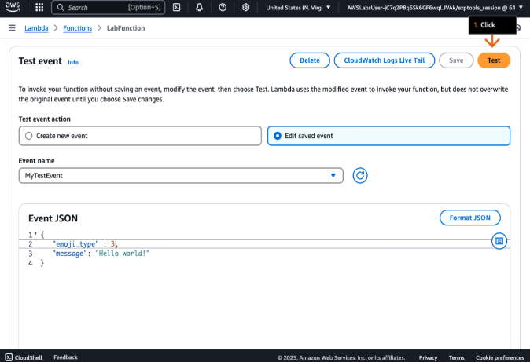

Concept: The execution results panel displays details about the test.

43. In the Execution result: succeeded section, click to expand Details.
44. Review the response results.

- For the emoji_type value of 3, custom_message displays a different message. 
- You can review the if-else block of the labFunction code to see all the conditions.

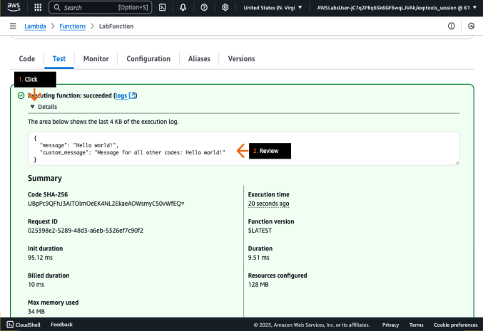

# DIY
Modify the Lambda function code to display different feeling values based on the emoji_type value in the JSON element.

The test servers will transmit a JSON object, containing the emoji_type identification element and a random message, to your Lambda function. 

{
    emoji_type:0,
    message: i love the park
}

Update the Lambda function by using the following rules:
emoji_type:0  returns feeling positive
emoji_type: 1 returns neutral
emoji_type: any any other value than 0 and 1, returns feeling negative

The Lambda function must return:
{
    feeling: positive,
    message: i love the park
}

Based on the sample code:
- Update the if else block to add a variable for the feeling attribute
- The feeling attribute is case sensitive
- Change the response section of the code to add the feeling attribute instead of custom_message
- Click Deploy to save code changes

