# Container Services
# Practice
In this practice, you will:
- Create a Docker image for an app.
- Create an Amazon ECR repository, and then push the Docker image to it.
- Deploy an app with Amazon ECS and AWS Fargate by using an image from Amazon ECR.

Concept
An Amazon Elastic Compute Cloud (Amazon EC2) instance is a virtual server in the cloud.

1. On the top navigation bar, review the Region selector to confirm that the Region is set to N. Virginia (us-east-1).
2. In the Services search box, type: ec2
3. In the search results, under Services, click EC2.

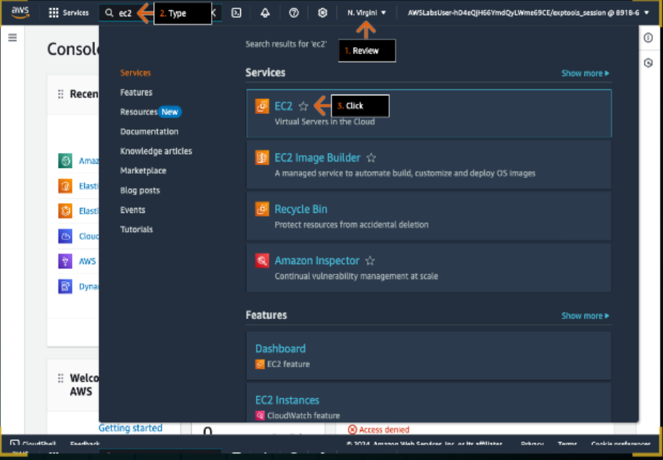

4. In the left navigation pane, click Instances.
5. In the Instances section, choose the check box to select Util-Server.
6. Click Connect.

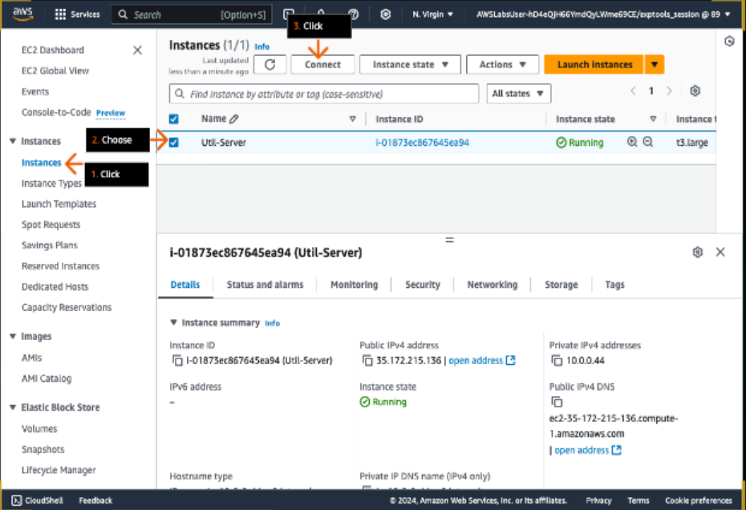

Concept
Session Manager provides secure and auditable node management without the need to open inbound ports, maintain bastion hosts or manage SSH keys. Using Session Manager you can also comply with corporate policies that require controlled access to managed nodes, strict security practices and fully auditable logs with node access details, while providing end users with one click cross platforms access to your managed nodes.

7. Click the Session Manager tab.
8. Click Connect.
- The Session Manager terminal opens in a new browser tab (or window).

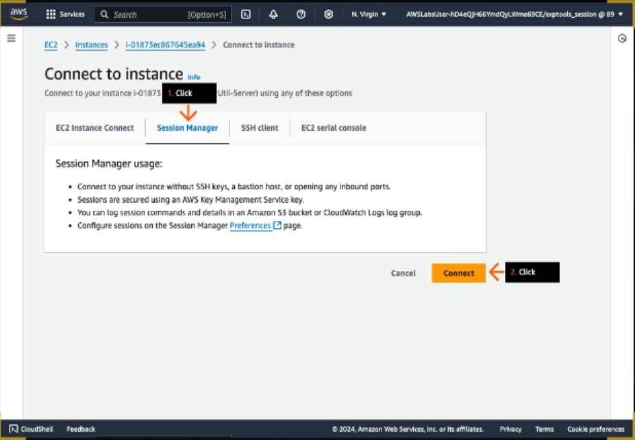

Concept
After you are connected to the instance, you can control the instance by using AWS Command Line Interface (AWS CLI) commands. The command prompt behaves as if you are connected locally.

9. To switch to ec2-user, in the terminal window, at the command prompt, run (type the command and press Enter):
sudo su - ec2-user
- You can also copy-paste this text. If you receive an undefined value when you paste this, try again.

10. To list the files, run:
ls -al
- Review the output. The lab-codes.zip file contains all the files required for this solution.

11. To unzip the contents of the lab-codes.zip file, run:
unzip lab-codes.zip

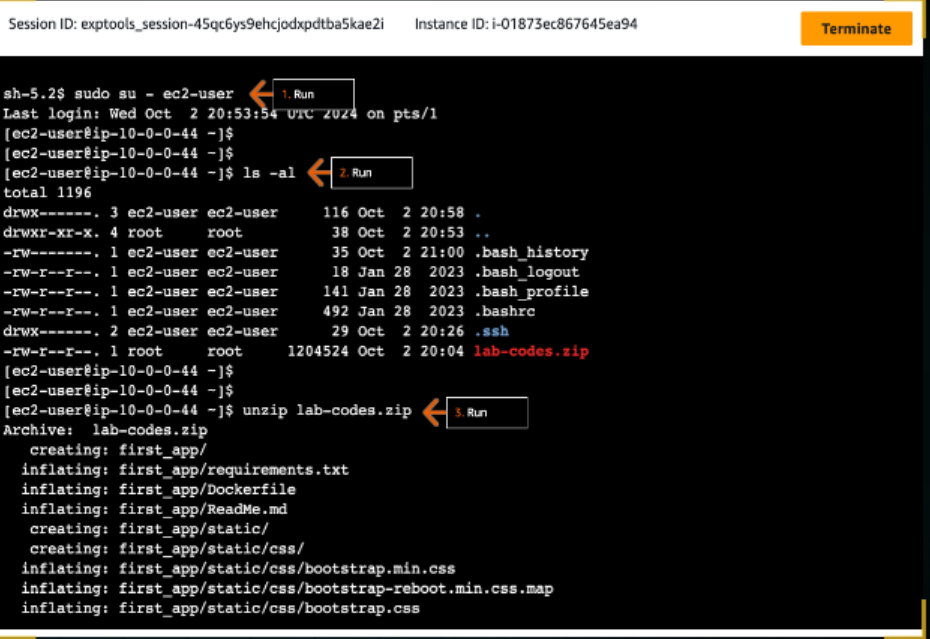

Concept
In UNIX/LINUX systems, as well as MS-DOS and Microsoft Windows, the tree is a recursive directory listing program that produces a depth-indented listing of files.

12. To view the unzipped content, run:
ls -ltrh
- Three folders are created.
13. To view the file structure of a specific folder, replacing <FOLDER_NAME> with the name of one of the three folders, run:
tree <FOLDER_NAME>
14. Review the file structure.

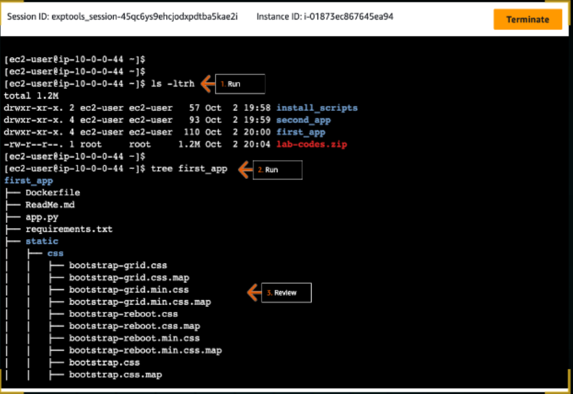

Concepts
Docker packages sotfware into standarized units called containers that have everything the software needs to run, including libraries, system tools, code and runtime.
You can use Docker to build, test and deploy apps quickly.

15. To install and start Docker in your environment, run.
./install_scripts/install_docker.sh 
- Make sure to include the period (.) before the forward slash in the command.

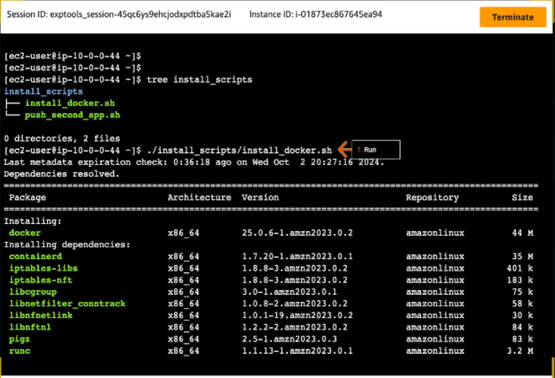

16. To check that Docker is running:
docker ps
- The output lists the running Docker containers.
- In this case, the list should be empty.

Concept
A Dockerfile describes the image we want to build. It contains the commands used to assemble the conatiner. A Docker uses significantly less resources than a fully OS because it takes advantage of the OS on the host machine for its basic operations.

17. To go to the first_app folder, run:
cd first_app
18. To view the Dockerfile, run:
cat Dockerfile
19. Review the Docker file contents. 
- This Dockerfile uses the python:3.11.6-slim-bookworm image. The RUN instruction installs the Python packages, and the CMD instruction runs the Flask application.

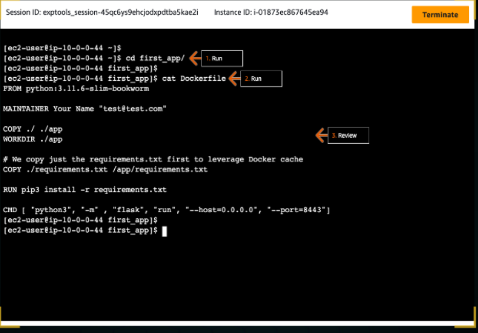

20. To set the value of the Region, run:
region=${region:-us-east-1}
21. To set the variables repo_name, run:
repo_name="my_app"
22. To set the account, run:
account=$(aws sts get-caller-identity --query Account --output text)
23. To set the fullname, run:
fullname="${account}.dkr.ecr.${region}.amazonaws.com/${repo_name}:latest"

Verify:
echo $repo_name
echo $account
echo $fullname

Concept
Amazon ECR (Elastic Container Registry) is a fully managed container registry that helps you store, manage, share and deploy your conatiner images and artifacts anywhere.

24. To create an Amazon ECR repository, run:
aws ecr create-repository --repository-name "${repo_name}"
25. To retrieve an authentication token, run:
aws ecr get-login-password --region ${region}|docker login --username AWS --password-stdin ${fullname}
- The AWS CLI "get-login-password" command authenticates Docker to an Amazon ECR registry.

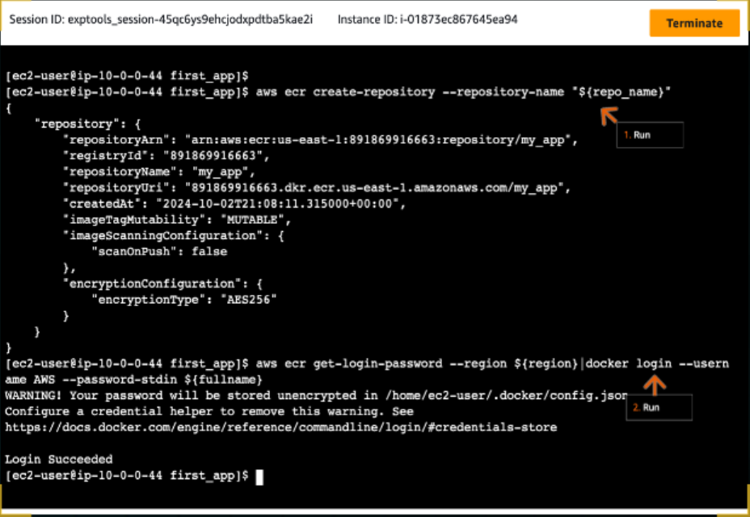

Concept
The Docker build command builds Docker images from a Dockerfile and a context. A build's context is the set of files located on the specified PATH or URL.

26. To create, build, and tag Docker images locally, run following commands one at a time:
cd /home/ec2-user/first_app
docker build -t ${repo_name} .
- Make sure to include the space and period (.) at the end of the second command.
- Make sure you are running the second command inside the first_app directory.
- You can safely ignore the warning alert about running pip as the root user.

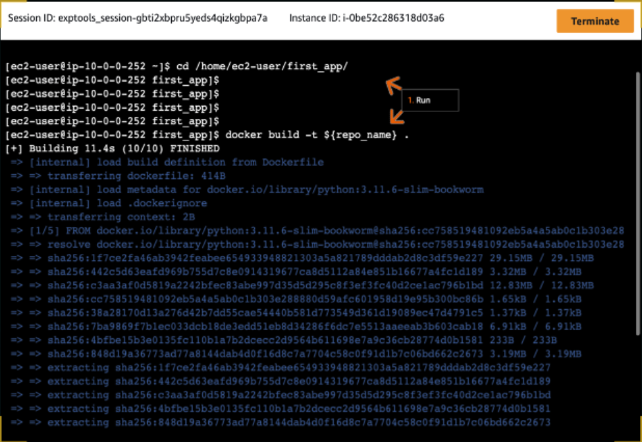

Concept
A Docker image contains app code, libraries, tools, dependencies and other files required to run an app.

27. To verify your Docker image, run:
docker images --filter reference=my_app
28. Review to confirm that your repo, named my_app, appears.

Concept
Amazon ECR is a managed AWS Docker Registry service. You can use Docker CLI to push, pull and manage images in your Amazon ECR repositories.

29. To push a Docker image to Amazon ECR, run the following commands one at a time.

docker tag ${repo_name} ${fullname}

docker push ${fullname}

Concept
Amazon ECR integrates with Amazon EKS, Amazon ECS, AWS Lambda and the Docker cli so you can streamline your development and production workflows.

30. To compile and push the image of the second_app to Amazon ECR, run the following commands one at a time.
cd /home/ec2-user/install_scripts/
./push_second_app.sh
31. Review the logs.
- The push_second_app.sh shell script automates manual steps to create the my_second_app image and push it to the Amazon ECR repository.

32. In the previous AWS Management Console browser tab, in the top navigation bar search box, type: 
registry
33. In the search results, under Services, click Elastic Container Registry.
34. In the left navigation pane, click Repositories.
35. On the Private tab, click the my_app repository name.

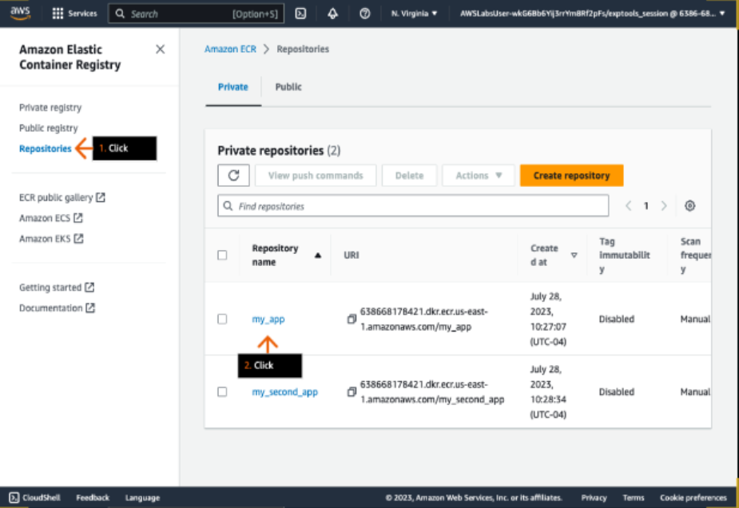

36. In the Images section, under Image URI, click Copy URI, and then paste it in the text editor of your choice on your device.
- You use this URI in later steps.

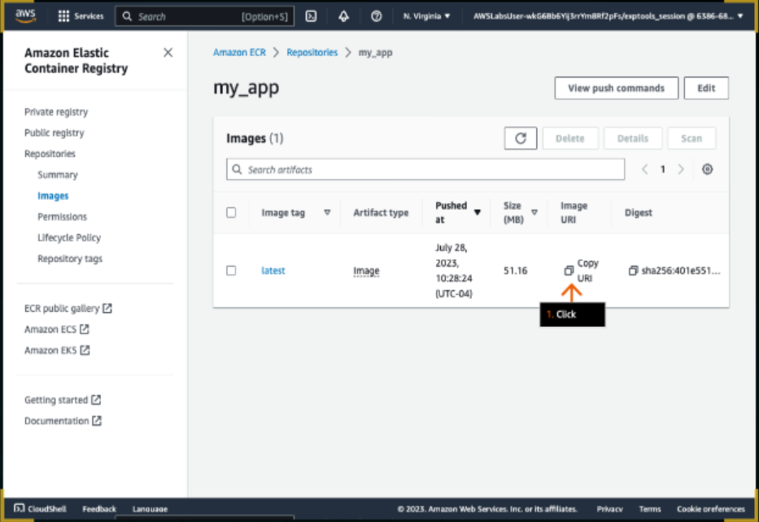

Concept
Amazon VPC gives you full control over your virtual networking environment, including resource placement, connectivity and security.

37. In the top navigation bar search box, type: 
vpc
38. In the search results, under Services, click VPC.
39. In the left navigation pane, click Your VPCs.
40. In the Your VPCs section, under VPC ID, review the VPC with Name Lab_VPC.

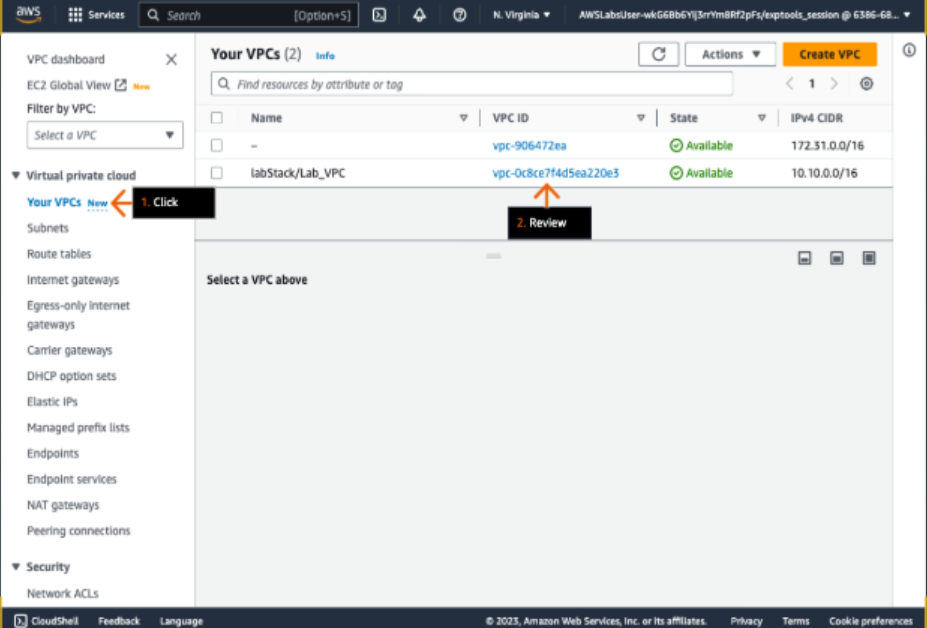

Concept
A security group acts as a virtual firewall for your instance to control inbound and outbound traffic.

41. In the left navigation pane, under Security, click Security groups.
42. In the Security groups section, under VPC ID, review to confirm that the VPC ID you just copied appears.
43. Choose the check box to select that same security group.
44. Below that section, click the Inbound rules tab.
45. Click Edit inbound rules.

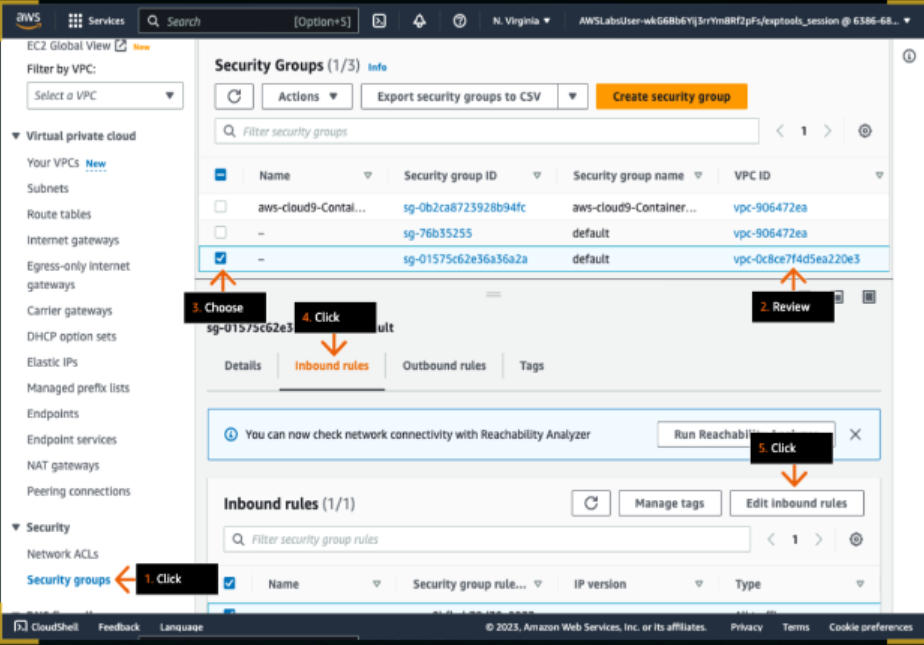

46. In the Inbound rules section, review the rule associated with this security group.
- All traffic allows the server associated with this security group to be accessible over the internet from any port.
- As a best practice, you should confine the security group to a particular port.
47. Click Delete.

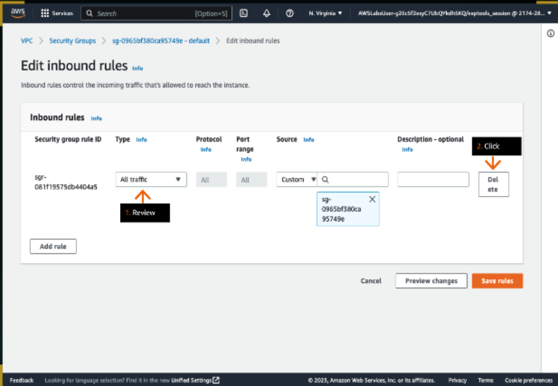

48. Click Add rule.
49. In the new rule, for Type, on the dropdown list, choose Custom TCP.
50. For Port range, type: 
8443
51. For Source, choose 0.0.0.0/0.
52. Click Save rules.

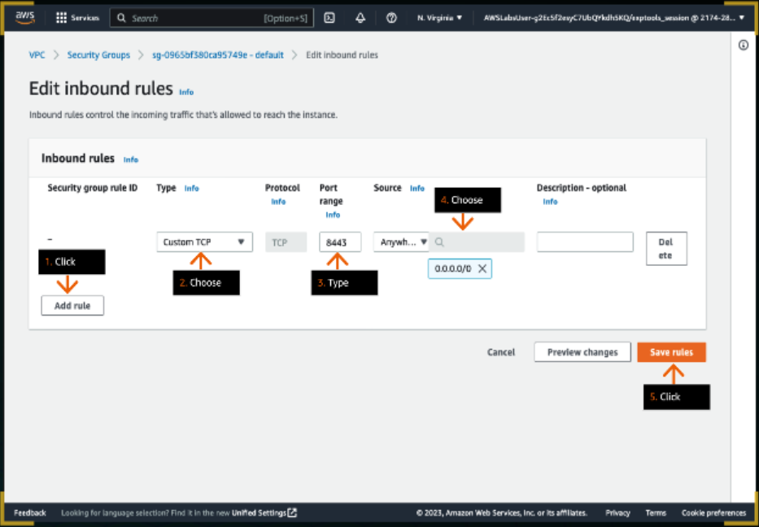

53. In the top navigation bar search box, type:
ecs
54. In the search results, under Services, click Elastic Container Service.

Concept
Amazon Elastic Container Service (Amazon ECS) is a fully managed container orchestration that helps you deploy, manage and scale containerized apps. There is no additional charge for Amazon ECS. You pay for the AWS resources (such as EC2instances or EBS volumes) that you create to store and run your app. You pay for only what you use, as you use it, there are no minimum fees and no upfront commitments.

55. In the Clusters section, review to see the Amazon ECS cluster, Lab_cluster.
- This cluster was created as part of the lab prebuild process.

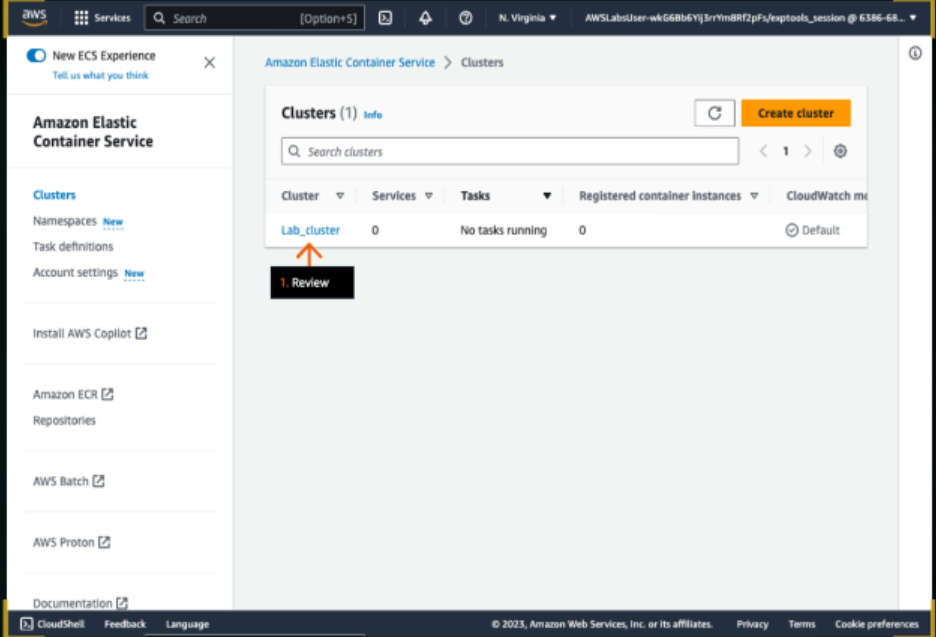

Concept
Using Tasks, you can define a set of containers that you would like to be placed together, (or as part of the same placement decision) define their properties, and define how they can be linked. Tasks include all the information that Amazon ECS needs to make the placement decisions.

56. In the left navigation pane, click Task definitions.
57. In the Task definitions section, click Create new task definition.

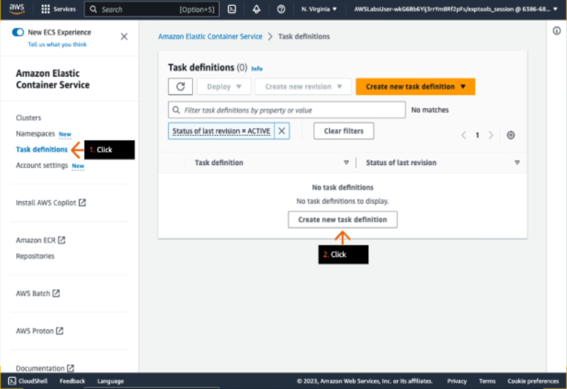

Concept
When you register a task definition, you can specify the total CPU and memory used for the task. This is separate from the CPU and memory values at the conatiner definition level. For tasks hosted on Amazon EC2 instances, these fields are optionals. For tasks hosted on AWS Fargate, these fields are required, and specific values are supported for both CPU and memory.

58. In the Task definition configuration section, for Task definition family, type:
first_App
59. In the Infrastructure requirements section, for Launch type, review to confirm that AWS Fargate is selected.
60. For Operating system/Architecture, review to confirm that Linux/x86_64 is selected.

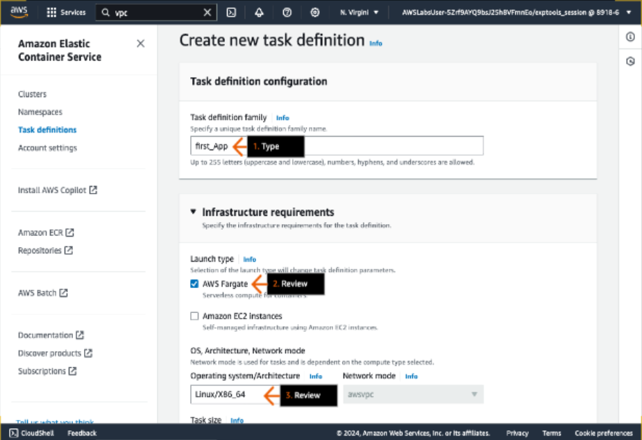

Concept
AWS Fargate is a serverless pay as you go compute engine that you can use to build app without managing servers. Fargates is compatible with ECS and EKS.

61. Under Task size, for CPU, choose .5 vCPU.
62. For Memory, choose 1 GB.
63. For Task role, choose ecsTaskExecutionRole.
64. For Task execution role, choose ecsTaskExecutionRole.
65. Scroll down to Container - 1.

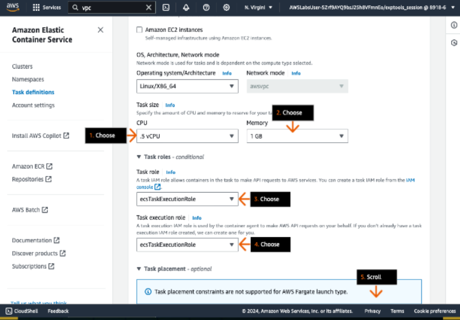

66. Under Container details, for Name, type:
my_app
67. For Image URI, paste the my_app image URI that you copied in an earlier step.
68. Under Port mappings, for Container port, type:
8443
69. For Protocol, review to confirm that TCP is selected.
70. Scroll down to Use log collection.

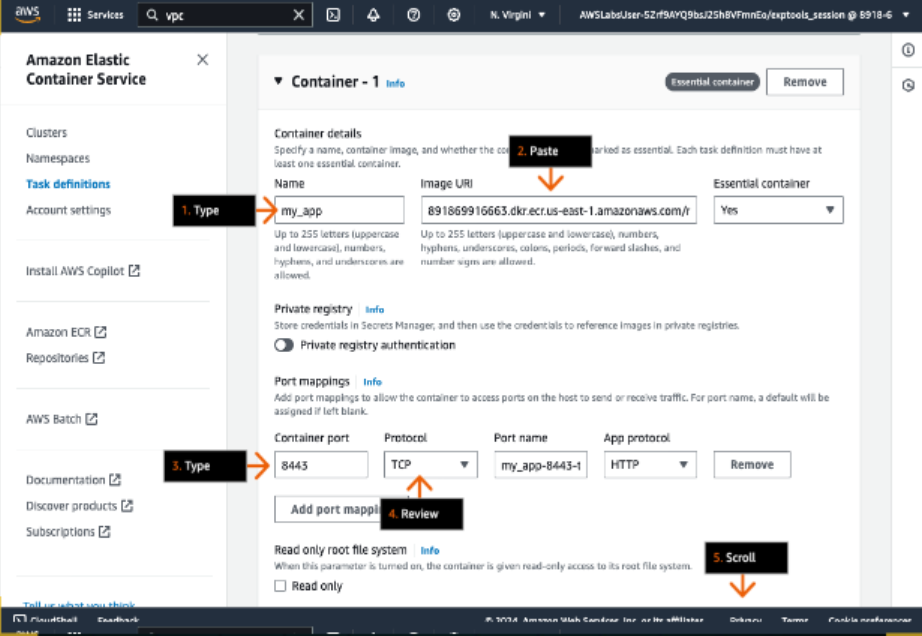

71. Clear the check box to deselect Use log collection.
72. Scroll down to the bottom of the page.

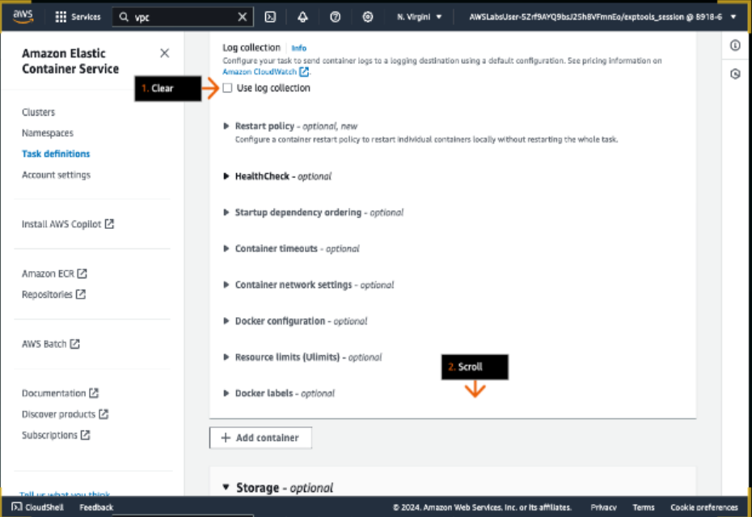

Concept
With AWS Fargate, you no longer have to provision, configure or scale cluster of virtual machines to run conainers. Amazon ECS uses containers provisioned by Fargete to automaticallt scale, load balance and manage scheduling of your containers for availability, providing and efficient way to build and operate containerized app.

73. Click Create.

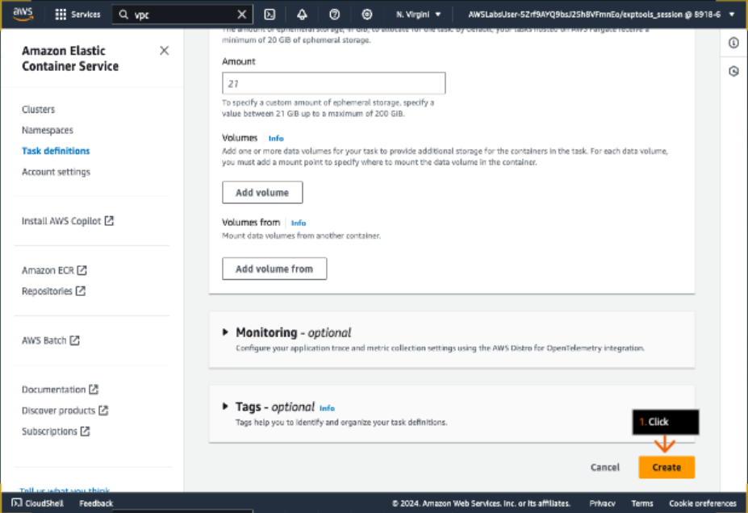

Concept
Amazon ECS clusters are Region specific.

74. In the success alert, review the message.
75. In the Overview section, under Status, review to see the Active status of the task definition.
76. Click Deploy to expand the dropdown list.
77. Choose Run task.

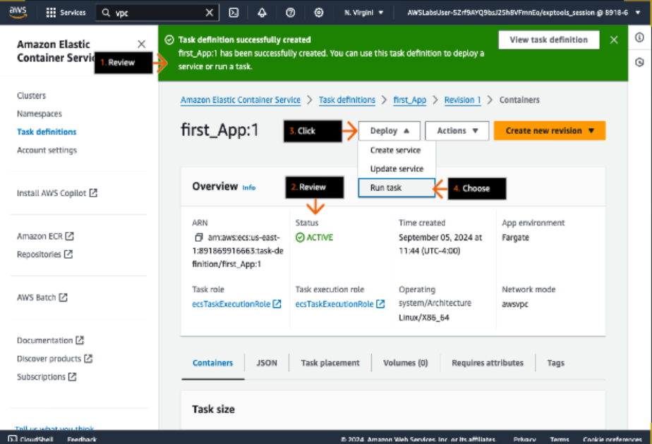

Concept
A cluster might contain a mix of tags hosted on AWS Fargate, Amazon EC2 instances or external instances.

78. For Task definition family, review to confirm that first_App is selected.
79. For Task definition review, review the default value of 1.
80. For Desired tasks, review to confirm that the number is set to 1.
81. Scroll down to Environment.

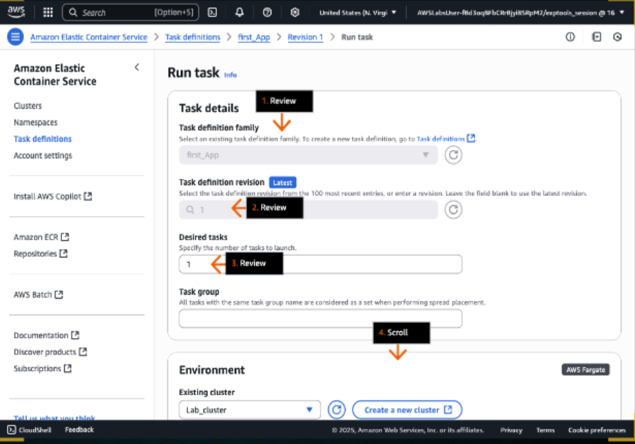

82. In the Environment section, for Existing cluster, choose Lab_cluster.
83. For Compute options, review to confirm that Launch type is selected.
84. For Launch type, choose FARGATE.
85. Scroll down to Networking.

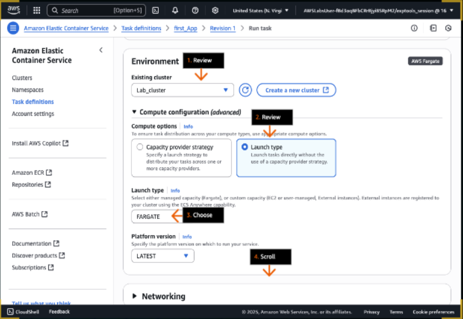

86. Click to expand the Networking section.
87. For VPC, choose the VPC name that contains Lab_VPC.
88. For Subnets, click the X to remove public_subnetSubnet2.
- Make sure that public_subnetSubnet1 remains selected.

89. For Security group, choose Use an existing security group.
90. For Security group name, review to confirm that the default security group is selected.
91. Turn on Public IP.
92. Scroll down to Task Overrides.

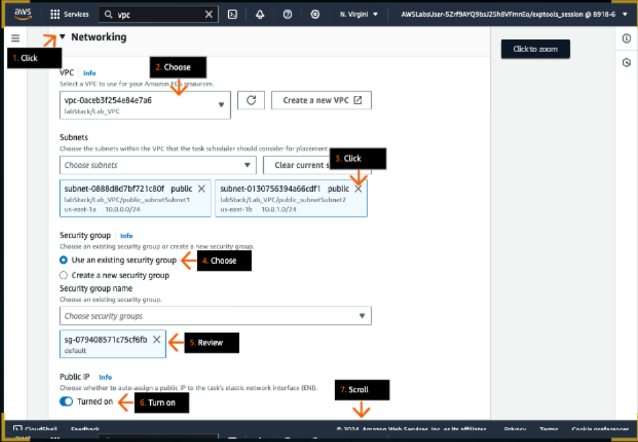

93. Click to expand the Task overrides section.
94. For Task role, choose ecsTaskExecutionRole.
95. For Task execution role, choose ecsTaskExecutionRole.
96. Click Create.

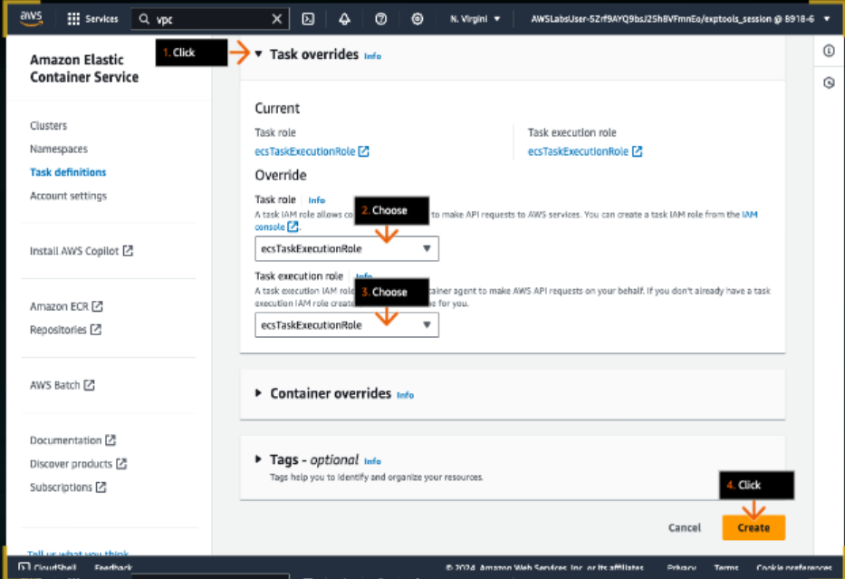

97. In the success alert, review the message.
98. Scroll down to the bottom of the page.

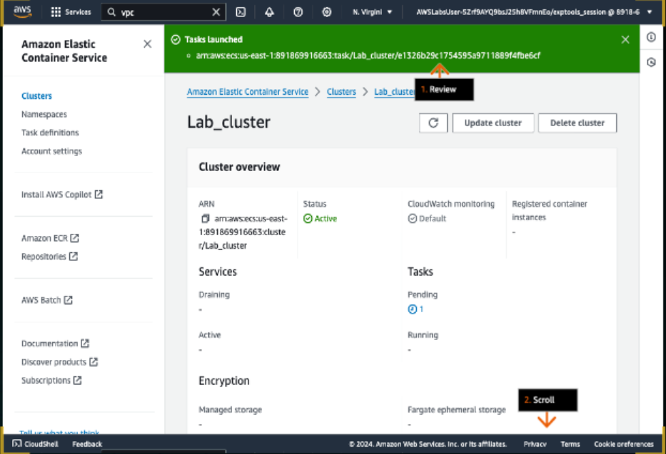

99. On the Tasks tab, wait a few minutes, and then click the refresh icon.
100. Under Last status, review to confirm that the status changed from PROVISIONING to RUNNING.
101. Under Task, click the available task ID.

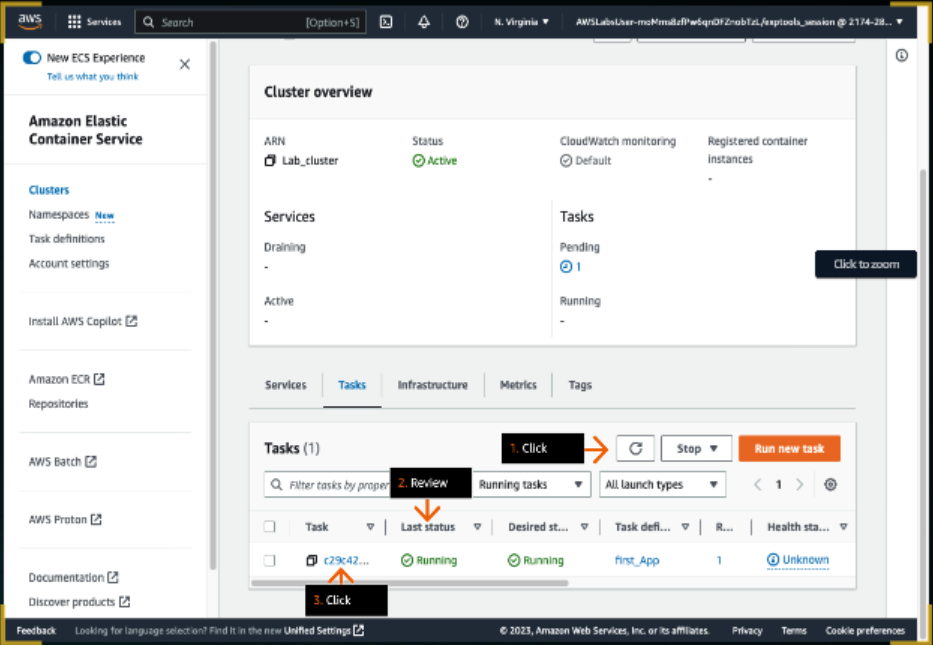

102. On the Configuration tab, review the Task overview section.
103. In the Configuration section, under Public IP, click the copy icon to copy the IP address of the launched server.

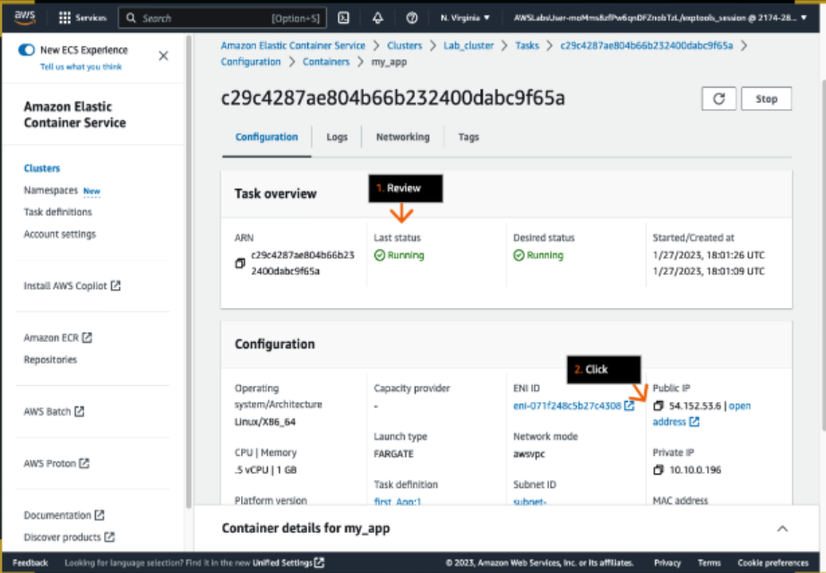

104. In a new browser tab (or window) address bar, type the following URL, replacing <Public IP> with the IP address that you just copied.
http://<Public IP>:8443
105. On the page, review to confirm that the app displays "Congratulations! This is your first containerized APP!!".
- If the page doesn't open, it might be blocked by your VPN. If possible, try again without connecting to your VPN or on another device.

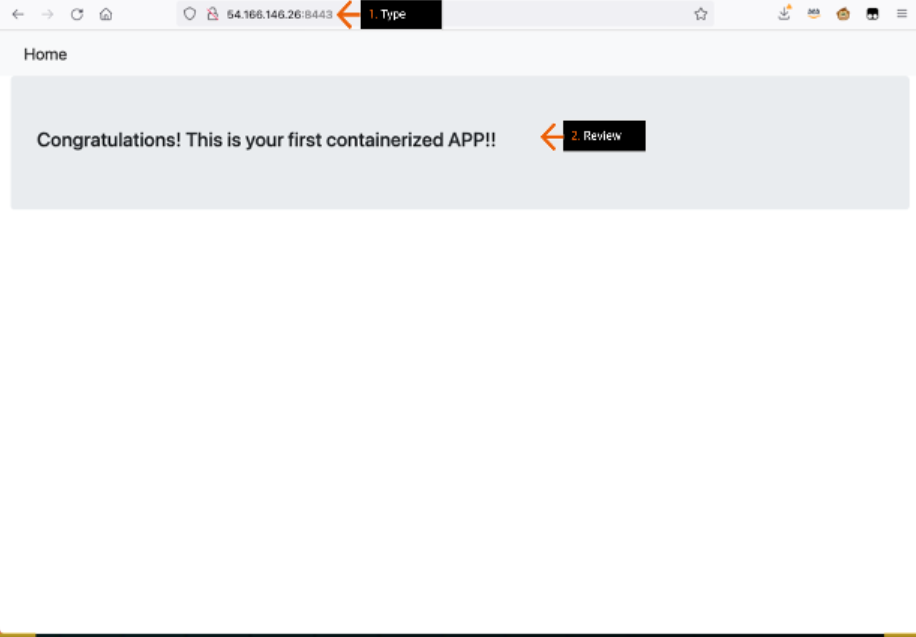

# DIY
Deploy a second app my_second_app in Fargate by using the image from Amazon ECR. Validate access to the second app.

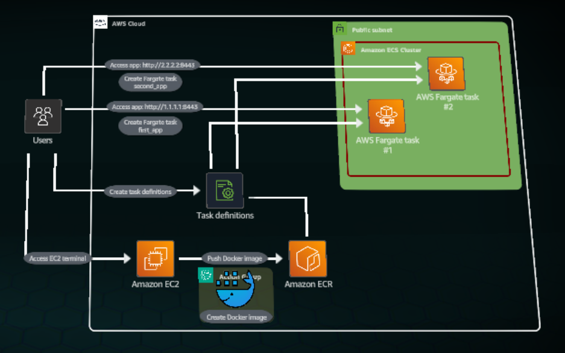

1. Obtener la URL de la imagen en ECR.
2. Creo una task para esa app.

install_scripts

[ec2-user@ip-10-0-0-112 install_scripts]$ cat install_docker.sh
#!/bin/bash
# Install Docker
sudo yum update -y
sudo yum install -y docker

# Start Docker service and enable it to run at boot
sudo systemctl start docker
sudo systemctl enable docker

# Add the ec2-user to the docker group to allow running Docker without sudo
sudo usermod -aG docker ec2-user

# Apply group changes without logging out
newgrp docker

# Confirm Docker is working for the ec2-user
docker --version

[ec2-user@ip-10-0-0-112 install_scripts]$ cat push_second_app.sh
#!/bin/bash

# Get the region defined in the current configuration (default to us-east-1 if none defined)
TOKEN=$(curl -s -X PUT "http://169.254.169.254/latest/api/token" -H "X-aws-ec2-metadata-token-ttl-seconds: 60")
region=$(curl -s -H "X-aws-ec2-metadata-token: $TOKEN" -v http://169.254.169.254/latest/meta-data/placement/region 2> /dev/null)
region=${region:-us-east-1}

# Get account ID
account=$(aws sts get-caller-identity --query Account --output text)

# Create repository name
repo_name="my_second_app"
fullname="${account}.dkr.ecr.${region}.amazonaws.com/${repo_name}:latest"

# If the repository doesn't exist in ECR, create it.
aws ecr describe-repositories --repository-names "${repo_name}" > /dev/null 2>&1

if [ $? -ne 0 ]
then
    aws ecr create-repository --repository-name "${repo_name}" > /dev/null
fi

# Get the login command from ECR and execute it directly
aws ecr get-login-password --region ${region}|docker login --username AWS --password-stdin ${fullname}

# Build the docker image locally with the image name and then push it to ECR
# with the full name.

cd /home/ec2-user/second_app

docker build  -t ${repo_name} .
docker tag ${repo_name} ${fullname}

docker push ${fullname}

first_app
[ec2-user@ip-10-0-0-112 first_app]$ cat Dockerfile
FROM python:3.11.6-slim-bookworm

LABEL maintainer="test@test.com"

COPY ./ ./app
WORKDIR ./app

# We copy just the requirements.txt first to leverage Docker cache
COPY requirements.txt /app/requirements.txt

RUN pip3 install -r requirements.txt

CMD [ "python3", "-m" , "flask", "run", "--host=0.0.0.0", "--port=8443"]
[ec2-user@ip-10-0-0-112 first_app]$ ls
Dockerfile  ReadMe.md  app.py  requirements.txt  static  templates

[ec2-user@ip-10-0-0-112 second_app]$ cat Dockerfile
FROM python:3.11.6-slim-bookworm

LABEL maintainer="test@test.com"

COPY ./ ./app
WORKDIR ./app

# We copy just the requirements.txt first to leverage Docker cache
COPY requirements.txt /app/requirements.txt

RUN pip3 install -r requirements.txt

CMD [ "python3", "-m" , "flask", "run", "--host=0.0.0.0", "--port=8443"]

PASOS
sudo su - ec2-user
ls -al
unzip lab-codes.zip
instalar docker
20. To set the value of the Region, run:
region=${region:-us-east-1}
21. To set the variables repo_name, run:
repo_name="my_app"
22. To set the account, run:
account=$(aws sts get-caller-identity --query Account --output text)
23. To set the fullname, run:
fullname="${account}.dkr.ecr.${region}.amazonaws.com/${repo_name}:latest"
24. To create an Amazon ECR repository, run:
aws ecr create-repository --repository-name "${repo_name}"
25. To retrieve an authentication token, run:
aws ecr get-login-password --region ${region}|docker login --username AWS --password-stdin ${fullname}
- The AWS CLI "get-login-password" command authenticates Docker to an Amazon ECR registry.
[ec2-user@ip-10-0-0-112 second_app]$ aws ecr create-repository --repository-name "${repo_name}"
{
    "repository": {
        "repositoryArn": "arn:aws:ecr:us-east-1:270967823201:repository/my_app",
        "registryId": "270967823201",
        "repositoryName": "my_app",
        "repositoryUri": "270967823201.dkr.ecr.us-east-1.amazonaws.com/my_app",
        "createdAt": "2025-12-27T21:13:25.545000+00:00",
        "imageTagMutability": "MUTABLE",
        "imageScanningConfiguration": {
            "scanOnPush": false
        },
        "encryptionConfiguration": {
            "encryptionType": "AES256"
        }
    }
}
[ec2-user@ip-10-0-0-112 second_app]$ aws ecr get-login-password --region ${region}|docker login --username AWS --password-stdin ${fullname}
WARNING! Your password will be stored unencrypted in /home/ec2-user/.docker/config.json.
Configure a credential helper to remove this warning. See
https://docs.docker.com/engine/reference/commandline/login/#credentials-store

Login Succeeded
[ec2-user@ip-10-0-0-112 second_app]$

[ec2-user@ip-10-0-0-112 second_app]$ docker build -t ${repo_name} .
[+] Building 9.6s (10/10) FINISHED   
[ec2-user@ip-10-0-0-112 second_app]$ docker images --filter reference=my_app
REPOSITORY   TAG       IMAGE ID       CREATED          SIZE
my_app       latest    7653329fcff5   24 seconds ago   152MB
[ec2-user@ip-10-0-0-112 second_app]$

docker tag ${repo_name} ${fullname}
docker push ${fullname}

[ec2-user@ip-10-0-0-112 second_app]$ docker images --filter reference=my_app
REPOSITORY   TAG       IMAGE ID       CREATED          SIZE
my_app       latest    7653329fcff5   24 seconds ago   152MB
[ec2-user@ip-10-0-0-112 second_app]$ docker tag ${repo_name} ${fullname}
[ec2-user@ip-10-0-0-112 second_app]$ docker push ${fullname}
The push refers to repository [270967823201.dkr.ecr.us-east-1.amazonaws.com/my_app]
cbbcca15d904: Pushed
923ef98d281d: Pushed
5f70bf18a086: Pushed
2bdcf9a69181: Pushed
d8815e8a268d: Pushed
8655910e6b5f: Pushed
355bb094feb8: Pushed
ed123c9f1a56: Pushed
92770f546e06: Pushed
latest: digest: sha256:a60e5f2f61789489e61993081a8d9ce4ff7f2ff28a31108ba3f27d10fc9be58f size: 2204
[ec2-user@ip-10-0-0-112 second_app]$ docker images --filter reference=my_app
REPOSITORY   TAG       IMAGE ID       CREATED              SIZE
my_app       latest    7653329fcff5   About a minute ago   152MB
[ec2-user@ip-10-0-0-112 second_app]$ docker images
REPOSITORY                                            TAG       IMAGE ID       CREATED              SIZE
270967823201.dkr.ecr.us-east-1.amazonaws.com/my_app   latest    7653329fcff5   About a minute ago   152MB
my_app                                                latest    7653329fcff5   About a minute ago   152MB
[ec2-user@ip-10-0-0-112 second_app]$

[ec2-user@ip-10-0-0-112 install_scripts]$ ./push_second_app.sh
WARNING! Your password will be stored unencrypted in /home/ec2-user/.docker/config.json.
Configure a credential helper to remove this warning. See
https://docs.docker.com/engine/reference/commandline/login/#credentials-store

Login Succeeded
[+] Building 0.2s (10/10) FINISHED  

270967823201.dkr.ecr.us-east-1.amazonaws.com/my_second_app

arn:aws:ecs:us-east-1:270967823201:task/Lab_cluster/1889818a7f3c4569b4956c2510497422

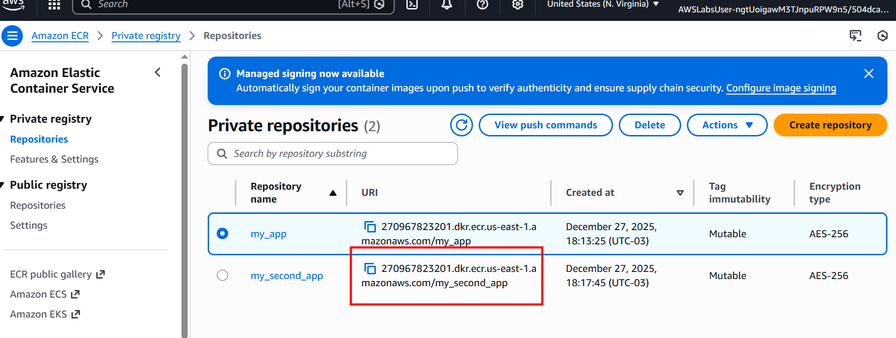
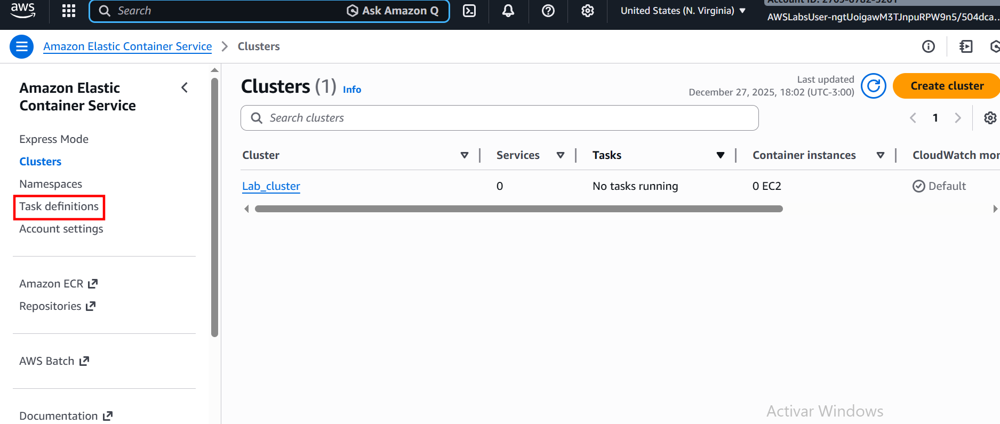
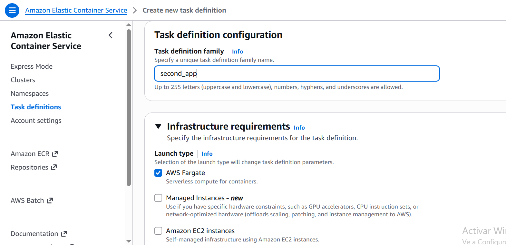
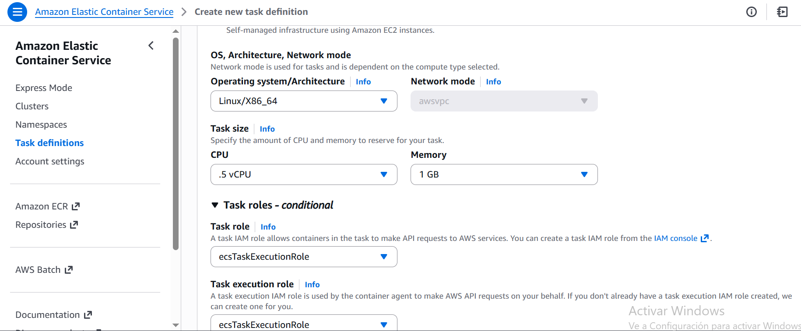
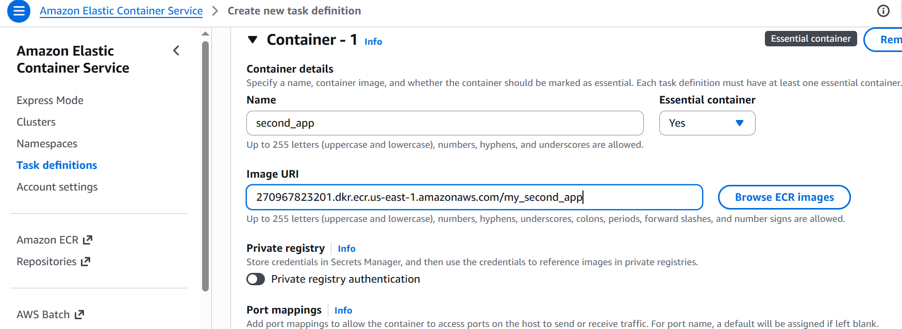
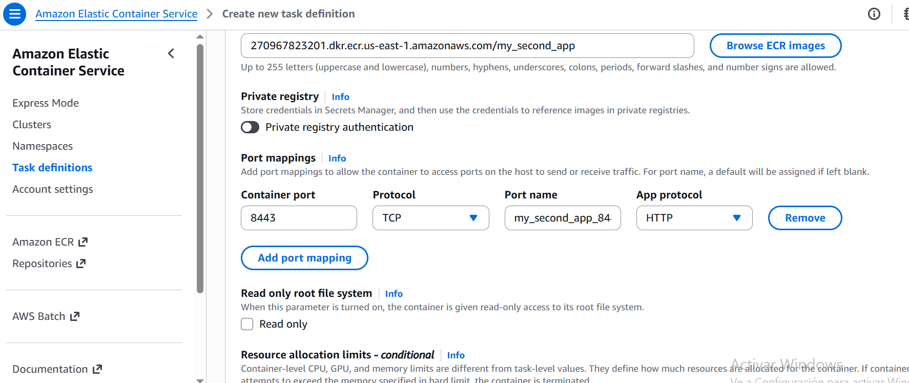
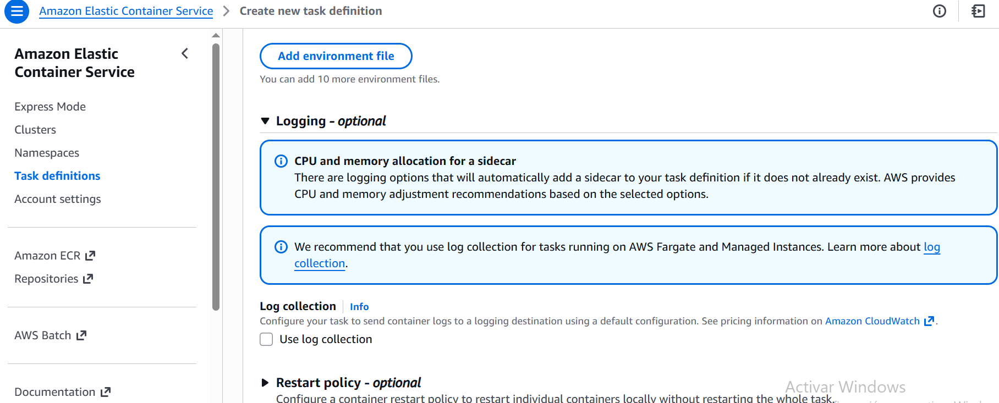
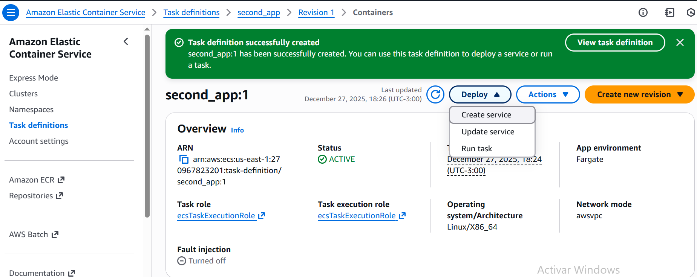
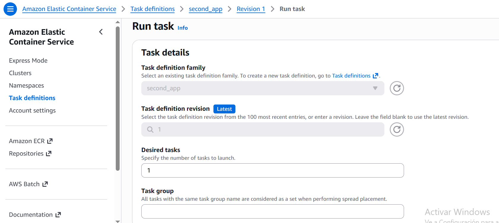
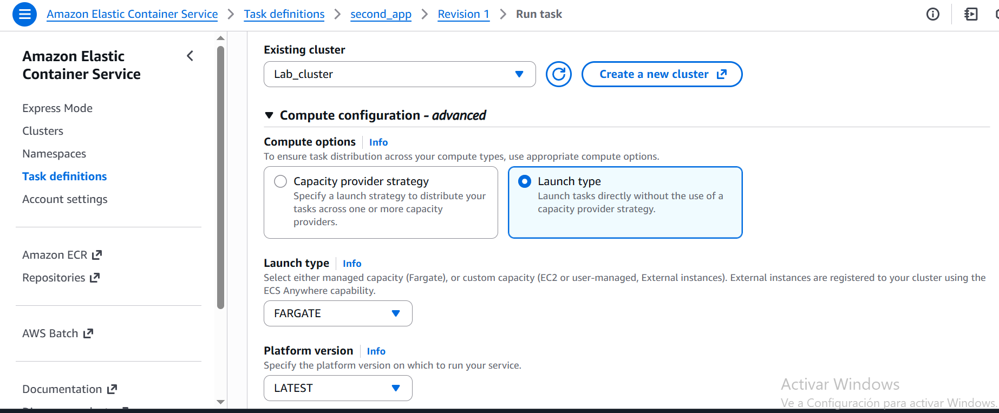
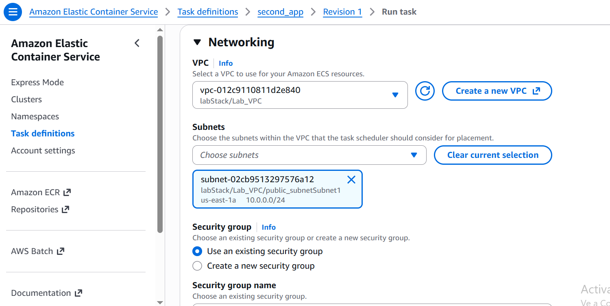
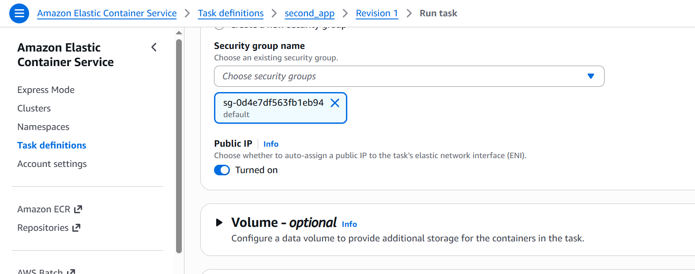
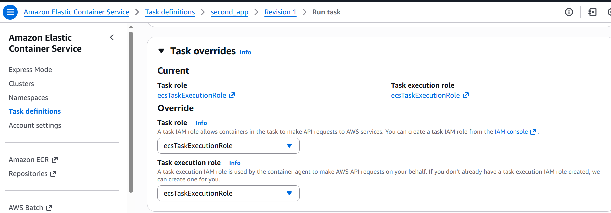
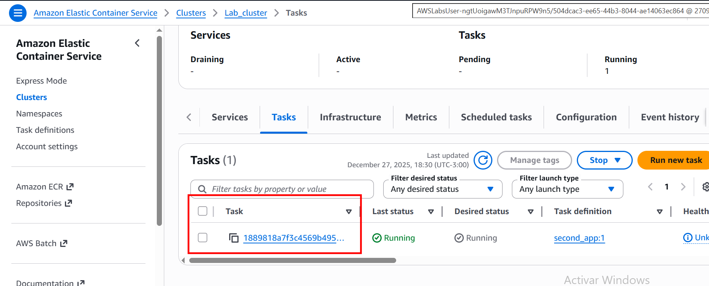
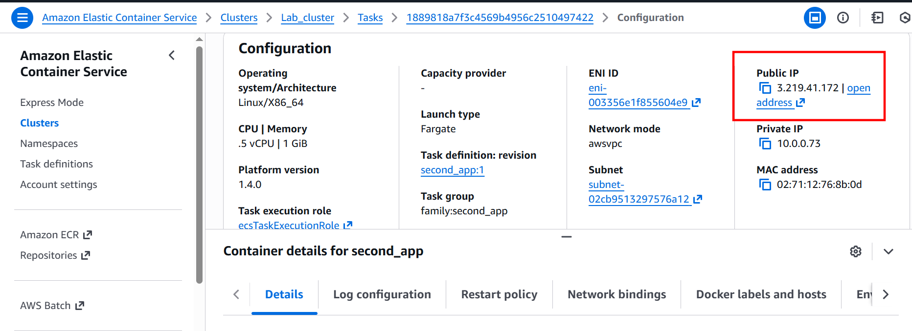
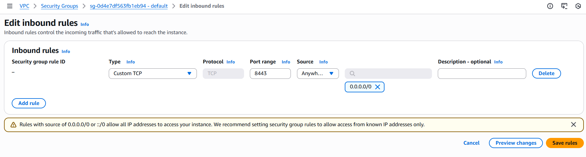
IMP -->
La regla anterior que permitia todo desde el recurso de AWS con ese sg no funcionaba.

En la primera imagen se ve algo como:

Type: All traffic

Protocol: All

Port range: All

Source: otro Security Group (sg-0965b3f80ca95749e)

🔑 Qué significa esto realmente:

Esa regla NO permite tráfico desde Internet.
Solo permite tráfico que venga desde recursos que tengan asociado ese Security Group de origen.

En Fargate, esto es típico cuando:

El tráfico viene desde un ALB (Application Load Balancer)

O desde otro servicio interno

📌 Problema en tu caso
Si estabas intentando acceder:

Desde tu navegador

Desde una IP pública

O directamente a la IP pública / DNS del servicio

👉 Ese tráfico NO pertenece a ese Security Group, así que AWS lo bloquea.

Por eso nunca llegaba a la app.

2️⃣ Segunda regla (SÍ funcionaba)

En la segunda imagen:

Type: Custom TCP

Port: 8443

Source: 0.0.0.0/0

🔑 Qué significa esto:

Permites tráfico TCP

Al puerto exacto donde escucha tu app (8443)

Desde cualquier IP del mundo

Eso incluye:

Tu navegador

Postman

Cualquier cliente externo

👉 Ahora el tráfico sí entra al ENI del task de Fargate, por eso la app responde.

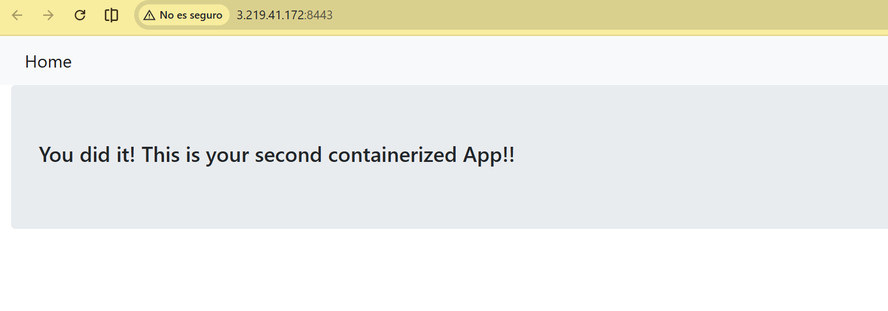