# Learn
Use Amazon API Gateway and and AWS Lambda function to create and deploy an API.

In this solution, Amazon API GW acts as the front door for applications to access data, bussiness logic, and functionality from backend services.

An application makes an HTTP request to access the backend.

API Gateway handles the request and all the tasks involved in accepting and processing the API call.

API Gateway invokes AWS Lambda, which processes the request and returns a response. API Gateway receives the response and returns it to the app.

With the ability to make synchronous calls from API Gateway to Lambda, users can create fully serverless apps and serverless microservices.

Using API Gateway, users can create multiple new endpoints and point them to different Lambda functions.

# Practice
In this practice Lab, you will:
- Create an Amazon API Gateway REST API.
- Deploy the REST API.
- Invoke an AWS Lambda function by using API Gateway proxy integration.

Concept 
AWS Lambda is a compute service that helps you run code without provisioning or managing servers. Lambda runs tour code only when needed, and it can scale automatically from a few requests per day to thousands per second. You pay only for the compute time that you use with no charge when your code is not running. Using AWS, you can run code for virtually any type of app or backend service, all with no administration.

1. In the top navigation bar search box, type:
lambda			
2. In the search results, under Services, click Lambda.

Concept 
A Lambda function consists of code and any associated dependencies. A Lambda function also has configuration information associated with it.

3. In the left navigation pane, click Functions.
4. In the Functions section, click Create function.
- You can safely ignore any Lambda functions that are already displayed in the section.

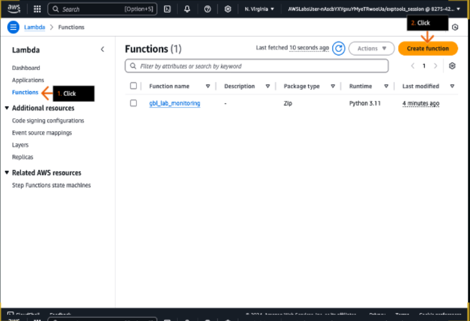

Concept 
Lambda runtimes allow functions in different languages to run in the same base execution environment. You configure your function to use a runtime that matches your programming language. The runtime sits between the Lambda service and your function code, relaying invocation events, context information and responses between the two. You can use runtimes provided by Lambda or build your one.

5. For Create function, choose Author from scratch.
6. For Function name, type:
labFunction
7. For Runtime, choose Python 3.x.
- The available Python version in the AWS Management Console might be different from what is displayed in the screenshot example.

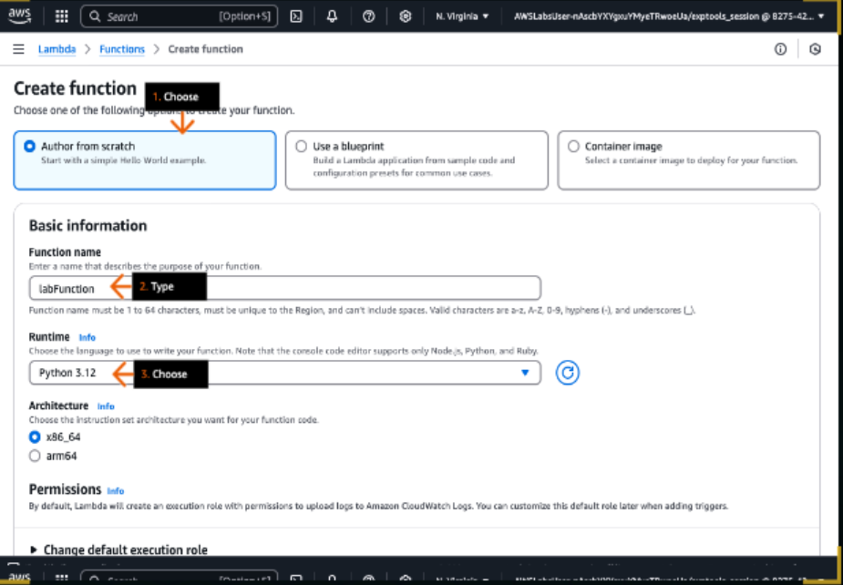

Concept
ALambda function's execution role is an AWS Identity and Access Management (IAM) role that grants the function permission to access AWS services and resources.You provide this role when you create a function, and Lambda assumes the role when your function is invoked.

8. Under Permissions, click to expand Change default execution role.
9. For Execution role, choose Use an existing role.
10. For Existing role, on the dropdown list, choose lab_function_role.
11. Click Create function.

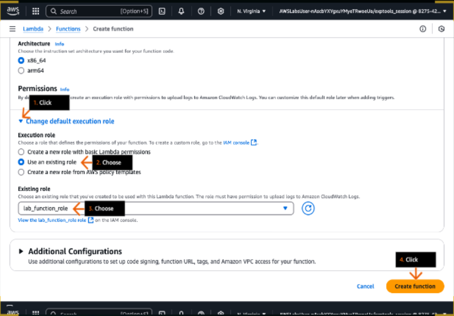

Concept
Using the code editor on the Lambda console, you can write, test and view the execution results of your Lambda function code. Lambda function code is stored in Amazon S3 and is encrypted at rest.

12. On the labFunction page, scroll down to the Code tab.
13. In the lambda_function code window, select (highlight) the code.
14. Delete the code.

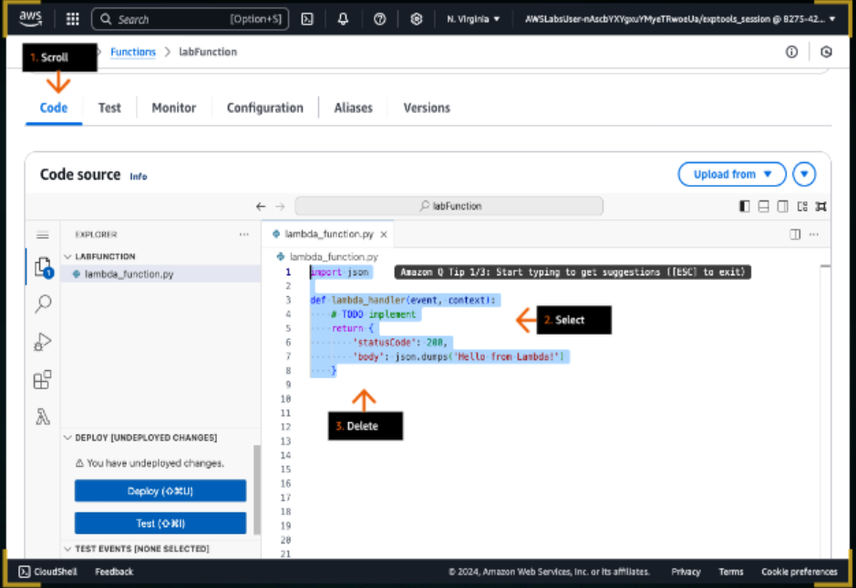

Concept
When you test your Lambda function, you want to inject some JSON event (input) validating that the function behaves as expected and returns the correct response (output).

15. Paste the code from the sample_code.py file that you downloaded in an earlier step.
- You can open a .py file with IDLE (which comes with Python), Notepad++, or another text editor or IDE.
- Python code blocks are defined by their indentation, so maintain the indentation between copy and paste.

16. Review the code.
17. Click Deploy.

Concept
You can create up to ten test events per function. The test events you create are not available to other users.

18. In the success alert, review the message.
19. To create a test event, click the Test tab.

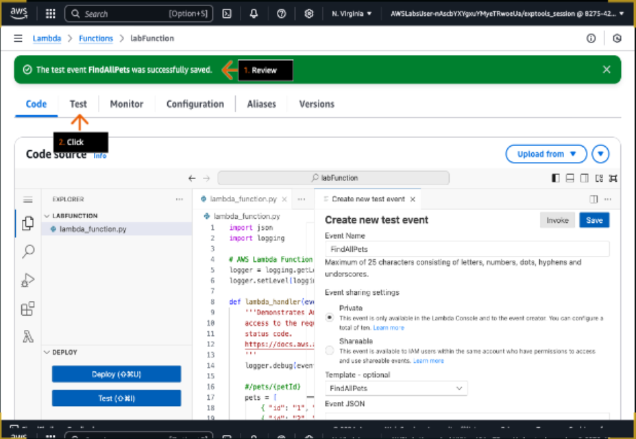

Concept
You can use sample templates to test an AMazon API Gateway Proxy integration. You can then customize your test to do things such as simulate a resource call for all resources in the code.

20. For Test event action, choose Create new event.
21. For Event name, type:
FindAllPets
22. For Event sharing settings, review to confirm that Private is selected. 
23. For Template, choose apigateway-aws-proxy.
24. For Event JSON, on line 3, type:
"resource": "/pets",

- Make sure to type this exactly as shown.
25. At the top of the Test event section, click Save.
26. Click Test.

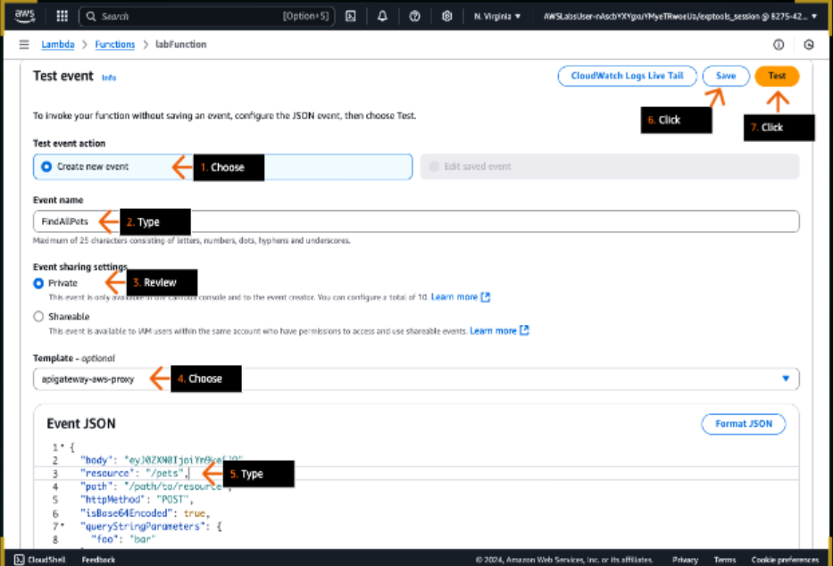

Concept
Lambda runs your function on your behalf. The function handler receives and then processes the sample event.

27. Click to expand Details.
28. Review the response.
29. Scroll down to Test event.

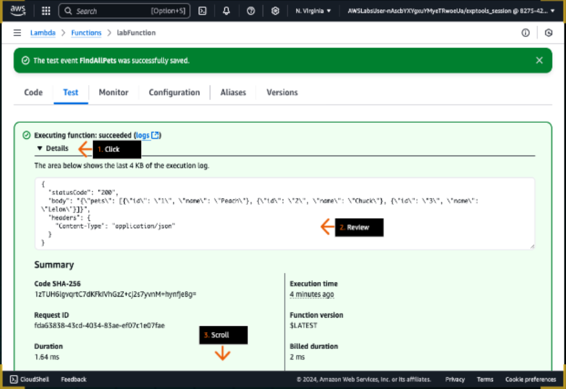

Concept
Based on the existing tests, you can create another test event.
30. For Test event action, choose Create new event.
31. For Event name, type:
FindPetById
32. For Event sharing settings, review to confirm that Private is selected. 
33. For Template, choose FindAllPets.

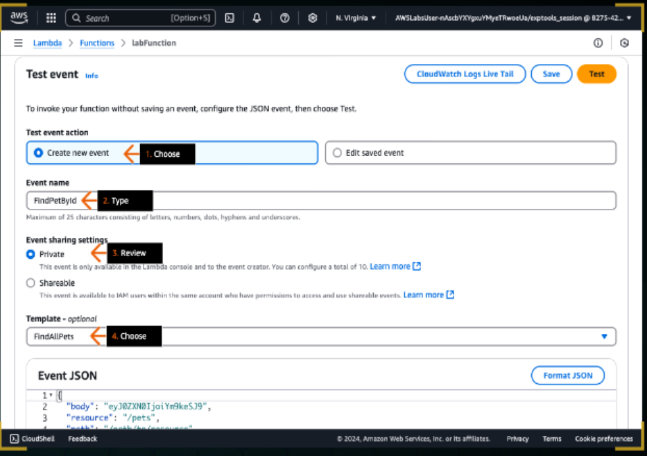

Concept
By creating multiple test events, you can see output based on a variety of different inputs, including resources parameters.

34. For Event JSON, on line 3, type:
"resource": "/pets/{id}",
35. On line 16, type:
"id": 1
- Make sure to type both of these exactly as shown.

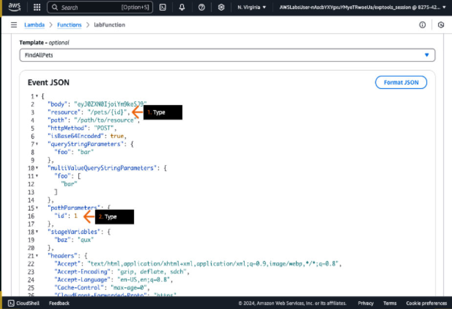

Concept
Creating multiple test events is useful when you want to slightly tweak one of your existing events and still keep the earlier version intact. When you are not sure how to structure a particulat event from a event source, you can use one of the sample event templates a nd tweak it to your needs.

36. At the top of the Test event section, click Save.
37. Click Test.

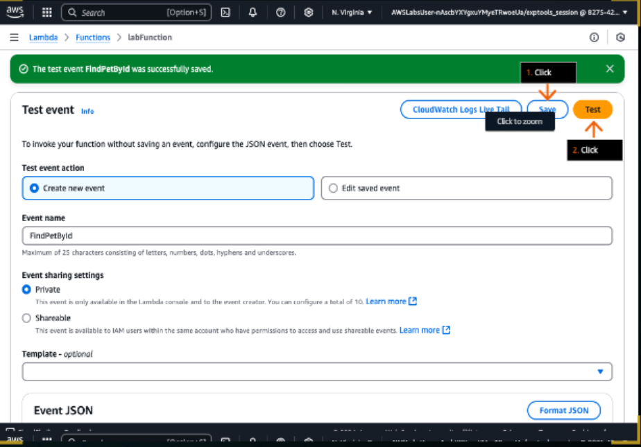

38. Under Details, review the response.

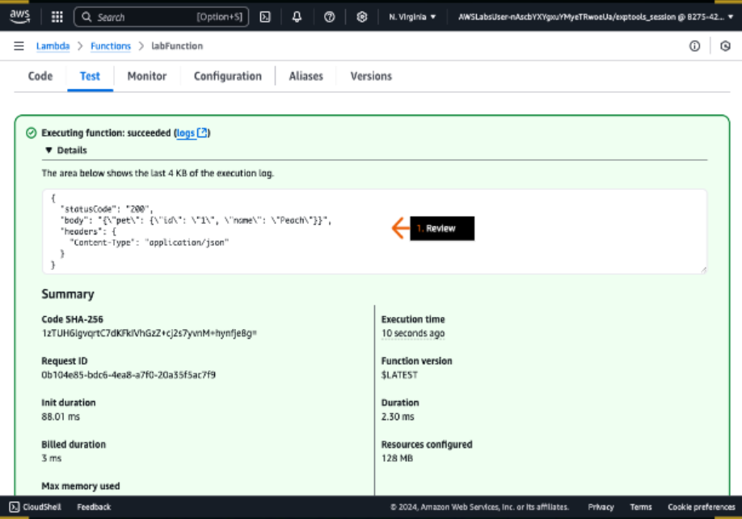

Concept
You can create a web API with an HTTP endpoint for your Lambda function by using Amazon API Gateway. API Gateway provides tools for creating and documenting web APIs that route HTTP requests to Lambda functions.

39. In the top navigation bar search box, type:
api
40. In the search results, under Services, click API Gateway.

Concept
API GW handles all the tasks involved in accepting and processing up to hundreds of thousands of concurrent API calls, including traffic management, authorization and access control, monitoring and API version management.

41. On the Amazon API Gateway console home page, scroll down to REST API.
42. On the REST API card, click Build.
- Make sure to NOT choose the REST API Private option.

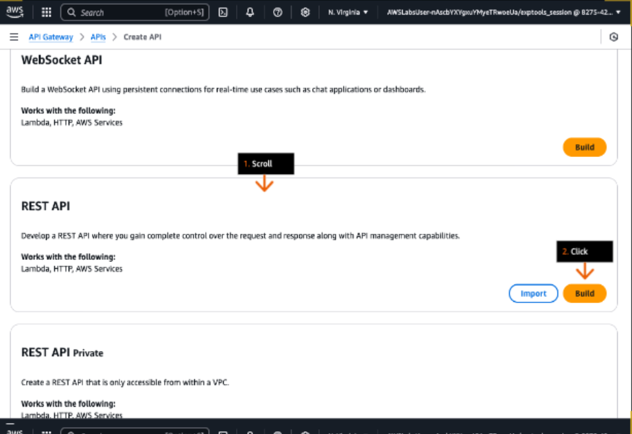

Concept
The API endpoint type can be edge optimized, Regional or private depending on where the majority of your API traffic originates from.

43. Choose New API.
44. For API name, type:
ApiLab
45. For Description, type:
API to support lab
46. For API endpoint type, review to confirm that Regional is selected.
47. Click Create API.

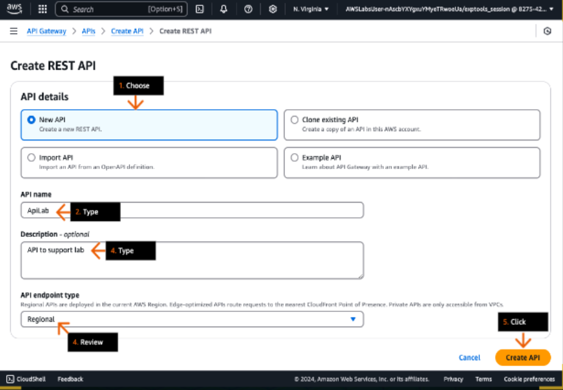

Concept
A resource is a logical entity that an app can access through a resource path.

48. In the success alert, review the message, and then click the X to close the alert.
49. Click Create resource.

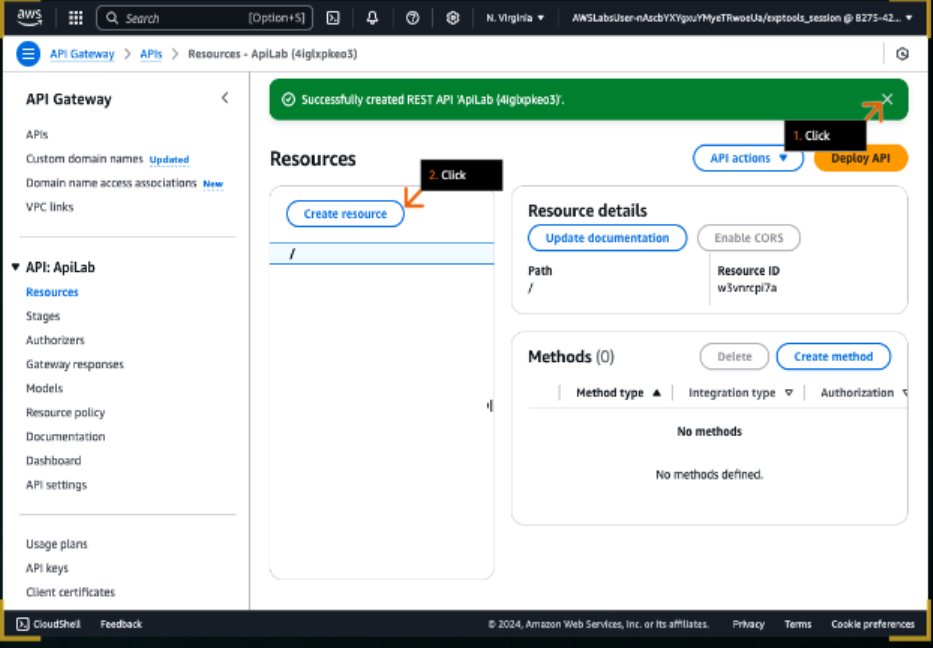

Concept 
Each resource entity can have one or more methods. A method defines the API for the client to access the exposed resource and represents an incoming request submitted by the client.

50. For Resource name, type:
pets
51. Click Create resource.

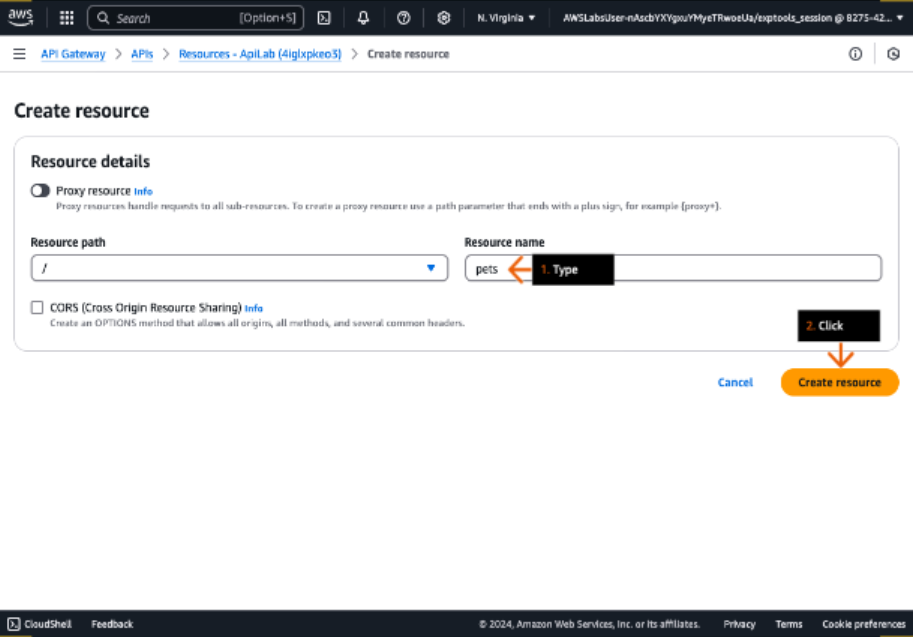

Concept
A method corresponds to a REST API request that is submitted by the user of your API and the response returned to the user. For example, a browser requests data from a REST API and a JSON file is returned.

52. In the success alert, review the message, and then click the X to close the alert.
53. For resource /pets, click Create method.

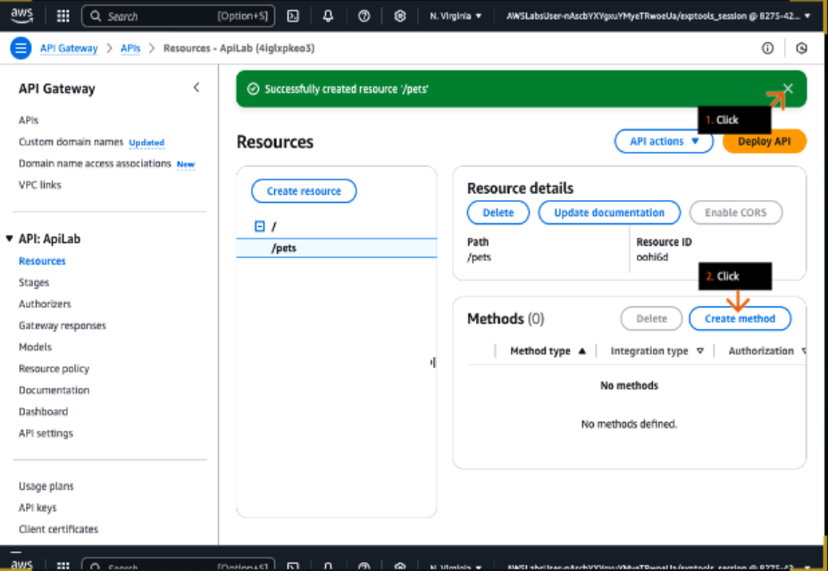

Concept 
HTTP defines a set of request methods to indicate the desired action to be permformed for a given resources.

54. For Method type, choose GET.
55. For Integration type, choose Lambda function.
56. Turn on Lambda proxy integration.

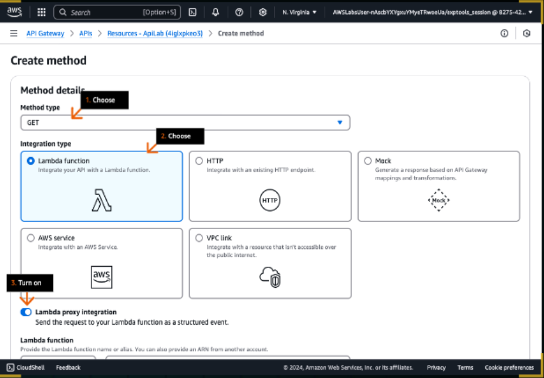

Concept
With Lambda proxy integration, the entire client request is sent to the backend Lambda function, as is, exceptthat the order of the request parameters isn't preserved. API GW maps the entire client to the input event parameter of the Backend Lambda function. The Lambda function's output, including status code, headers, and body is returned to the client as is.

57. For Lambda function, review to confirm that the us-east-1 AWS Region is selected.
58. In the next search box, type:
lab
and choose the labFunction ARN.
- You created this Lambda function in an earlier step.
59. Click Create method.

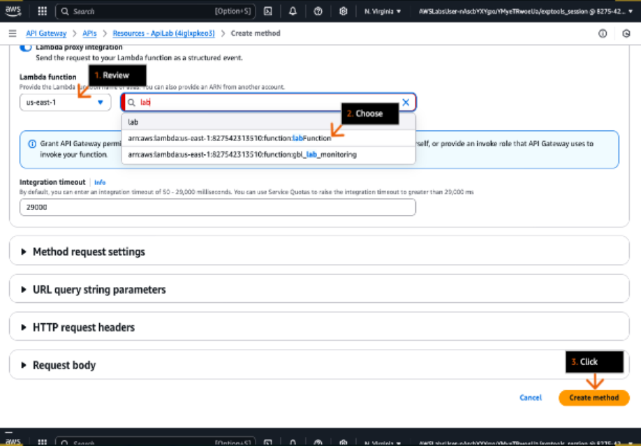

Concept
You can test the integration between API GW and Lambda.

60. In the success alert, review the message, and then click the X to close the alert.
61. Below the /pets - GET - Method execution window, click the Test tab.

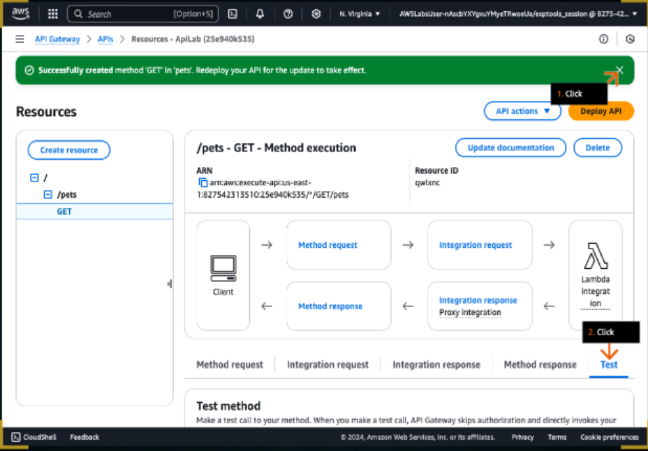

Concepr 
The test action simulates a GET request from a client.

62. In the Test method section, click Test.
63. Go to the next step.

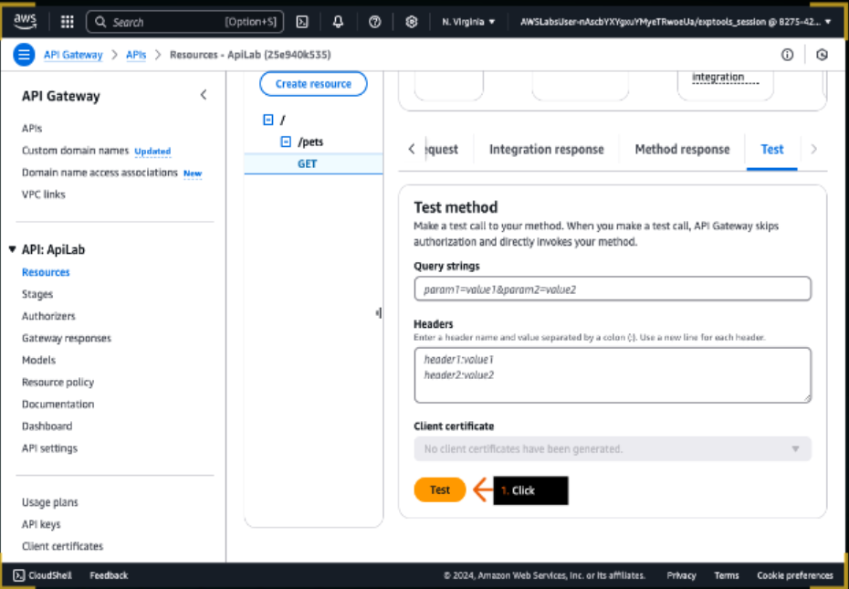

Concept
API GW returns the header, body and status code from the Lambda function.

64. Under Status and Response body, review the results.
- Response body might have a different layout from the screenshot example.

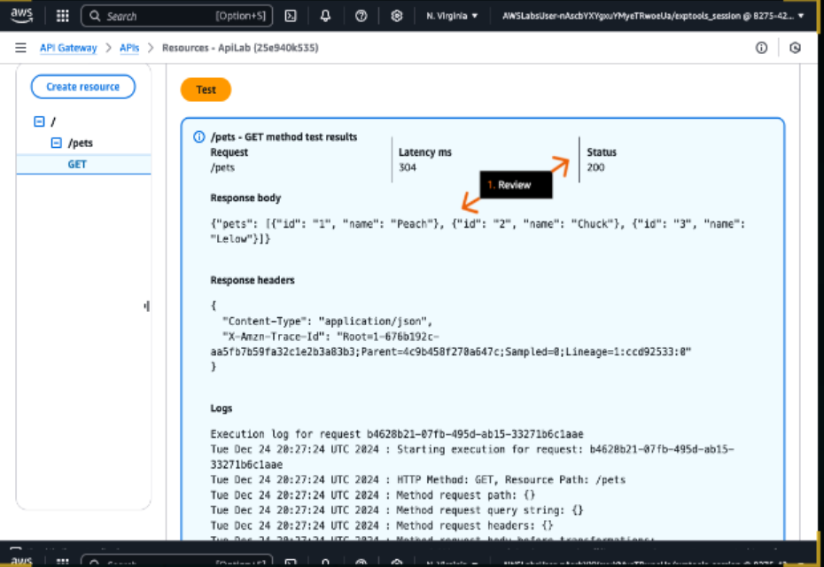

Concept
A resource is a typed object that is part of the domain for your API. Each resource can have an associated data model, relationships to other resources and can respond to different methods.

65. In the Resources pane, click /pets.
66. Click Create resource.

Concept
You can also define resources as variables to intercept requests to multiple child resources.

67. For Resource name, type:
{id}
68. Click Create resource.

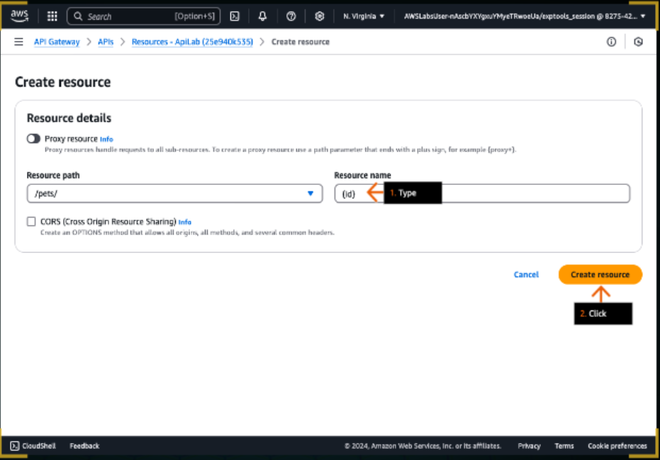

Concept
In API GW, an API method embodies a method request and a method response. You set up an API method to define what a client should or must do to submit a request to access the service at the backend and to define the responses that the client receives in return.

69. In the success alert, review the message, and then click the X to close the alert.
70. In the Resources pane, review to confirm that /{id} is selected.
71. Click Create method.

Concept
To set up the method request, you configure an HTTP method (or verb), the path to an API resource, headers and applicable query string parameters. You also configure a payload when the HTTP methods is POST, PUT or PATCH.

72. For Method type, choose GET.
73. For Integration type, choose Lambda function.
74. Turn on Lambda proxy integration.
75. For Lambda function, choose labFunction.
76. Scroll down to the bottom of the page, and then click Create method (not shown).

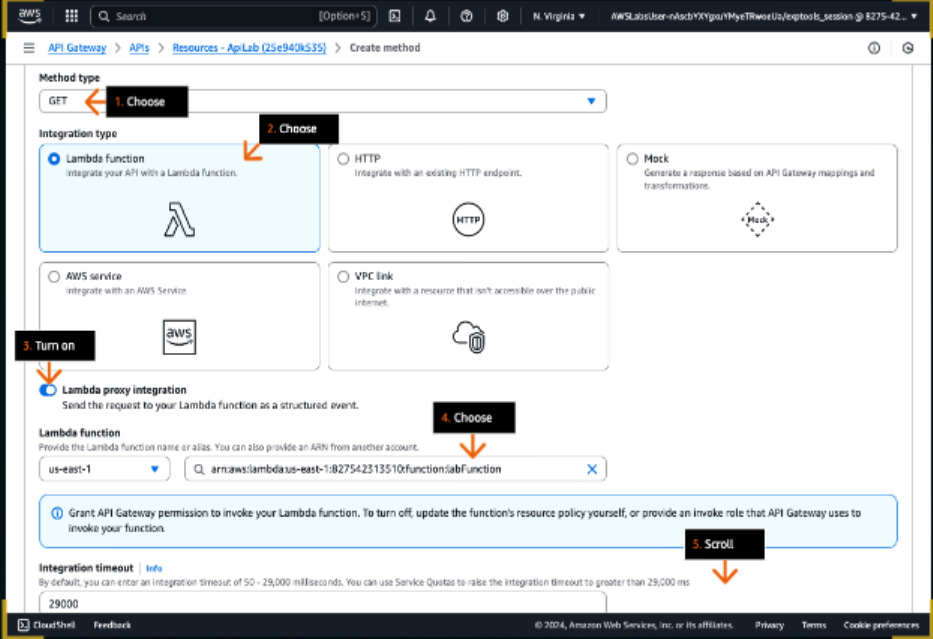
77. In the Resources pane, review to confirm that the GET method for the /{id} resource is selected.
78. Click the Test tab.

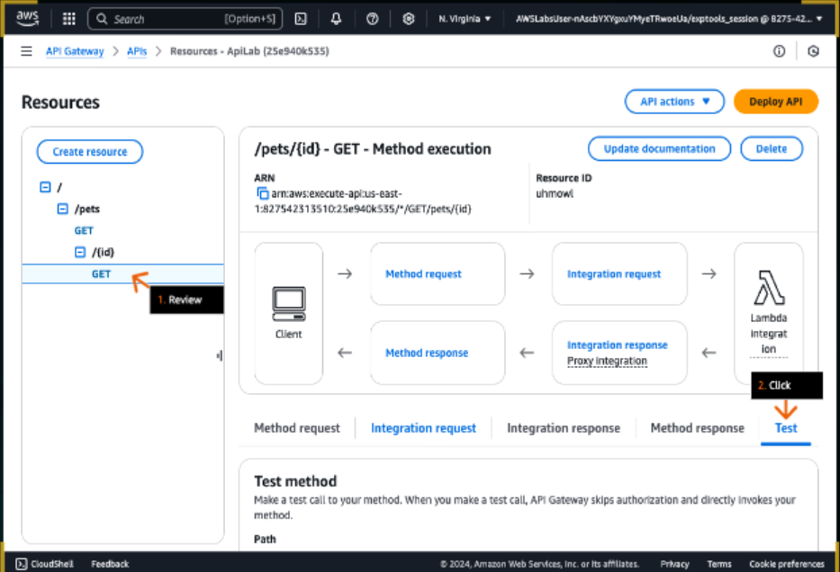

Concept
A test, for example, can simulate a GET request from a client and include a parameter.

79. In the Test method section, for Id, type:
1
80. Click Test.

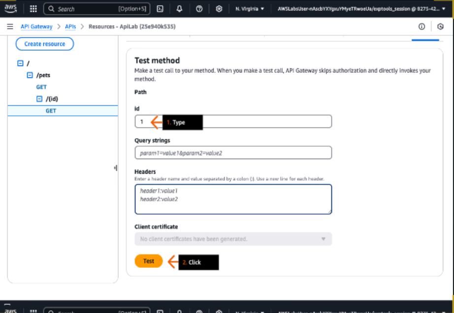

Concept
The Lambda runtime serializes the response object into JSON and sends it to the API. The API parses the response and uses it to create an HTTP response, which it then sends to the client that made the original request.

81. Under Response body, review to confirm the correct ID and name.
82. Go to the next step.

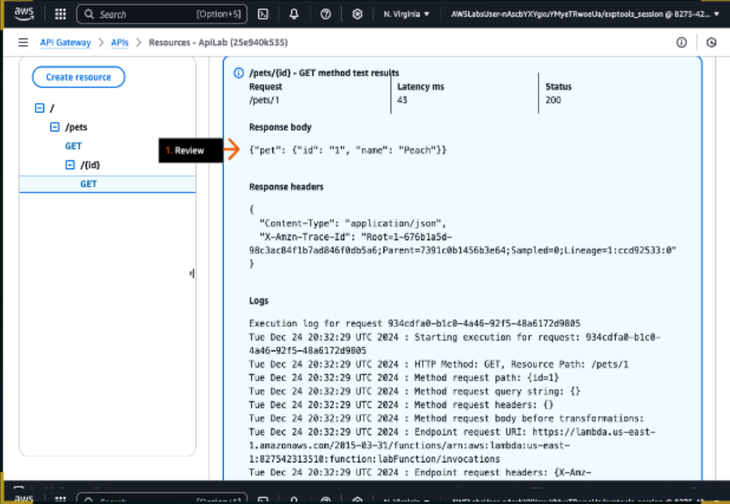

Concept
After creating your API, you must deploy it to make it callable by your users. This action creates an external URL.

83. At the top of the page, click Deploy API.

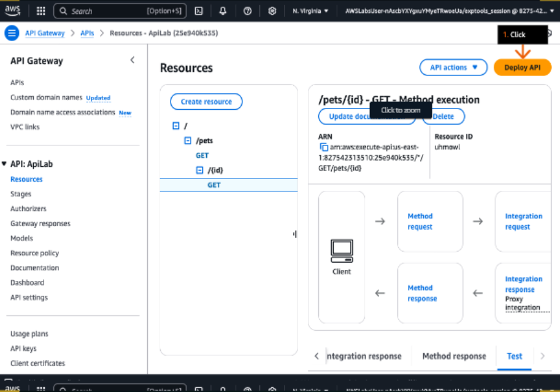

Concept
A stage represents a unique identifier for a version of a deployed REST API that is callable by users.

84. In the pop-up box, for Stage, choose *New stage*.
85. For Stage name, type:
lab			
86. For Deployment description, type a short description, such as Lab deployment.
87. Click Deploy.

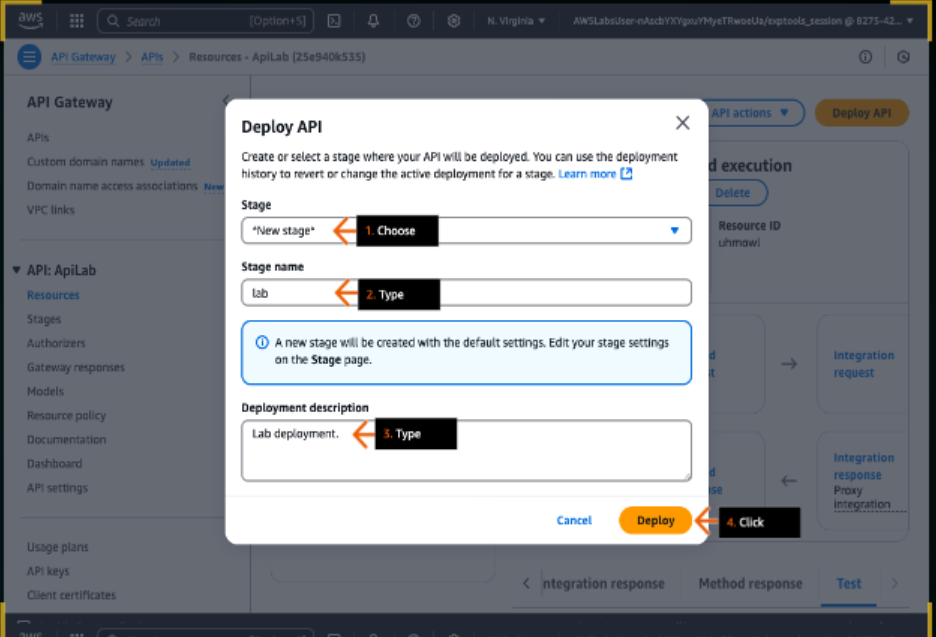

Concept
A stage is a named reference to a deployment, which is a snapshot of the API. You use a stage to manage and optimize a particular deployment.

88. In the success alert, review the message.
89. Under Invoke URL, click the copy icon to copy the provided URL.
https://7ffsuly8nh.execute-api.us-east-1.amazonaws.com/lab

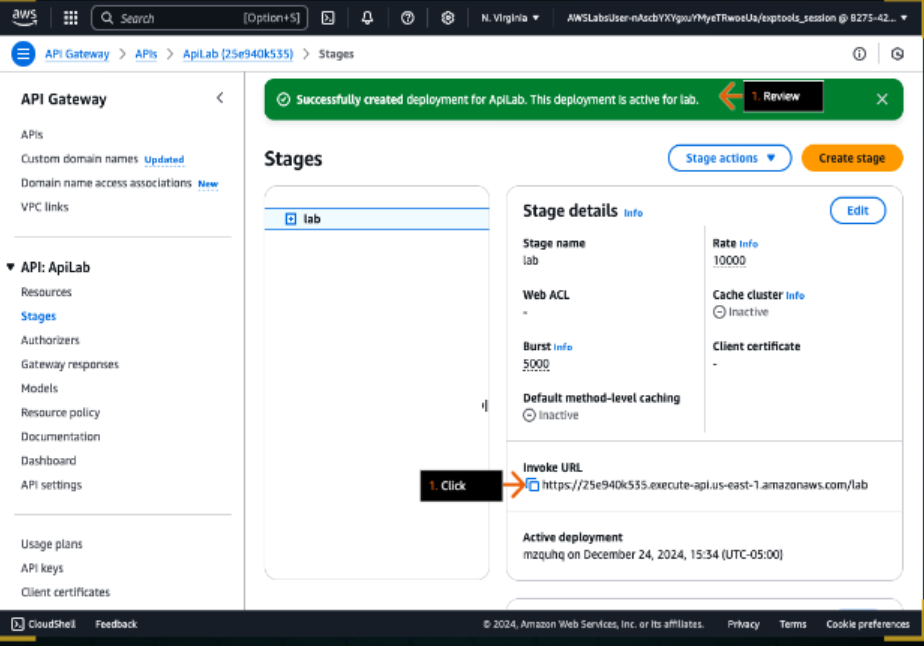

Concept
You can use any HTTP client (such as a browser, curl or SDK) to test your API.

90. In a new browser tab (or window) address bar, paste the invoke URL that you just copied.
91. To invoke your API, at the end of the pasted URL, type:
/pets
and press Enter.

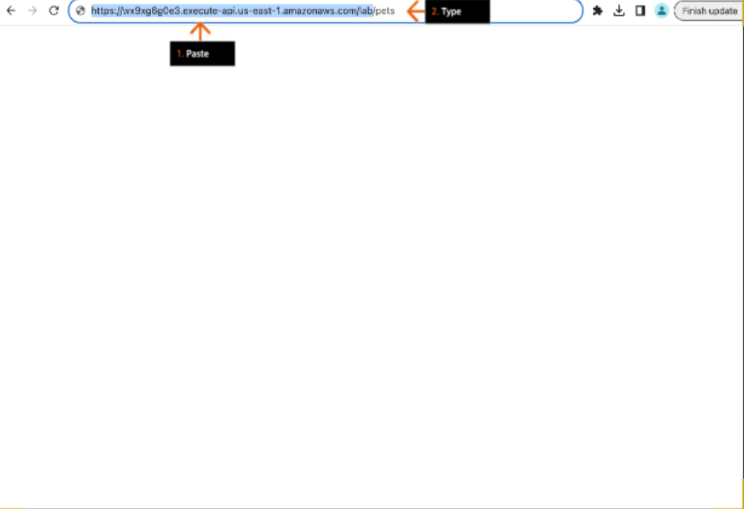

Concept
You can test a call to return all resources.

92. Review the response.
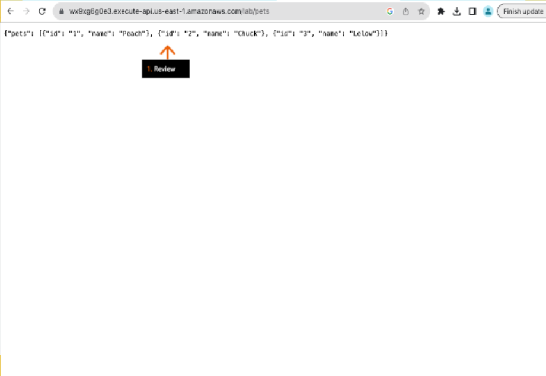

93. In a new browser tab (or window) address bar, paste the same invoke URL.
94. At the end of the pasted URL, type:
/pets/3
and press Enter.
95. Review the response.

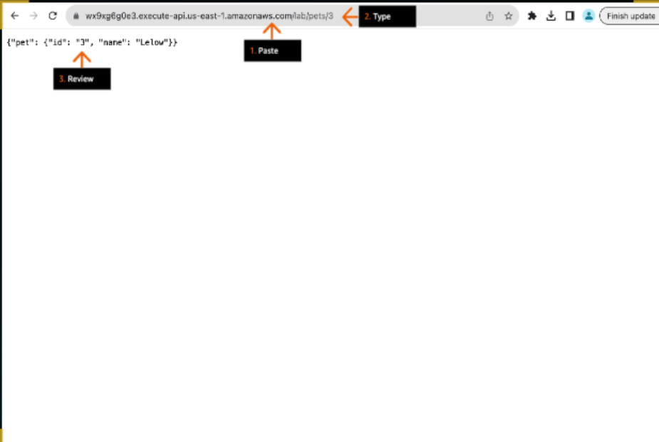

# DIY
Use the sample vehicles_function.py file to create a new Lambda function.
Create a API GW endpoint for vehicles and integrate it with the new lambda function.

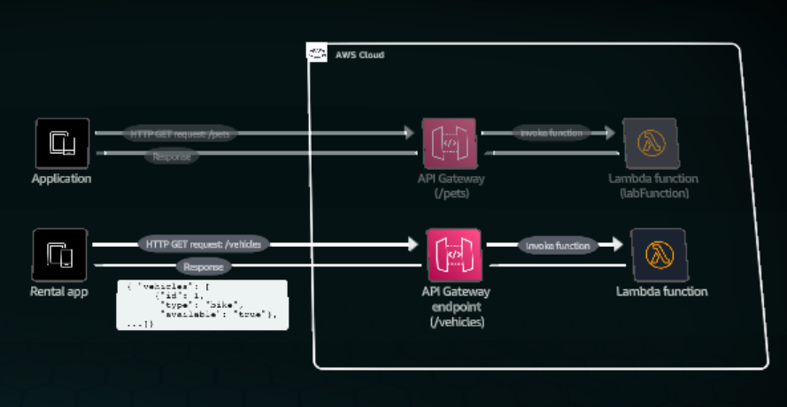

Repeti el proceso con la otra función y creé un nuevo stage.