# Learn
Add a NoSQL database to the vehicle rental app and integrate the app with Amazon API GW and AWS Lambda.

This solution uses Amazon API GW, AWS Lambda and Amazon DynamoDB to build backend app withouth the need to maintain servers.

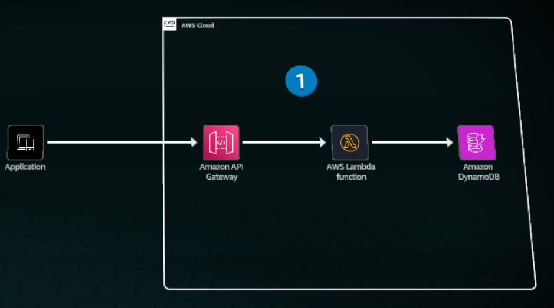

The application makes an HTTP request that sends the payload (JSON) to be processed by the backend.

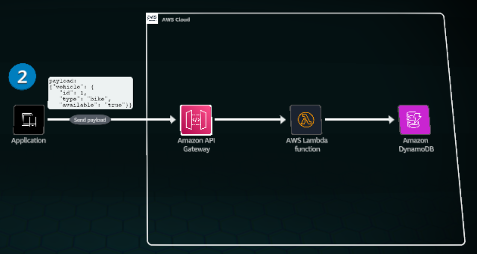

Amazon API GW acts as the front door for apps to access data, business logic or functionality from backend services.

API GW invokes an AWS Lambda function, which processes the data and uses Amazon DynamoDB as a data store.

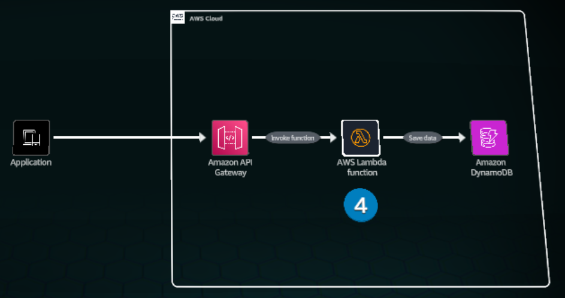

DynamoDB is a key-value and document database that delivers single-digit miliseconds performance at any scale.

DynamoDB can support tables of virtually any size, and can scale to more than ten trillion requests per day with peaks greater than 20 million rquests per second.

DynamoDB is serverless, with no servers to provision, patch or manage and no software to insatll, maintain or operate.

DynamoDB availability and fault tolerance are built in, removing the need to architect apps for these capabilities.

# Practice
In this practice lab, you will:
- Create an Amazon DynamoDB table.
- Define the table schema.
- Create an AWS Lambda function to create, update and query table items.
- Expose an Amazon API Gateway RESTful API to the Lambda function.

Concept
Amazon DynamoDB helps you offload the administrative buurdens of operating and scaling a distributed db so that you don't have to worry about hardware provisioning, setup and configuration, replication, software patching or cluster scaling.

1. In the top navigation bar search box, type:
dynamo
2. In the search results, under Services, click DynamoDB.

Concept
Tables, items and attributes are the core components, that you work with in DynamoDB. A table is a collection of ìtems, and each item is a collection of attributes.

3. In the left navigation pane, click Tables.
4. In the Tables section, click Create table.

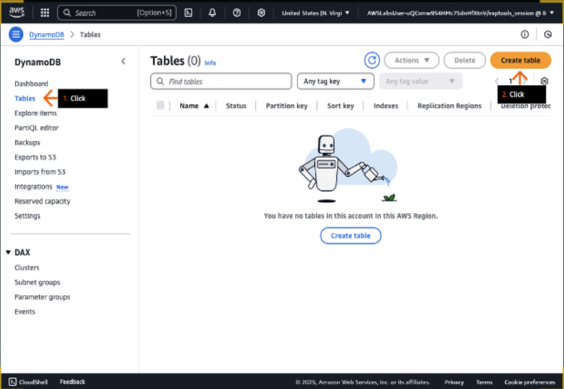

Concept
DynamoDB uses primary keys to uniquely identify each item in a table and secondary indexes to provide more querying flexibility. A simple primary key, composeed of one attribute, is known as a partition key.

5. For Table name, type:
rental_app
- Make sure to use this exact table name or you will get AccessDenied errors later in the lab.
6. For Partition key, type:
record_type
7. For Sort key, type:
id
8. Scroll down to the bottom of the page, and then click Create table (not shown).

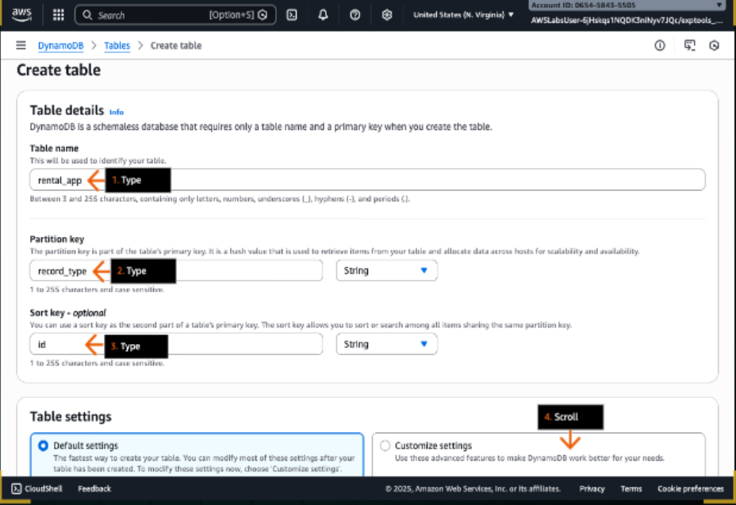

Concept
DyanmoDB usses the partition key's value as input to an internal hash function. In a table that has only a partition key, no two items can have the same partition key value.

9. On the Tables page, under Status, review and wait a few seconds until your table status changes to Active. 
10. Go to the next step.

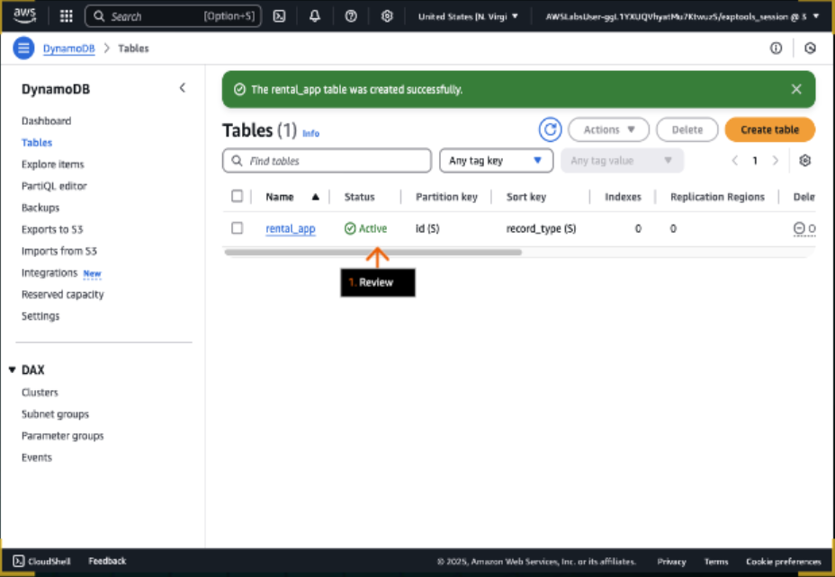

Concept
AWS Lambda is a compute service that helps you run code without provisioning or managing servers. Lambda runs your code only when needed, and it can scale automatically from a few requests per day to thousands per second. You pay for only the compute time you use, with no charge when your code is not running.

11. In the top navigation bar search box, type:
lambda
12. In the search results, under Services, click Lambda.

Concept
A function is a resource that you can invoke to run your code in Lambda. A function has code that processes events, and a runtime that passes requests and responses between Lambda and the function code.

13. On the Functions page, click Create function.
- You can safely ignore any Lambda functions that are already displayed in the section.

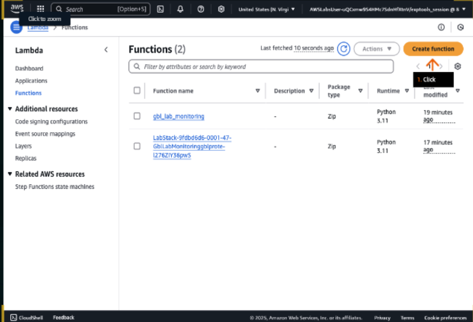

Concept
With Lambda runtimes, functions in different languages can run in the same base execution environment. You configure your function to use a runtime that matches your programming language.

14. For Create function, keep the default setting of Author from scratch.
15. For Function name, type:
labFunction
- You can give a Lambda function any name that you like.
16. For Runtime, choose Python 3.14.
- The available Python version in the AWS Management Console might be different from what is displayed in the screenshot example.
17. Under Permissions, click to expand Change default execution role.

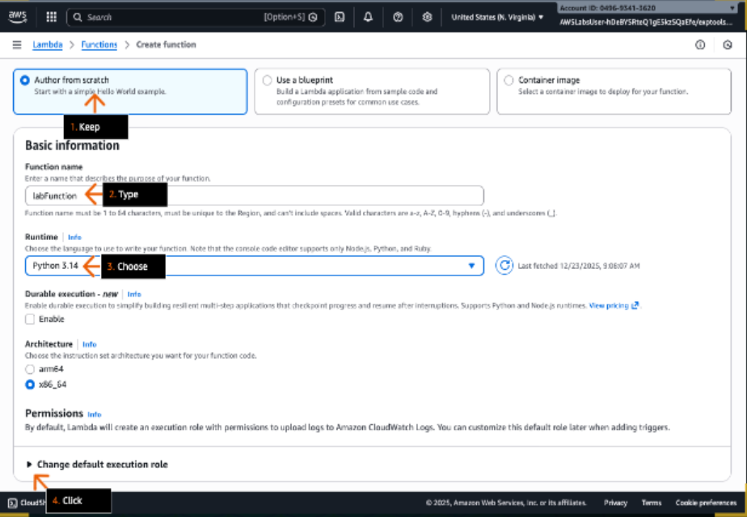
Concept
A Lambda function's execution role defines what permissions are assigned to the function to access AWS services and resources. At a minimum, your function needs access to Amazon Cloudwatch logs for log streaming.

{
    "Version": "2012-10-17",
    "Statement": [
        {
            "Action": [
                "dynamodb:DeleteItem",
                "dynamodb:GetItem",
                "dynamodb:PutItem",
                "dynamodb:Query",
                "dynamodb:Scan",
                "dynamodb:UpdateItem",
                "logs:CreateLogGroup",
                "logs:CreateLogStream",
                "logs:PutLogEvents"
            ],
            "Resource": [
                "arn:aws:dynamodb:us-east-1:270967823201:table/rental_app",
                "arn:aws:dynamodb:us-east-1:270967823201:table/rental_app/index/*"
            ],
            "Effect": "Allow"
        },
        {
            "Action": "*",
            "Resource": [
                "arn:aws:lambda:us-east-1:270967823201:function:gbl_lab_monitoring",
                "arn:aws:iam::270967823201:role/LabStack-504dcac3-ee65-44-GblLabMonitoringgbllabmon-YuIpiQjNsayQ",
                "arn:aws:events:us-east-1:270967823201:rule/LabStack-504dcac3-ee65-44-GblLabMonitoringmonitorin-rsY4jfcfmm19",
                "arn:aws:events:us-east-1:270967823201:rule/LabStack-504dcac3-ee65-44-GblLabMonitoringmonitorin-uW4qXBoiv20H",
                "arn:aws:events:us-east-1:270967823201:rule/LabStack-504dcac3-ee65-44-GblLabMonitoringmonitorin-bXRPpibhFMFx",
                "arn:aws:events:us-east-1:270967823201:rule/LabStack-504dcac3-ee65-44-GblLabMonitoringmonitorin-KXabAUXBHIru",
                "arn:aws:events:us-east-1:270967823201:rule/LabStack-504dcac3-ee65-44-GblLabMonitoringmonitorin-I4R666zqih62",
                "arn:aws:events:us-east-1:270967823201:rule/LabStack-504dcac3-ee65-44-GblLabMonitoringmonitorin-qtu8LVlbDTqA"
            ],
            "Effect": "Deny"
        },
        {
            "Action": "lambda:PutProvisionedConcurrencyConfig",
            "Resource": "*",
            "Effect": "Deny"
        }
    ]
}

18. For Execution role, choose Use an existing role.
19. For Existing role, on the dropdown list, choose the role that starts with lab_function_role-.
20. Click Create function.

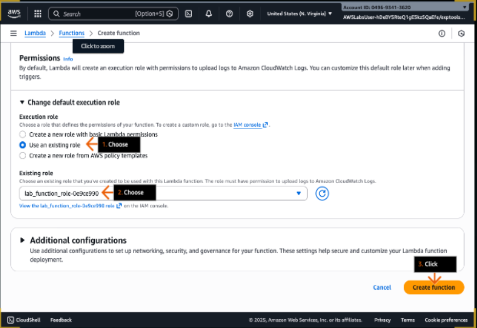

21. Scroll down to the Code tab.
22. Go to the next step.

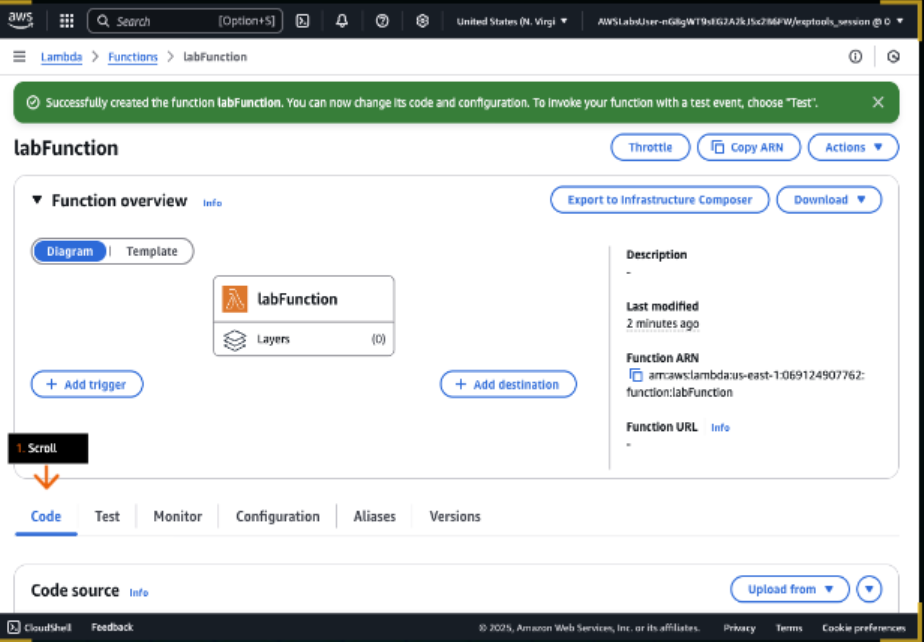

Concept
Using the code editor on the Lambda console, you can write, test and view the execution reults of your Lambda function code.

23. In the lambda_function code window, select (highlight) the code, and then delete the code.

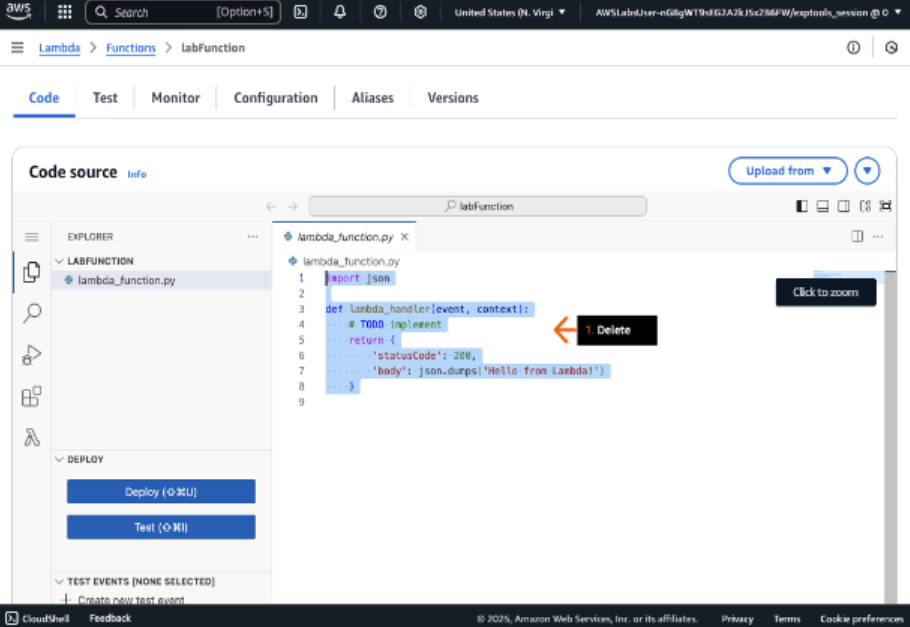

Concept
Lambda stores your code in Amazon S3 and encrypts it at rest.
24. Paste the code from the sample_code.py file that you downloaded in an earlier step.

- On your device, you can open a .py file with any text editor or IDE.
- Python code blocks are defined by their indentation, so maintain the indentation between copy and paste.

25. In the Explorer window, click Deploy.
26. Review to see that the Lambda code gets the DynamoDB table name through a Lambda environment variable.
27. Click the Configuration tab.

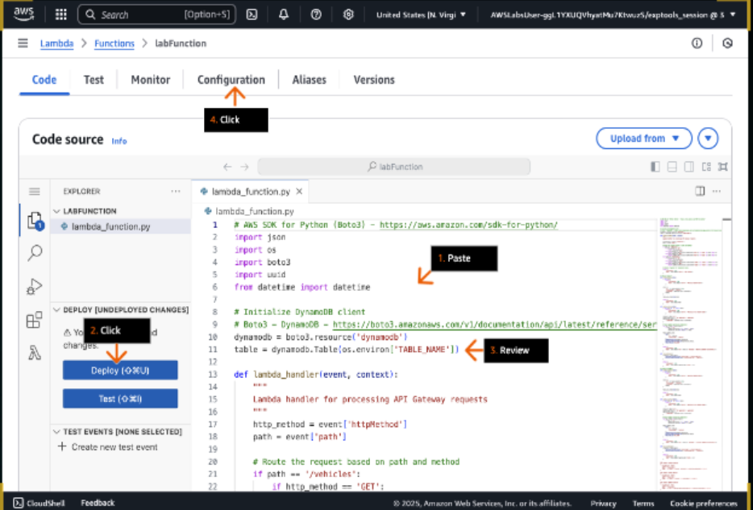

Concept
Lambda environment variables are key-value pairs that you can configure for your Lambda functions.

28. Click Environment variables.
29. Click Edit.

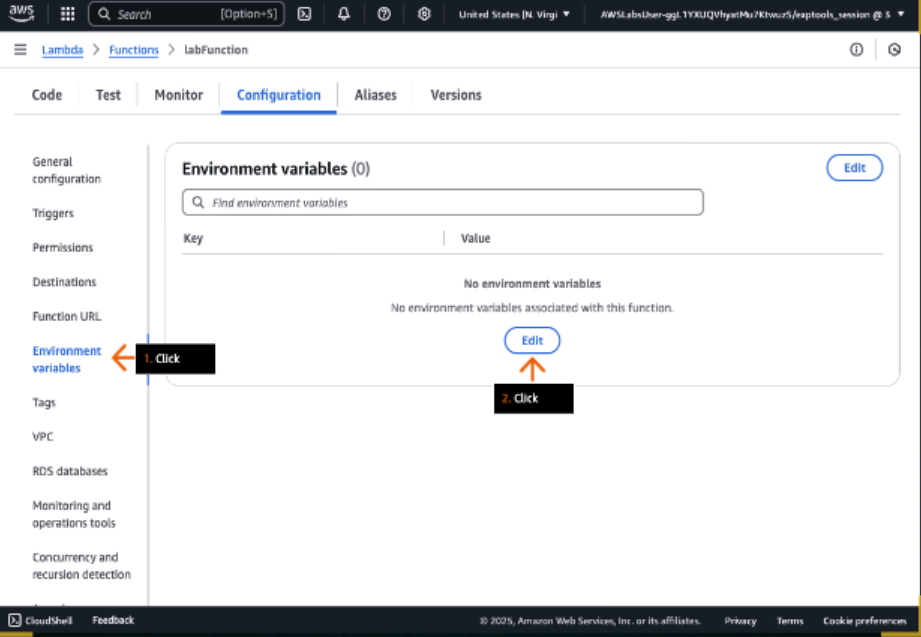

Concept
Environment variables are limited to 4kb total size for all environment variables.

30. Click Add environment variable.

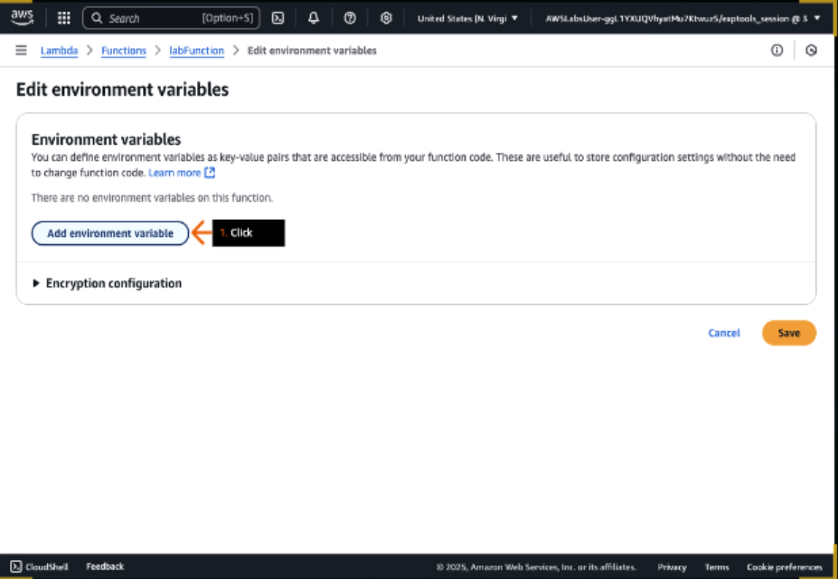

Concept
Environment variables are encrypted at rest using AWS Key Management Service (AWS KMS).

31. For Key, type:
TABLE_NAME
32. For Value, type:
rental_app
33. Click Save.

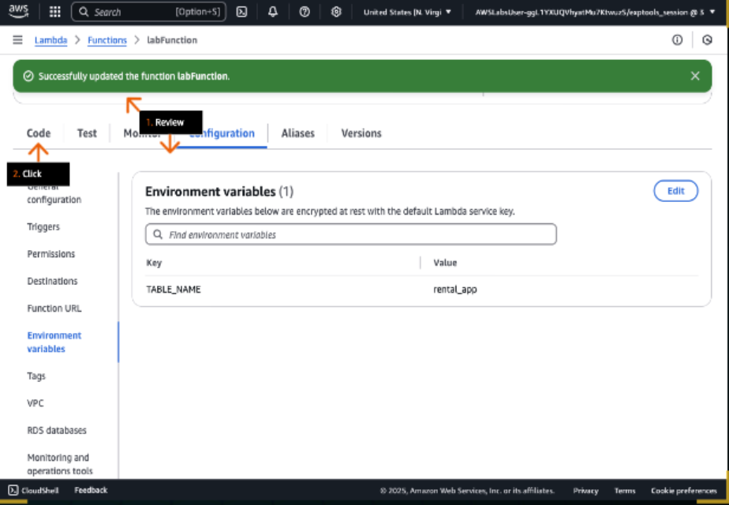

34. Click on the code tab.
35. On the top navigation bar, click the expand icon to go into full screen mode.
36. Review the remainder of the code.
- The code has all the necessary functionality to create, update, and list items in the DynamoDB table.
37. Scroll down to line 178.

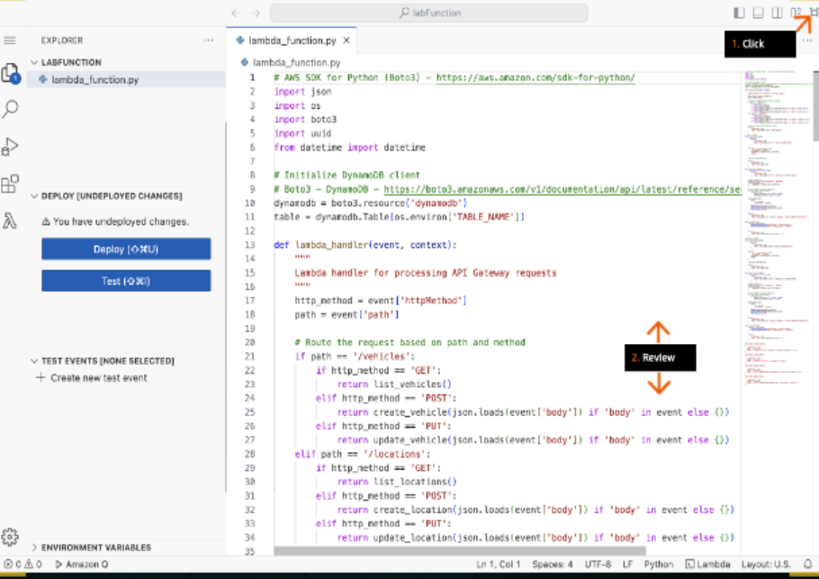

38. Select (highlight) and copy the code on lines 178–182.
39. In the Explorer window, click Test.
40. On the dropdown list (not shown), choose Create new test event.

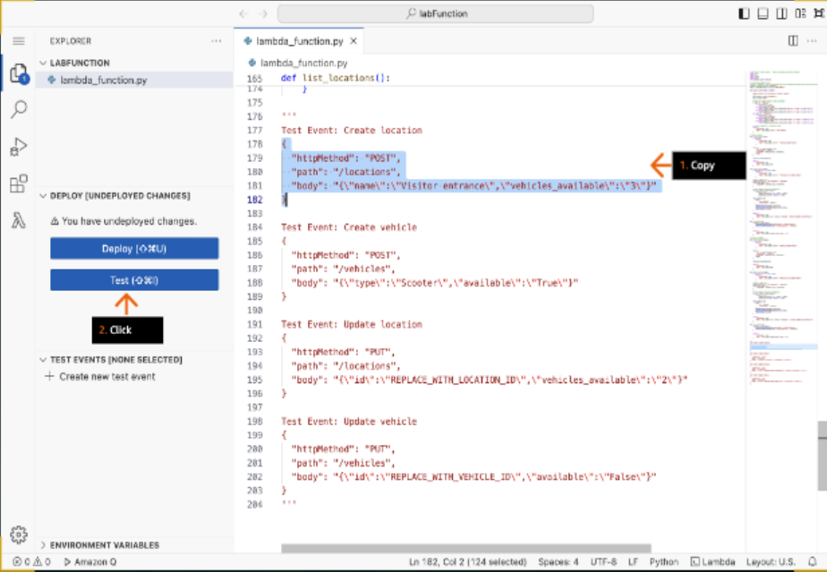

Concept
You can use several available event templates to generate your own test event. Modify the JSON code to configure test input.

41. In the Create new test event window, for Event Name, type:
create_location
42. For Event sharing settings, choose or keep Private.  
43. For Event JSON, paste the code segment that you just copied.
- The code should look similar to what is displayed in the screenshot example.
44. Click Save.

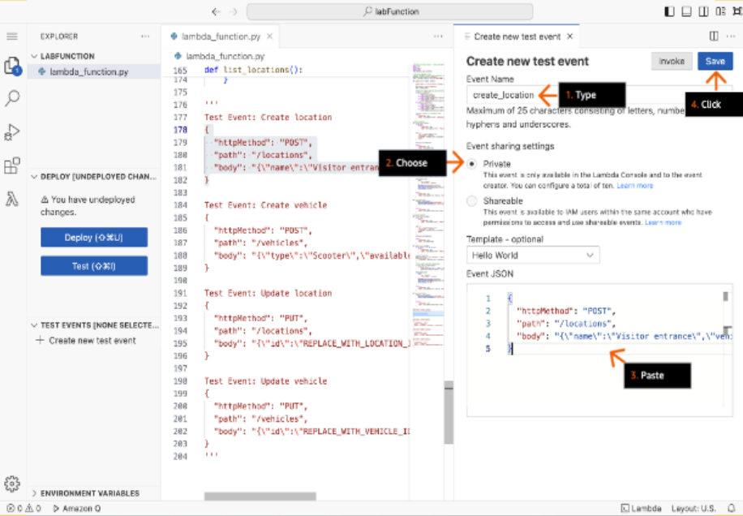

Concept
Lambda code can create a new record in DynamoDB, update the record and then query the record.

45. In the Explorer window, click Test.
46. In the bottom Execution results window, review the results. 
- The logging information confirms that an item was successfully created in the DynamoDB table.

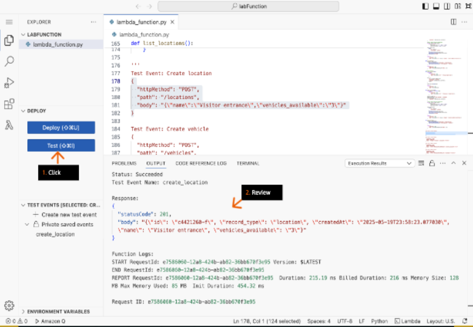

47. In the top navigation bar search box, type:
dynamo
48. In the search results, under Services, click DynamoDB.
49. In the left navigation pane, click Tables.
50. On the Tables page, click rental_app.

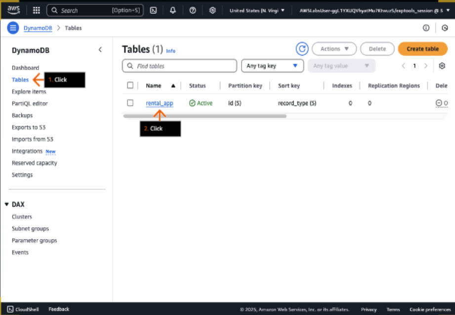

Concept
Amazon DynamoDB is a schemaless db. Every table must have a primary key to uniquely identify each data item, but there are no similar constraints on other non-key attributes. DynamoDB can manage structured or semistructured data, including JSON documents.

51. Click Explore table items.

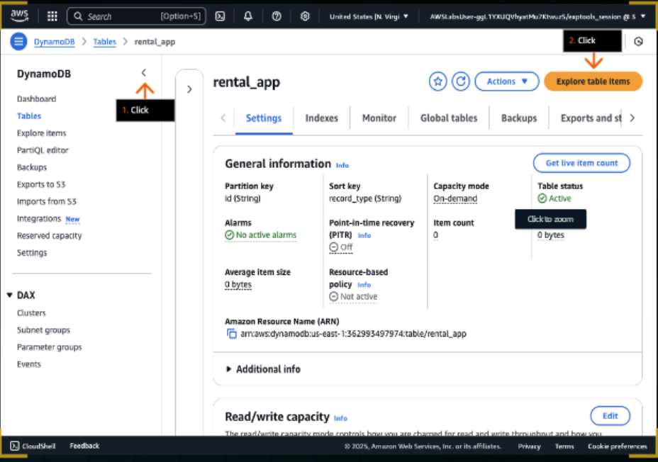

Concept
In DynamoDB, a Scan operation returns one or more items and item attributes by accesing every item in a table or a secondary index.

52. In the Items returned section, review the data populated by the Lambda function.
53. Select (highlight) and copy the available Id.
- You use this location ID in a later step.

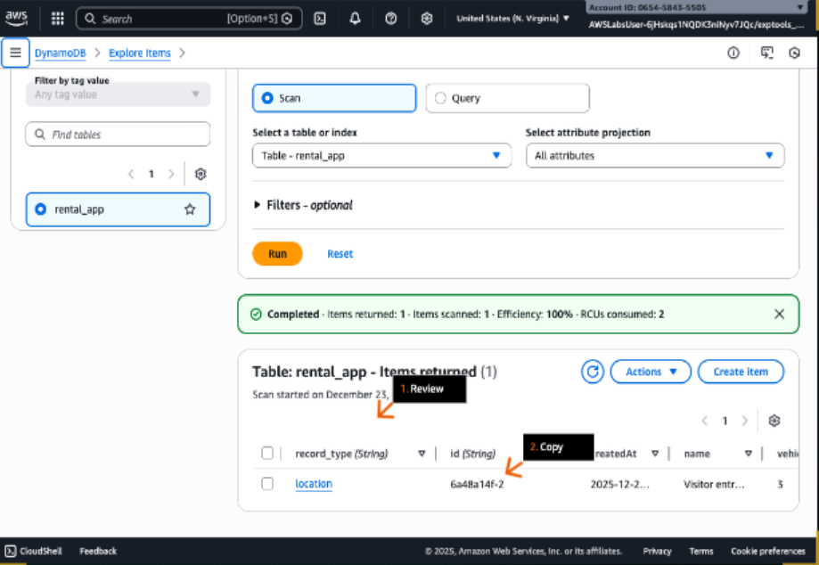

Concept
Amazon API GW is a fully managed service that helps developers create, publish, maintain, monitor and secure APIs at any scale.

54. In the top navigation bar search box, type:
api
55. In the search results, under Services, click API Gateway.

Concept
API GW provides the connection and access to data, bussiness logic and additional functionality from backend services such as AWS Lambda or Amazon EC2.

56. On the API GW home page, click create an API.

Concept
You can choose between an HTTP API, a WebSocket API or a REST API. 
HTTP APIs and REST APIs are both RESTful APIs that are HTTP based. They enable stateless client-server communication and implement standard HTTP methods such as GET, POST, PUT, PATCH and DELETE.

57. On the REST API card, click Build.

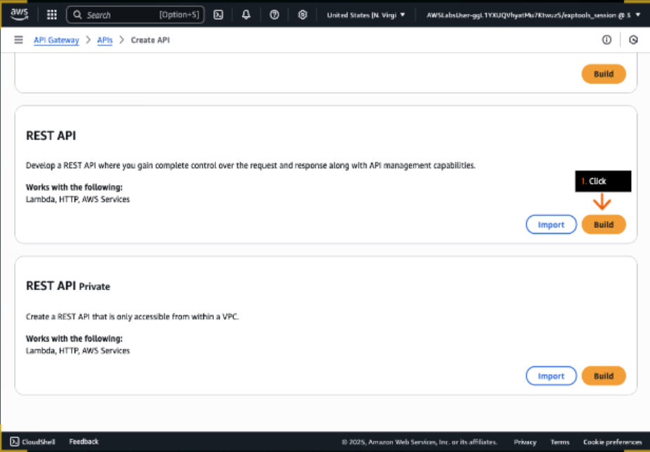

Concept
PASO 29